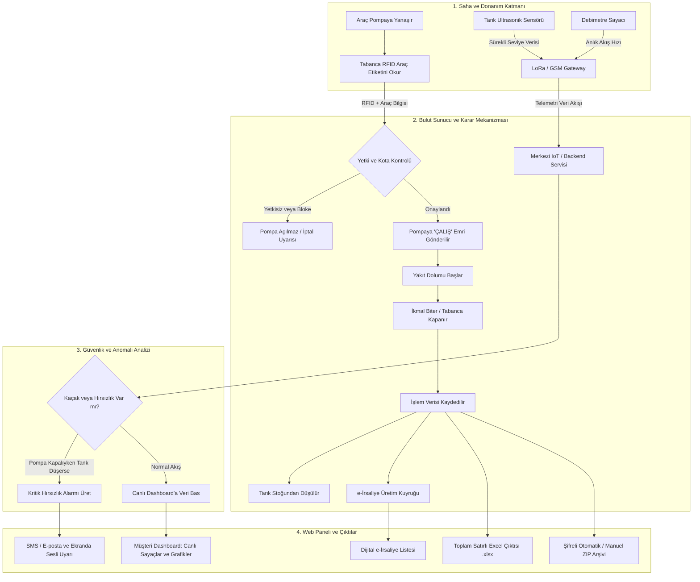

# ⛽ Endüstriyel IoT & LoRaWAN Destekli Akıllı Akaryakıt, Şantiye ve Telemetri Yönetim Platformu

---

## 1. Proje Başlığı ve Kısa Özet
* **Proje Başlığı:** Çok Kiracılı (Multi-Tenant) Akaryakıt Otomasyonu, Şantiye Telemetrisi ve Dijital İrsaliye Yönetim Sistemi
* **Kısa Özet:** Bu proje; inşaat şantiyeleri, maden sahaları ve lojistik filolarında kullanılan sabit/mobil yakıt tanklarını, pompaları, araçları ve şoförleri uçtan uca dijitalleştiren bir yönetim platformudur. Sahadaki ultrasonik seviye sensörleri, debimetreler ve RFID okuyuculardan gelen verileri anlık olarak işleyerek yakıt kaçaklarını engeller, yetkisiz alımları durdurur, e-İrsaliye ve arşivleme süreçlerini otomatikleştirir.

---

## 2. Projenin Amacı ve Çözdüğü Problem
* **Çözülen Problem:**
  * Şantiyelerde manuel yakıt defteri tutulması nedeniyle oluşan yakıt hırsızlığı, kaçak ve kayıt dışı ikmallar.
  * Hangi aracın hangi şoför tarafından, ne zaman ve ne kadar yakıt aldığının şeffaf takip edilememesi.
  * Tanklardaki yakıt seviyesinin anlık bilinmemesi sebebiyle iş makinelerinin yakıtsız kalıp şantiye işlerinin aksaması.
  * Farklı firmaların ortak şantiyelerinde yakıt mahsuplaşmasının ve çapraz kullanım kotalarının yönetilememesi.
  * Elle fatura/irsaliye kesilmesinden kaynaklanan mali hatalar ve yavaş operasyonlar.
* **Projenin Amacı:** Sahadaki fiziksel yakıt pompalarını ve tankları internete (IoT/LoRaWAN) bağlayarak; tabanca araca takıldığı andan irsaliyenin kesilip arşivlenmesine kadar tüm süreci sıfır insan hatasıyla otomatikleştirmektir.

---

## 3. Hedef Kullanıcılar ve Proje Paydaşları
1. **Şantiye Şefleri ve Saha Yöneticileri:** Şantiyedeki tank seviyelerini, günlük tüketimleri ve çalışan araçları canlı izler; acil durumlarda pompaları uzaktan kilitler.
2. **Filo ve Akaryakıt Yöneticileri:** Araçların tüketim performanslarını inceler, limit tanımlar ve hırsızlık/anomali alarmlarını takip eder.
3. **Şoförler ve Pompa Operatörleri:** RFID kart veya araç RFID halkası (tag) ile pompaya kendini tanıtarak yetkili yakıt ikmali yapar.
4. **Muhasebe ve Finans Ekipleri:** Otomatik hesaplanan toplam satırlı Excel raporlarını alır, dijital e-İrsaliyeleri denetler ve arşiv paketlerini indirir.
5. **Sistem / Platform Yöneticileri (Süper Admin - Geliştirici):** Sisteme yeni müşteri firmalar (kiracılar) ekler, şantiye tanımlar, modül lisanslarını açıp kapatır ve donanım sağlık durumlarını denetler.

---

## 4. Projenin Temel Özellikleri ve İşlevleri
* **Canlı Tank & Pompa Telemetrisi:** Ultrasonik sensörler ile tank doluluk oranı (Litre / Yüzde), sıcaklık ve pompa anlık akış hızı (Litre/Dakika) anlık takip edilir.
* **RFID Güvenlikli İkmal:** Pompa tabancası yetkisiz araçlara yakıt vermez; RFID tag eşleştiğinde otomatik açılır ve limit kadar yakıt verir.
* **Çapraz Şantiye (Cross-Site) Ortak Havuz:** A firmasının aracı, tanımlanan kota ve süre dahilinde B firmasının şantiyesindeki tanktan güvenle yakıt alabilir.
* **Kaçak ve Anomali Tespit Motoru:** Pompa çalışmıyorken tank seviyesi düşerse veya sayaç ile tank düşümü uyuşmazsa sistem sesli/görsel hırsızlık alarmı üretir.
* **Dinamik Toplam Satırlı Excel Raporlama:** İndirilen her Excel raporunun altına "GENEL TOPLAM" satırı otomatik hesaplanarak eklenir.
* **Otomatik ve Manuel Veri Arşivleme:** 7, 15, 30 veya 90 günlük periyotlarla ya da tek tıkla anlık olarak sistem logları ve irsaliyeler şifreli arşiv paketi haline getirilir.
* **Geliştirici & Müşteri Çift Arayüzü:** Süper adminler için sistem genelini yöneten "Geliştirici Paneli" ile şirketlerin kendi verilerini gördüğü "Müşteri Paneli" bağımsız olarak çalışır.

---

## 5. Kullanılan Teknolojiler ve Araçlar
* **Kullanıcı Arayüzü (Frontend):**
  * React 18 & TypeScript
  * Vite (Hızlı derleme ve geliştirme ortamı)
  * Tailwind CSS (Modern, endüstriyel koyu tema tasarımı)
  * Lucide Icons & Material Symbols (Endüstriyel ikon seti)
  * SheetJS / XLSX (Excel oluşturma ve dışa aktarma)
* **Backend & Servisler (Mevcut Mimari & Yol Haritası):**
  * Node.js & TypeScript (Sunucu tarafı mantığı)
  * Express / NestJS mimarisi
  * Socket.io / WebSocket (Anlık pompa ve telemetri veri akışı)
* **Veritabanı & IoT Altyapısı (Hedeflenen/Tasarım):**
  * PostgreSQL (İlişkisel veriler ve çok kiracılı izolasyon)
  * TimescaleDB *(Varsayım)* (Milyonlarca sensör telemetri kaydını saklamak için zaman serisi veritabanı)
  * Redis & BullMQ *(Varsayım)* (Arka plan iş kuyrukları ve dağıtık kilitler)
  * MQTT / EMQX Broker & LoRaWAN (ESP32 ve debimetre cihazlarıyla haberleşme)

---

## 6. Projenin Genel Çalışma Mantığı
1. Sahadaki tanklarda bulunan **ultrasonik seviye sensörleri** ve pompalardaki **debimetreler**, akaryakıt durumunu sürekli ölçer.
2. Ölçülen bu veriler LoRa/GSM modülleri üzerinden bulut sunucusuna (Backend) iletilir.
3. Bir araç yakıt almak için yanaştığında tabancadaki **RFID anteni** araçtaki etiketi okur.
4. Sistem aracın aktifliğini, şantiye yetkisini ve aylık yakıt kotasını kontrol eder.
5. Onay verilirse pompa valfi açılır, yakıt doldurulur ve her saniye basılan miktar ekranda canlı akar.
6. İkmal bittiğinde sayaç kilitlenir, tank stoğundan düşülür, finansal hareket kaydı oluşturulur ve e-İrsaliye kuyruğuna aktarılır.
7. Tüm bu hareketler web arayüzünde canlı dashboard'lara, haritalara ve dışa aktarılabilir raporlara yansıtılır.

---

## 7. Uçtan Uca Proje Akış Şeması



---

## 8. Veri Girişleri, İşlemler, Karar Noktaları ve Çıktılar

| Aşama | Detay / İçerik |
| :--- | :--- |
| **Gerekli Veri Girişleri** | • Araç Plakası, Ruhsat ve RFID Tag UID<br>• Şoför Ad Soyad, TC No ve Ehliyet Bilgisi<br>• Tank Kapasitesi ve Yakıt Türü (Motorin/Benzin)<br>• Şantiye Konumu ve Geofence Koordinatları<br>• Sensörlerden gelen ham ultrasonik seviye (mm) ve debi (L/dk) |
| **Yapılan İşlemler** | • Milimetrik tank seviyesini daldırma cetveliyle litreye çevirme<br>• Pompa dolum hızını saniyelik hesaplama<br>• İkmal hareketlerinin toplam litre/tutarını dinamik toplama<br>• Verileri periyodik veya anlık olarak şifreli ZIP arşiv paketine dönüştürme |
| **Kritik Karar Noktaları** | • **RFID Doğrulama:** Araç aktif mi? Şantiyeye girme yetkisi var mı?<br>• **Kota Kontrolü:** Aracın aylık kotası veya çapraz şantiye izni doldu mu?<br>• **Anomali Kararı:** Pompadan geçen yakıt ile tanktan eksilen yakıt birbirini tutuyor mu? |
| **Sistem Çıktıları** | • Canlı pompa debi ve tank seviye grafikleri<br>• Otomatik genel toplam satırı içeren `.xlsx` Excel tabloları<br>• GİB UBL-TR uyumlu e-İrsaliye dökümleri<br>• Şifreli `.ZIP` geçmiş veri arşiv paketleri<br>• Kaçak/Hırsızlık anomali bildirimleri |

---

## 9. Proje Modül ve Klasör Yapısı

```text
/
├── public/                         # Statik dosyalar, favicon ve genel ikonlar
├── src/
│   ├── components/                 # Yeniden kullanılabilir UI bileşenleri
│   │   ├── AddCompanyModal.tsx     # Yeni firma ekleme penceresi
│   │   ├── FuelDeliveryModal.tsx   # Manuel tank dolumu / ikmal modalı
│   │   ├── HardwareHealthModal.tsx # ESP32/Sensör donanım durumu modalı
│   │   └── Layout.tsx              # Üst menü, şantiye filtresi ve navigasyon
│   ├── context/
│   │   └── AppContext.tsx          # Uygulama genel durum (State) ve veri havuzu
│   ├── pages/                      # Ekranlar ve sayfalar
│   │   ├── admin/                  # Geliştirici (Süper Admin) Ekranları
│   │   │   ├── DeveloperPanel.tsx  # Sistem geneli, firma ve donanım yönetimi
│   │   │   └── IntegrationSimulator.tsx # ESP32 ve MQTT sinyal test simülatörü
│   │   └── customer/               # Müşteri (Şantiye / Şirket) Ekranları
│   │       ├── DashboardPage.tsx   # Canlı göstergeler, tank seviyeleri ve harita
│   │       ├── TransactionsPage.tsx# İkmal hareketleri tablosu ve Excel dışa aktarımı
│   │       ├── VehiclesDriversPage.tsx # Filo, araç ve şoför yönetimi
│   │       ├── CrossSitePage.tsx   # Çapraz şantiye yetkilendirme ve ortak havuz
│   │       ├── AnomaliesPage.tsx   # Hırsızlık/kaçak tespiti ve uyarılar
│   │       ├── EInvoicesPage.tsx   # Dijital irsaliyeler ve fatura listesi
│   │       └── ArchivePage.tsx     # Otomatik/Manuel veri arşivleme ve indirme
│   ├── types/
│   │   └── index.ts                # TypeScript veri modelleri ve tip tanımları
│   ├── utils/
│   │   └── excelExporter.ts        # Otomatik toplam satırlı merkezi Excel motoru
│   ├── App.tsx                     # Ana yönlendirici (Router) ve sayfa geçişleri
│   ├── main.tsx                    # React başlangıç giriş noktası
│   └── index.css                   # Tailwind CSS stil tanımları
├── README_PROJECT_OVERVIEW.md      # Ekip için genel proje ve mimari tanıtım dokümanı
├── ISSUES_ROADMAP.md               # Detaylı backend ve teknik iş listesi
├── PRE_AUTOMATION_SPEC.md          # Otomasyon öncesi mimari eksiklikler kılavuzu
├── metadata.json                   # Uygulama meta verileri ve izinler
└── package.json                    # Proje bağımlılıkları ve çalıştırma komutları
```

---

## 10. Ekip Üyelerinin Görevleri ve Katkı Alanları
* **Frontend / UI-UX Geliştirici:**
  * React ekranlarının geliştirilmesi, koyu tema uyumluluğu ve mobil/tablet duyarlılığı.
  * Canlı veri göstergeleri, filtreleme tabloları ve modal formların yönetimi.
* **Backend & API Mühendisi:**
  * Node.js/NestJS REST API ve WebSocket ağ geçitlerinin kurulması.
  * Çapraz şantiye kota motoru, dağıtık kilitler (Redlock) ve yetkilendirme (RBAC).
* **Gömülü Sistem & IoT Mühendisi:**
  * ESP32, debimetre, RFID modülleri ve LoRaWAN gateway yazılımlarının geliştirilmesi.
  * Donanım imzalama (HMAC-SHA256) ve MQTT veri paketleme.
* **Veritabanı & DevOps Mühendisi:**
  * PostgreSQL RLS politikaları, TimescaleDB hipertabloları ve Redis kuyrukları.
  * Docker konteynerizasyonu, CI/CD süreçleri ve bulut sunucu yönetimi.
* **Mevzuat & Test / QA Mühendisi:**
  * GİB e-İrsaliye standartlarına (UBL-TR 1.2) uygunluk testleri.
  * Uçtan uca ikmal simülasyonları ve yük/stres testlerinin (k6) yürütülmesi.

---

## 11. Kurulum ve Çalıştırma Adımları

### Gereksinimler:
* Node.js (v18.0 veya üzeri)
* npm veya yarn paket yöneticisi

### Adım Adım Çalıştırma:
1. **Bağımlılıkları Yükleyin:**
   ```bash
   npm install
   ```
2. **Uygulamayı Geliştirme Modunda Başlatın:**
   ```bash
   npm run dev
   ```
3. **Tarayıcıda Açın:**
   Geliştirme sunucusu başladıktan sonra tarayıcınızdan `http://localhost:3000` adresine gidin.
4. **Derleme (Production Build):**
   ```bash
   npm run build
   ```
5. **Kod Denetimi (Linting):**
   ```bash
   npm run lint
   ```

---

## 12. Bilinen Eksikler, Varsayımlar ve Gelecek Geliştirmeler

### Bilinen Eksikler ve Yapılacaklar:
* **Gerçek Donanım Sinyal Entegrasyonu:** Şu anda arayüz üzerindeki donanım hareketleri simülatör ve yerel state üzerinden akmaktadır; sahadaki gerçek MQTT broker bağlantısı `[Doldurulacak - Faz 2]`.
* **GİB e-İrsaliye Entegratör Bağlantısı:** e-İrsaliye XML üretimi tasarlanmış olup, özel entegratör (Logo, Sovos vb.) canlı API uçları `[Doldurulacak - Faz 3]`.
* **Kullanıcı Yetkilendirme Giriş Ekranı (Login):** Kullanıcı rolleri ve oturum açma mekanizması şablon durumundadır; gerçek JWT backend servisi bağlanacaktır.

### Mimari Varsayımlar:
* *[Varsayım]* Şantiyelerde internet kesintisi yaşanabileceği öngörülerek saha kontrol panolarında çevrimdışı (offline) veri depolayan bir flash bellek bulunacağı varsayılmıştır.
* *[Varsayım]* Tankların seviye-litre dönüşümü için her tankın bir kalibrasyon daldırma cetveline (strapping table) sahip olduğu varsayılmıştır.

### Gelecek Geliştirme Fikirleri:
* **Yapay Zeka Destekli Tüketim Tahmini:** Gemini AI entegrasyonu ile şantiyedeki hava durumu ve iş yoğunluğuna bakarak "3 gün sonra yakıtınız bitecek" şeklinde proaktif sipariş önerisi.
* **Mobil Operatör Uygulaması:** Şoförlerin yakıt alım geçmişlerini ve araç tüketim skorlarını cep telefonlarından görebileceği mobil uygulama (React Native / PWA).
* **Plaka Tanıma Kamerası (ANPR) Desteği:** RFID'ye ek olarak pompaya yaklaşan aracın plakasını kameradan otomatik okuyan yapay zeka kamera modülü.
