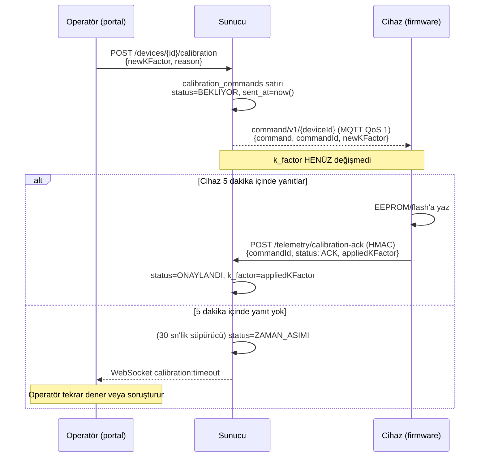
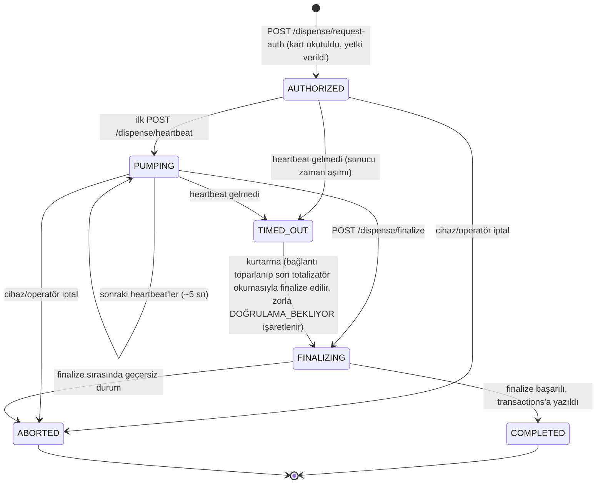

# Hardware Integration Guide v1.0

**Hedef kitle:** pano/cihaz üreticileri ve saha firmware geliştiricileri (ESP32
pompa kontrolcüsü, ultrasonik tank probu, RFID terminali, LoRaWAN sensör).

Bu belge cihazın backend ile konuştuğu **iki kanalı** (HMAC korumalı HTTP ve
MQTT) ve her akışın tam sözleşmesini tanımlar. REST uçlarının etkileşimli
referansı ayrıca Swagger UI'da: **`/api-docs`** (dev) — bu belge o referansın
"donanım tarafı nasıl uygular" tamamlayıcısıdır (DOC-1201).

> **Sahaya kurulum / devreye alma:** adım adım prosedür, sayısal kabul kriterleri ve imzalı form için [SAHA_KURULUM.md](SAHA_KURULUM.md) (DOC-1206).
>
> **Sürüm politikası:** bu v1.0. Kırıcı bir protokol değişikliği yeni bir major
> sürüm (`telemetry/v2/...`, `Hardware Integration Guide v2.0`) ile gelir;
> v1 en az bir major sürüm daha desteklenir.

---

## 0. Hızlı başvuru

| Ne | Değer |
|---|---|
| REST taban yolu | `/api/v1` |
| MQTT broker | EMQX, MQTT **v5**, `mqtt://<host>:1883` (WS: `:8083`) |
| MQTT kimlik | `MQTT_USERNAME` / `MQTT_PASSWORD` (ortak kimlik — bkz. §3.1) |
| Cihaz kimlik doğrulaması (HTTP) | HMAC-SHA256, 4 başlık (§2) |
| Cihaz secret'ı nereden | Tek seferlik **claim** akışı (§6) |
| Zaman damgası toleransı | ±30 saniye |
| Nonce ömrü | 120 saniye, cihaz başına tek kullanımlık |
| HTTP rate limit (cihaz) | `X-Device-ID` başına **300 istek / dakika** → `429` |
| Presence (ONLINE) TTL | 10 saniye — bkz. §3.4 |

---

## 1. Onboarding sırası (bir cihaz ilk kez sahaya çıktığında)

```
1. Portal (COMPANY_OWNER/SUPER_ADMIN)  ──►  POST /devices/claim-codes
   → tek kullanımlık, süreli "claim kodu" üretir (varsayılan 15 dk)

2. Saha teknisyeni / cihaz              ──►  POST /devices/claim
   { code, deviceId, serialNumber?, macAddress?, model?, hardwareRevision? }
   → yanıt: { deviceId, name, siteName, secret }   ← SECRET YALNIZCA BURADA
   Cihaz bu secret'ı güvenli (flash/secure element) saklar.

3. Cihaz artık HMAC üretebilir  ──►  §2'deki tüm HTTP uçları + §3'teki MQTT
```

Claim edilmemiş bir `deviceId`:
- HTTP'de `401 UNAUTHORIZED_DEVICE` alır (secret'ı olmadığı için geçerli HMAC
  zaten üretemez),
- MQTT'de yayınladığı paketler **sessizce düşürülür** (ne presence'a yansır ne
  telemetri olayı üretir).

---

## 2. HMAC-SHA256 HTTP Kimlik Doğrulaması (AUTH-202)

`security: []` etiketli tüm uçlar JWT değil, cihazın kendi HMAC imzasını
bekler. Her isteğe **dört başlık** eklenir:

| Başlık | İçerik |
|---|---|
| `X-Device-ID` | Cihazın claim'de aldığı kimlik (ör. `ESP32-PUMP-02`) |
| `X-Timestamp` | İsteğin oluşturulduğu an — **ms epoch** (`1788700000000`) **veya** ISO-8601 (`2026-09-06T10:00:00.000Z`) |
| `X-Nonce` | İstek başına benzersiz, rastgele değer — **16 bayt hex önerilir** |
| `X-Hardware-Signature` | Aşağıdaki imzanın **küçük harf hex** gösterimi |

### 2.1 İmzalanan dize

```
signString = <X-Timestamp> + "." + <X-Nonce> + "." + <rawBody>
signature  = HMAC_SHA256(signString, deviceSecret)   // hex, küçük harf
```

- `<rawBody>` = isteğin gövdesinin **birebir gönderilen bayt dizisi** (JSON'u
  imzaladıktan sonra tekrar serialize etme — aynı byte'ları gönder).
- **Gövdesiz istekler** (ör. `GET /telemetry/fail-open-policy`): `<rawBody>`
  yerine iki karakterlik `{}` dizesi imzalanır.
- Nonce imzaya **dahildir** — yakalanan geçerli bir paketin nonce'unu değiştirip
  tekrar göndermek imzayı bozar.

### 2.2 Referans üretim (Node.js — firmware'de eşdeğerini uygula)

```js
const crypto = require('crypto');

function signRequest(deviceSecret, bodyString /* '' veya JSON metni */) {
  const timestamp = Date.now().toString();
  const nonce = crypto.randomBytes(16).toString('hex');
  const rawBody = bodyString && bodyString.length > 0 ? bodyString : '{}';
  const signString = `${timestamp}.${nonce}.${rawBody}`;
  const signature = crypto.createHmac('sha256', deviceSecret)
    .update(signString).digest('hex');
  return {
    'X-Device-ID': 'ESP32-PUMP-02',
    'X-Timestamp': timestamp,
    'X-Nonce': nonce,
    'X-Hardware-Signature': signature,
  };
}
```

`curl` örneği (`/dispense/request-auth`):

```bash
BODY='{"rfidCardId":"CARD-881201","tankName":"Gebze Ana Tank (T-1)"}'
TS=$(node -e 'process.stdout.write(Date.now().toString())')
NONCE=$(node -e 'process.stdout.write(require("crypto").randomBytes(16).toString("hex"))')
SIG=$(node -e "process.stdout.write(require('crypto').createHmac('sha256',process.env.SECRET).update(process.argv[1]).digest('hex'))" "$TS.$NONCE.$BODY")

curl -sS -X POST http://<host>/api/v1/dispense/request-auth \
  -H "Content-Type: application/json" \
  -H "X-Device-ID: ESP32-PUMP-02" \
  -H "X-Timestamp: $TS" -H "X-Nonce: $NONCE" -H "X-Hardware-Signature: $SIG" \
  -d "$BODY"
```

### 2.3 Hata kodları

| HTTP | `error` | Anlamı / cihazın yapması gereken |
|---|---|---|
| 401 | `MISSING_HARDWARE_HEADERS` | Dört başlıktan biri eksik |
| 401 | `UNAUTHORIZED_DEVICE` | `deviceId` sistemde kayıtlı değil — claim akışını çalıştır |
| 403 | `DEVICE_BLOCKED` | Cihaz operatör tarafından bloke edilmiş — sahada müdahale gerekir |
| 400 | `INVALID_TIMESTAMP_FORMAT` | `X-Timestamp` ms sayısı ya da ISO tarih değil |
| 401 | `REPLAY_ATTACK_DETECTED` | Zaman damgası ±30 sn dışında (genelde **RTC kayması**). NTP/senkron gerekir; paketi güncel damgayla tekrar gönder |
| 401 | `INVALID_SIGNATURE_FORMAT` | `X-Hardware-Signature` geçerli hex değil |
| 401 | `INVALID_HARDWARE_SIGNATURE` | İmza tutmuyor — yanlış secret, yanlış imzalanan dize ya da body değiştirilmiş |
| 401 | `NONCE_REUSED` | Bu nonce bu cihazda 120 sn içinde zaten kullanıldı — her istekte yeni nonce üret |
| 429 | `TOO_MANY_REQUESTS` | Dakikada 300 isteği aştın — geri çekil (backoff) |

> **Ops görünürlüğü:** bir cihazdan 5 dakikada 5+ reddedilen paket gelirse
> sunucu alarm seviyesinde loglar (cihaz bloke edilmez, ama izlenir).

### 2.4 Secret rotasyonu (AUTH-202.3)

Operatör bir cihazın secret'ını uzaktan döndürebilir. Geçiş penceresi boyunca
**hem yeni hem eski** secret kabul edilir. Cihaz, MQTT komut kanalından
(`command/v1/{deviceId}`) yeni secret'ı alıp sakladıktan sonra yalnızca yeni
secret'la imzalamalıdır. Eski secret'la gelen istek kabul edilir ama sunucu
"hâlâ eski secret" uyarısı loglar.

### 2.5 HMAC imzalama test vektörleri (DOC-1202)

Aşağıdaki girdi/çıktı çiftleri backend'in **gerçek** doğrulama koduyla
(`hardwareAuthMiddleware.ts`: `HMAC_SHA256(timestamp + "." + nonce + "." + rawBody, deviceSecret)`)
üretilmiştir — firmware tarafı aynı girdilerle **birebir aynı** çıktıyı
üretmelidir. `deviceSecret` burada sahte/örnek bir değerdir — gerçek cihaz
secret'ınızı asla bir belgeye veya sürüm kontrolüne yazmayın.

**Vektör 1 — gövdesiz istek (ör. `GET /telemetry/fail-open-policy`):**

| Alan | Değer |
|---|---|
| `deviceSecret` | `ornek_test_gizli_anahtar_12345` |
| `X-Timestamp` | `1788700000000` |
| `X-Nonce` | `a1b2c3d4e5f6a7b8c9d0e1f2a3b4c5d6` |
| `rawBody` | `{}` |
| imzalanan dize | `1788700000000.a1b2c3d4e5f6a7b8c9d0e1f2a3b4c5d6.{}` |
| **beklenen `X-Hardware-Signature`** | `991aa39d17cc4e261a57861ef19a2fb1738b8e7a729d6b94f21749cf1e51dd86` |

**Vektör 2 — gövdeli istek (`POST /dispense/request-auth`):**

| Alan | Değer |
|---|---|
| `deviceSecret` | `ornek_test_gizli_anahtar_12345` |
| `X-Timestamp` | `1788700000000` |
| `X-Nonce` | `a1b2c3d4e5f6a7b8c9d0e1f2a3b4c5d6` |
| `rawBody` | `{"rfidCardId":"CARD-881201","tankName":"Gebze Ana Tank (T-1)"}` |
| imzalanan dize | `1788700000000.a1b2c3d4e5f6a7b8c9d0e1f2a3b4c5d6.{"rfidCardId":"CARD-881201","tankName":"Gebze Ana Tank (T-1)"}` |
| **beklenen `X-Hardware-Signature`** | `d621eddad2c20ba99ead9816370c8eeea773d2a90a4d120701f9222622c4911d` |

Doğrulama (Node.js, `crypto` çekirdek modülüyle — ek bağımlılık gerekmez):

```js
const crypto = require('crypto');
const sig = crypto.createHmac('sha256', 'ornek_test_gizli_anahtar_12345')
  .update('1788700000000.a1b2c3d4e5f6a7b8c9d0e1f2a3b4c5d6.{}')
  .digest('hex');
console.assert(sig === '991aa39d17cc4e261a57861ef19a2fb1738b8e7a729d6b94f21749cf1e51dd86', 'Vektör 1 tutmuyor!');
```

Firmware tarafında (ör. mbedTLS `mbedtls_md_hmac`) aynı üç bileşeni
(`timestamp`, `nonce`, `rawBody`) noktayla birleştirip HMAC-SHA256 uygulayan
bir test fonksiyonu yazıp bu iki vektörle karşılaştırın — sonuç tutmuyorsa
sorun secret'ta değil, **birleştirme sırasında veya body serileştirmesindedir**
(ör. JSON alan sırası farklı, fazladan boşluk/satır sonu).

---

## 3. MQTT Telemetri Kanalı (IOT-301)

### 3.1 Bağlantı

- Broker: EMQX, **MQTT v5**, `mqtt://<host>:1883` (WebSocket `ws://<host>:8083`).
- Kimlik: `MQTT_USERNAME` / `MQTT_PASSWORD`. **Şu an tüm cihazlar ve backend
  tek bir ortak MQTT kimliği kullanır** (anonim bağlantı KAPALI). Cihaz-başına
  MQTT kimlik/ACL ileride gelecek; bugün cihazın gerçek kimlik sınırı §2'deki
  HMAC (HTTP) ve §6'daki claim kaydıdır.
- `clean session = false`, QoS 1 önerilir (paket kaybını önlemek için).

### 3.2 Topic düzeni

```
telemetry/v1/{tenantId}/{siteId}/{deviceType}/{deviceId}/data     ← cihaz YAYINLAR (telemetri)
telemetry/v1/{tenantId}/{siteId}/{deviceType}/{deviceId}/status   ← cihaz YAYINLAR (ONLINE/OFFLINE, LWT)
command/v1/{deviceId}                                             ← cihaz ABONE OLUR (sunucu komutları)
```

- `{tenantId}` ve `{deviceId}`, cihazın claim kaydındaki değerlerle **birebir**
  eşleşmelidir. Topic'teki `tenantId`, cihazın kayıtlı olduğu tenant'tan
  farklıysa paket "tenant sahtekarlığı şüphesi" olarak loglanıp düşürülür.
- `{deviceType}`: `pump`, `tank`, `rfid`, `lorawan`, `gateway` … (serbest metin;
  yalnızca `lorawan` özel işlenir — bkz. §4).
- `{siteId}`: şantiye tanımlayıcısı (topic içinde tutarlı olması yeterli —
  korelasyon bu değere göre yapılır, ör. AI-501 debi↔tank analizi).

### 3.3 `/data` yükü

- **JSON** (varsayılan): serbest anahtar/değer, ör. pompa:
  `{"pumpId":"PUMP-01","litersDispensed":12.3,"flowRate":8.1}`.
- **Binary/hex** (`deviceType = lorawan`): bkz. §4.

### 3.4 `/status` ve presence (IOT-301.2)

- `/status` yüküne `ONLINE` veya `OFFLINE` (düz metin) yayınla.
- Sunucu `ONLINE` durumu **10 saniyelik TTL** ile tutar. Cihaz en az **her
  ~8-10 saniyede bir** `/data` veya `/status:ONLINE` yayınlamazsa durumu
  kendiliğinden `OFFLINE`'a düşer.
- **LWT (Last Will and Testament):** bağlanırken will mesajını
  `topic = telemetry/v1/{tenantId}/{siteId}/{deviceType}/{deviceId}/status`,
  `payload = OFFLINE`, `qos = 1`, `retain = false` olarak ayarla — ani kopmada
  broker bunu otomatik yayınlar, panel anında "OFFLINE" görür.

### 3.5 Çoklu backend replikası

Backend, telemetri topic'lerine **paylaşımlı abonelik** (`$share/...`) ile
abone olur: zero-downtime dağıtım sırasında birden fazla backend kopyası aynı
anda ayakta olsa bile her mesaj **yalnızca bir kez** işlenir. Cihaz tarafında
ek bir şey yapmana gerek yok.

### 3.6 Sunucu → cihaz komutları (`command/v1/{deviceId}`)

JSON: `{ "command": "<AD>", ...ek alanlar, "issuedAt": "<ISO>" }`. Bilinen komutlar:

| `command` | Ne zaman | Cihaz ne yapar |
|---|---|---|
| `FORCE_CUTOFF` | İkmal sırasında limit/süre aşımı ya da heartbeat zaman aşımı | Solenoidi/pompayı **derhal** kapat; `payload.reason`, `payload.sessionId` bilgi amaçlı |
| (kalibrasyon) | Operatör K-faktör değişikliği talep etti | §5'teki ACK akışını çalıştır |
| `TIME_SYNC` | Cihazın imzaladığı `X-Timestamp`, sunucu saatinden **5 saniyeden fazla** sapıyor (IOT-307; henüz `AUTH-202.2`'nin 30 sn'lik sert reddine ulaşmadan, erkenden) | RTC'yi `payload.serverTime` (ISO 8601) ile eşitle; `payload.driftMs` bilgi amaçlı (+ = cihaz geride). Aynı cihaza 60 sn içinde tekrar basılmaz — kayıp mesaj varsa bir sonraki sapan istekte yeniden gelir |

**Komut protokolü — ack biçimi, zaman aşımı, idempotency (DOC-1202):** komutlar
İKİ ailededir. `FORCE_CUTOFF`/`TIME_SYNC` **"ateşle-ve-unut"**dur — MQTT QoS 1
teslimatına güvenilir, HTTP ACK **beklenmez**; idempotency, komutun kendisinin
**etkisiz-yineleme (idempotent)** olmasından gelir (`FORCE_CUTOFF` zaten kapalı
bir solenoidi tekrar kapatmak zararsızdır; `TIME_SYNC` 60 sn'lik soğuma
penceresiyle sınırlıdır — bkz. yukarıdaki tablo). Kalibrasyon komutu ise
**ACK/NACK beklenen** tek komut ailesidir ve kendi `commandId`'siyle (bkz. §5)
zaman aşımı + tekilliği yönetir:



- **Ack formatı:** `{ commandId, status: 'ACK' | 'NACK', appliedKFactor? (ACK zorunlu), reason? (NACK) }`.
- **Zaman aşımı:** `BEKLIYOR` durumundaki bir komut `sent_at`'ten **5 dakika**
  sonra `ZAMAN_ASIMI`'na döner (30 sn'lik bir süpürücü kontrol eder). **Bu
  noktadan sonra gelen bir ACK/NACK artık kabul EDİLMEZ** — sunucu
  `CALIBRATION_COMMAND_NOT_FOUND` (404) ile reddeder, çünkü ACK sorgusu yalnızca
  hâlâ `BEKLIYOR` durumundaki komutları eşleştirir. Cihaz 5 dakikadan uzun süren
  bir gecikmeden sonra ACK göndermeye çalışırsa ve 404 alırsa, komutun zaten
  zaman aşımına uğradığını ve k-faktörün DEĞİŞMEDİĞİNİ bilmelidir — operatörün
  komutu yeniden göndermesi gerekir.
- **Idempotency:** ACK sorgusu yalnızca **hâlâ `BEKLIYOR`** durumundaki komutları
  eşleştirir (`WHERE id=commandId AND status='BEKLIYOR'`) — bu yüzden aynı
  `commandId` ile İKİNCİ bir ACK/NACK (ör. ağ tekrarı, kayıp yanıt sanılıp
  yeniden gönderme) **404 `CALIBRATION_COMMAND_NOT_FOUND` ile reddedilir**,
  sessizce yok sayılmaz. Cihaz firmware'i bu 404'ü **"muhtemelen zaten
  işlendi"** olarak yorumlamalı, hata saymamalıdır — yeniden denemeden önce
  önce gerçekten terminal bir durum mu (ONAYLANDI/REDDEDILDI/ZAMAN_ASIMI) diye
  komutun son durumunu (varsa) sorgulamalıdır.

---

## 4. LoRaWAN Binary Payload Formatı (IOT-302)

ChirpStack/TTN üzerinden gelen ultrasonik tank probu uplink'i. MQTT'de
`telemetry/v1/{tenantId}/{siteId}/lorawan/{deviceId}/data` topic'ine ya **düz
hex string** ya da ağ sunucusu zarfı yayınlanır:

```json
{ "data": "<hex>", "rxInfo": { "rssi": -95, "snr": 7.5 }, "devEUI": "AA11BB22CC33DD44", "fPort": 2 }
```

(`data` yerine `payloadHex` / `frmPayload` de kabul edilir; `rxInfo` yerine
düz `rssi`/`snr` alanları da okunur.)

### 4.1 Uplink düzeni — sürüm 1, `TANK_LEVEL` — **sabit 15 bayt**

| Ofset | Alan | Kodlama | Anlam |
|---:|---|---|---|
| 0 | `protocolVersion` | `uint8` | `0x01` |
| 1 | `messageType` | `uint8` | `0x01` = `TANK_LEVEL` |
| 2–3 | `distanceMm` | **`uint16` big-endian** | Probdan yakıt yüzeyine mesafe (mm), 0–65535 |
| 4–5 | `temperatureCentiC` | **`int16` big-endian (işaretli)** | Sıcaklık, 0.01 °C adımlı (`2350` = 23.50 °C; negatif olabilir) |
| 6–9 | `batteryVoltage` | **`float32` little-endian (IEEE-754)** | Batarya gerilimi, Volt |
| 10 | `statusFlags` | `uint8` bit alanı | `bit0` lowBattery, `bit1` sensorFault, `bit2` tiltAlarm |
| 11–14 | `uplinkCounter` | **`uint32` big-endian** | Cihaz frame sayacı (fCnt) — dedup / boşluk tespiti |

> Sensör alanları **big-endian** (`readInt16BE`/`readUInt16BE`), batarya
> gerilimi ise **little-endian float** (`readFloatLE`) — decoder ikisini de
> bu şekilde bekler. Karıştırma, ticket'ın belirttiği Buffer API'lerine göre
> bilinçlidir.

### 4.2 Çözülmüş çıktı

```json
{
  "protocolVersion": 1,
  "messageType": "TANK_LEVEL",
  "distanceMm": 1450,
  "temperatureC": 19.25,
  "batteryVoltage": 3.58,
  "lowBattery": false, "sensorFault": false, "tiltAlarm": false,
  "uplinkCounter": 11,
  "rssi": -95, "snr": 7.5,          // (zarftan geldiyse)
  "decodedAt": "2026-09-06T10:00:00.000Z"
}
```

### 4.3 Bozuk paket davranışı (`CorruptedPayloadException`)

Şu durumların hepsi paketi **bozuk** sayar ve sunucu o paketi tek başına
düşürür (aynı akıştaki diğer cihazların paketleri etkilenmez, presence/telemetri
olayı üretilmez, `warn` seviyesinde loglanır):

- Tek sayıda hex karakter / hex olmayan karakter / boş payload
- Uzunluk 15 bayt değil
- Bilinmeyen `protocolVersion` veya `messageType`
- Çözülen değer fiziksel olarak imkânsız: `batteryVoltage` NaN veya
  0–20 V dışında, `distanceMm` > 20000, sıcaklık −60…90 °C dışında

Cihaz tarafında yapılacak: CRC/uzunluk kontrolünü uygula, RTC ile damga tut,
frame sayacını monotonik artır.

---

## 5. Uzaktan Kalibrasyon — K-Faktör (FUEL-404.1)

> Uçtan uca sekans diyagramı (ACK/NACK, 5 dakikalık zaman aşımı, idempotency
> kuralları dahil) — bkz. **§3.6 "Komut protokolü"**, komut ailesi olarak
> kalibrasyonun tek ACK/NACK bekleyen komut türü olması nedeniyle orada
> tanımlanmıştır. Aşağıdaki metin aynı akışın kısa özetidir.

```
1. Operatör portal'dan  ──►  POST /devices/{deviceId}/calibration  { newKFactor, reason, referenceMeasurement? }
   → sunucu bir "kalibrasyon komutu" (commandId) oluşturur, k_factor HENÜZ değişmez.

2. Cihaz komutu alır (MQTT command kanalı veya bir sonraki telemetri yanıtı),
   yeni K-faktörü EEPROM/flash'a yazar, ve:

   POST /telemetry/calibration-ack        (HMAC)
   { "commandId": "...", "status": "ACK", "appliedKFactor": <cihazın FİİLEN uyguladığı değer> }
   veya reddediyorsa:
   { "commandId": "...", "status": "NACK", "reason": "..." }

3. Sunucu k_factor'ü YALNIZCA ACK üzerine günceller. ACK'te `appliedKFactor`
   ZORUNLUDUR — cihaz kendi ölçtüğünü bildirir (sunucunun gönderdiğiyle
   karşılaştırılır).
```

Geri alma: operatör `POST /devices/{deviceId}/calibration/rollback` ile bir
önceki K-faktöre döner (aynı ACK döngüsü tekrarlanır).

---

## 6. Cihaz Provisioning / Claim (IOT-304)

| Uç | Kimlik | Gövde | Yanıt |
|---|---|---|---|
| `POST /devices/claim-codes` | JWT (operatör) | `{ siteName, deviceName, expiresInMinutes? }` | `{ code, expiresAt, ... }` |
| `POST /devices/claim` | **yok** (kod = kimlik) | `{ code, deviceId, serialNumber?, macAddress?, model?, hardwareRevision? }` | `{ deviceId, name, siteName, secret }` |

- `deviceId`: `^[A-Za-z0-9_-]{3,64}$`, global benzersiz, `X-Device-ID` ile birebir
  aynı olacak.
- `secret` **yalnızca claim yanıtında** döner, tekrar alınamaz. Kaybolursa
  operatör `POST /hardware-devices/{deviceId}/rotate-secret` ile yenisini üretir.
- Claim kodu: yüksek entropili, **tek kullanımlık**, süreli (varsayılan 15 dk).
  Süresi dolmuş/kullanılmış kod `410`/`409` döner.

---

## 7. Çevrimdışı Toplu Senkronizasyon (IOT-303.1)

Bağlantısı kesilen bir cihaz ikmalleri yerelde biriktirir; bağlantı gelince:

```
POST /telemetry/sync-batch            (HMAC)
{
  "records": [
    {
      "localSequenceId": 1,                       // cihaz-yerel, monotonik artan, ZORUNLU
      "deviceTimestamp": "2026-09-06T09:12:00Z",  // ISO-8601, ZORUNLU
      "siteName": "Gebze Ana Şantiye",
      "vehiclePlate": "34 CTP 82",                // Türkiye plaka formatı
      "tankName": "Gebze Ana Tank (T-1)",
      "amountLiters": 320.5,
      "driverName": "...",        // opsiyonel
      "flowRateLpm": 48.2         // opsiyonel
    }
    // ... tek istekte en fazla 5000 kayıt
  ]
}
```

Yanıt **kayıt bazlıdır**:

```json
{
  "success": true,
  "summary": { "totalReceived": 3, "accepted": 2, "duplicateSkipped": 1, "failed": 0 },
  "results": [
    { "localSequenceId": 1, "status": "ACCEPTED", "transactionId": "tx-..." },
    { "localSequenceId": 2, "status": "DUPLICATE_SKIPPED", "transactionId": "tx-..." },
    { "localSequenceId": 3, "status": "ERROR", "error": "NEGATIVE_STOCK_DETECTED" }
  ]
}
```

- `(deviceId, localSequenceId)` ikilisi DB seviyesinde benzersiz — aynı batch'i
  tekrar göndermek ikinci bir mali kayıt **yaratmaz** (`DUPLICATE_SKIPPED`).
- Cihaz, kendi kuyruğundan **yalnızca `ACCEPTED` ve `DUPLICATE_SKIPPED`**
  kayıtları siler; `ERROR` olanları tutup mutabakata bırakır.
- Kısmi başarı da HTTP `200` döner — hatalar `results` içindedir.

---

## 8. Fail-Open Politikası (FUEL-410)

Cihaz, sunucuya erişemediği anlarda ikmale nasıl davranacağını bu politikadan
öğrenir. **Periyodik olarak çek ve yerelde önbelleğe al:**

```
GET /telemetry/fail-open-policy       (HMAC — gövdesiz, "{}" imzala)
→ {
    "success": true,
    "data": {
      "offlineDispenseAllowed": true,
      "failClose": false,                    // true ise offlineDispenseAllowed'ı EZER (tam fail-close)
      "maxLitersPerVehicle": 400,
      "maxDailyDispensesPerVehicle": 3,
      "whitelistFreshnessHours": 24
    }
  }
```

Uygulama kuralları (cihaz tarafında):
- `failClose = true` → sunucu yokken **hiç ikmal yok**.
- `offlineDispenseAllowed = true` ve whitelist önbelleği
  `whitelistFreshnessHours`'tan taze → araç başına `maxLitersPerVehicle` ve
  günde `maxDailyDispensesPerVehicle` sınırıyla ikmale izin ver.
- Bağlantı gelince biriken ikmalleri §7 (`sync-batch`) ile yükle.
- Politikayı `whitelistFreshnessHours`'tan **daha sık** çek ki eldeki kopya hep
  geçerli olsun.

---

## 9. RFID-Tetiklemeli Otomatik İkmal Oturumu (FUEL-401)

Üç uç da HMAC korumalı. Durum makinesi:
`AUTHORIZED → PUMPING → FINALIZING → COMPLETED` (+ `ABORTED`/`TIMED_OUT`).

**Cihaz (oturum) durum makinesi (DOC-1202):**



`TIMED_OUT`'tan `FINALIZING` DIŞINDA hiçbir geçiş yoktur — sunucu geçersiz bir
geçiş denemesini (`INVALID_STATE_TRANSITION`, §12) reddeder; cihaz durum
makinesini birebir bu diyagrama göre uygulamalıdır, aksi halde meşru bir
kurtarma denemesi bile reddedilir.

### 9.1 `POST /dispense/request-auth` — kart okutuldu

```
{ "rfidCardId": "CARD-881201", "tankName": "Gebze Ana Tank (T-1)" }
→ { "success": true, "data": {
      "sessionId": "dsess-...", "state": "AUTHORIZED",
      "vehiclePlate": "34 CTP 82", "driverName": "Ahmet Yılmaz",
      "maxAllowedLiters": 320
} }
```

Reddedilirse `details.error` makine-okunur: `CARD_UNKNOWN`, `DRIVER_INACTIVE`,
`NO_VEHICLE_ASSIGNED`, `VEHICLE_BLOCKED`, `NO_SITE_PERMISSION`,
`QUOTA_EXHAUSTED`, `TANK_NOT_FOUND`, `TANK_LOW`, `TANK_UNAVAILABLE` (IOT-501:
tank operatör tarafından **bakımda/devre dışı** işaretlenmiş — dolu olsa bile
ikmale kapalı) — cihaz her birine farklı bir LED/ekran mesajı gösterebilir.
`TANK_LOW`, tankın **ölü hacim düşüldükten sonraki** kullanılabilir stoğu
tükendiğinde de tetiklenir (INV-1501) — ham `current_level_liters` sıfırın
üstünde görünse bile.

### 9.2 `POST /dispense/heartbeat` — pompalama sırasında her ~5 sn

```
{ "sessionId": "...", "totalizerLiters": <KÜMÜLATİF totalizatör okuması>, "flowRateLpm": 48.2 }
→ { "success": true, "command": "CONTINUE", "state": "PUMPING", "serverTime": "<ISO 8601>" }
  veya
→ { "success": true, "command": "FORCE_CUTOFF", "reason": "MAX_LITERS_EXCEEDED", "serverTime": "<ISO 8601>" }
```

- `totalizerLiters` **sıfırlanmayan kümülatif** debimetre değeridir (bu
  heartbeat'te "akan miktar" değil).
- `serverTime` (IOT-307): sunucu saati, **HER** heartbeat yanıtında — komut
  beklemeden, cihazın RTC'sini pasif biçimde karşılaştırıp gerekirse kendi
  içinde düzeltmesi için. Sapma 5 sn'yi aşarsa AYRICA `TIME_SYNC` komutu da
  gelir (§3.6) — iki kanal birbirini tamamlar, biri kaybolursa diğeri kalır.
- İlk heartbeat oturumu `AUTHORIZED → PUMPING`'e geçirir ve o andaki okumayı
  başlangıç noktası olarak sabitler.
- **15 saniye** heartbeat gelmezse sunucu oturumu `TIMED_OUT` yapar ve
  `command/v1/{deviceId}` üzerinden `FORCE_CUTOFF` yayınlar — cihaz her iki
  kanaldan da (HTTP yanıtı + MQTT) kesme emri alabilmeli.

### 9.3 `POST /dispense/finalize` — ikmal bitti

```
{ "sessionId": "...", "endTotalizerLiters": <son okuma>, "reportedLiters": <cihazın kendi toplamı>, "idempotencyKey": "<cihaz üretir, sabit>" }
→ { "success": true, "data": { ...transaction, "verification_status": "DOĞRULANDI" | "DOĞRULAMA_BEKLIYOR" } }
```

- **Asıl doğruluk kaynağı:** `endTotalizerLiters − startTotalizerLiters`.
  `reportedLiters` yalnızca **±%1** sapma kontrolü için kullanılır; sapma aşılırsa
  ya da oturum `TIMED_OUT`'tan kurtarıldıysa `verification_status =
  DOĞRULAMA_BEKLIYOR` (operatör onayına düşer).
- `idempotencyKey`: cihaz üretir ve ağ kesintisi sonrası **aynı** değerle tekrar
  gönderir — ikinci bir kayıt yaratılmaz, var olan idempotent olarak döner.

---

## 10. Operatör/portal uçları (bilgi — cihaz firmware'i çağırmaz)

JWT ile korunur, `HARDWARE_DEVICE_MANAGER_ROLES` (`SUPER_ADMIN`,
`COMPANY_OWNER`):

- `GET/POST /hardware-devices`, `POST /hardware-devices/{id}/{rotate-secret|block|unblock|relocate}`
- `POST/GET /devices/claim-codes`
- `POST /devices/{id}/calibration`, `.../calibration/{commandId}/approve`,
  `.../calibration/rollback`, `GET .../calibration-history`
- `POST /devices/{id}/test-intake`, `GET .../test-intakes` (FUEL-404.2 — referans kap ölçümü, teknisyen elle girer)
- `GET/POST /policies/fail-open`, `GET /policies/fail-open/{deployment-status|offline-ratio-alerts}`

---

## 10.1 Cihaz ekran ve buzzer mesajları (FW-1316 ↔ DOC-1207)

Pompa ekranı/buzzer mesajlarının **tek kaynağı** [operator/device-messages.json](operator/device-messages.json)'dır (16 harf × 4 satır, Türkçe karakter dahil; her mesajın ekran satırları, buzzer kalıbı, anlamı ve operatörün ne yapacağı).
Firmware bu dosyayı **derleme zamanında gömer**; [Operatör El Kitabı](OPERATOR_EL_KITABI.md) ve pompa özet kartı **bu dosyadan üretilir** — ekran metni yalnızca burada değiştirilir. Sunucunun cihaza döndürdüğü her hata kodu (`error`) bu katalogda bir mesaja karşılık gelir (CI'da doğrulanır).

---

## 11. Firmware kontrol listesi

- [ ] Claim akışı: kod al → `POST /devices/claim` → secret'ı güvenli sakla
- [ ] Her HTTP isteğinde 4 HMAC başlığı; her istekte **yeni nonce**
- [ ] RTC/NTP senkronu — zaman damgası ±30 sn içinde kalmalı
- [ ] Gövdesiz istekte `{}` imzala
- [ ] `429`/HMAC hatalarında exponential backoff
- [ ] MQTT: `clean=false`, QoS 1, LWT → `.../status` = `OFFLINE`
- [ ] Presence için ~8-10 sn'de bir `/data` veya `/status:ONLINE`
- [ ] `command/v1/{deviceId}`'a abone; `FORCE_CUTOFF` → solenoidi anında kes
- [ ] LoRaWAN: 15 baytlık düzen, big-endian sensör + LE float batarya, monotonik `uplinkCounter`
- [ ] Çevrimdışı kuyruk: monotonik `localSequenceId`; yalnızca `ACCEPTED`/`DUPLICATE_SKIPPED` silinir
- [ ] `fail-open-policy`'yi `whitelistFreshnessHours`'tan sık çek ve önbelleğe al
- [ ] Kalibrasyon: yeni K-faktörü yaz → `calibration-ack` (`ACK` + `appliedKFactor`)
- [ ] Ekran/buzzer: `operator/device-messages.json` mesajlarını birebir göster (Türkçe karakterli özel font; 16×4)

---

## 12. Hata Kodları Sözlüğü (DOC-1202)

Bu belgedeki TÜM uçlarda karşılaşılabilecek makine-okunur `error` kodlarının
tek, konsolide referansı. Ekranda **ne gösterileceği** ayrı bir kaynaktan
gelir: [operator/device-messages.json](operator/device-messages.json) (§10.1)
her kodu bir ekran/buzzer mesajına eşler ve CI'da bu sözlükle tutarlılığı
doğrulanır — burada yalnızca **anlam ve nereden geldiği** var.

### 12.1 HMAC kimlik doğrulama (§2.3) — tüm HMAC korumalı uçlarda ortak

| HTTP | `error` | Anlamı |
|---|---|---|
| 401 | `MISSING_HARDWARE_HEADERS` | Dört HMAC başlığından biri eksik |
| 401 | `UNAUTHORIZED_DEVICE` | `deviceId` sistemde kayıtlı değil |
| 403 | `DEVICE_BLOCKED` | Cihaz operatör tarafından bloke edilmiş |
| 400 | `INVALID_TIMESTAMP_FORMAT` | `X-Timestamp` ms/ISO formatında değil |
| 401 | `REPLAY_ATTACK_DETECTED` | Zaman damgası ±30 sn dışında |
| 401 | `INVALID_SIGNATURE_FORMAT` | `X-Hardware-Signature` geçerli hex değil |
| 401 | `INVALID_HARDWARE_SIGNATURE` | İmza tutmuyor |
| 401 | `NONCE_REUSED` | Nonce 120 sn içinde tekrar kullanıldı |
| 429 | `TOO_MANY_REQUESTS` | Dakikalık istek limiti aşıldı |

### 12.2 Otomatik ikmal oturumu (§9) — `POST /dispense/*`

| HTTP | `error` | Anlamı |
|---|---|---|
| 403 | `CARD_UNKNOWN` | RFID kartı sisteme kayıtlı değil |
| 403 | `DRIVER_INACTIVE` | Kart sahibi sürücü aktif değil (İZİNLİ/PASİF) |
| 403 | `NO_VEHICLE_ASSIGNED` | Sürücüye atanmış araç yok |
| 403 | `VEHICLE_BLOCKED` | Araç bloke/bakımda |
| 403 | `NO_SITE_PERMISSION` | Araç bu şantiyede ikmal yapamaz (çapraz şantiye izni yok) |
| 403 | `QUOTA_EXHAUSTED` | Araç/dönem kotası tükendi |
| 404 | `TANK_NOT_FOUND` | Belirtilen ad+şantiye kombinasyonunda tank yok |
| 409 | `TANK_LOW` | Kullanılabilir stok (ölü hacim düşülmüş) sıfır/altında |
| 403 | `TANK_UNAVAILABLE` | Tank BAKIMDA/DEVRE_DIŞI — dolu olsa bile kapalı |
| 403 | `FUEL_TYPE_MISMATCH` | Araç yakıt tipi ile tank yakıt tipi uyuşmuyor |
| 409 | `SESSION_ALREADY_ACTIVE` | Bu pompada zaten devam eden bir oturum var |
| 404 | `SESSION_NOT_FOUND` | `sessionId` bilinmiyor veya süresi doldu |
| 409 | `INVALID_STATE_TRANSITION` | Durum makinesinde (§9 diyagramı) izin verilmeyen bir geçiş denendi |

### 12.3 Kalibrasyon (§5) — `POST /telemetry/calibration-ack`

| HTTP | `error` | Anlamı |
|---|---|---|
| 404 | `CALIBRATION_COMMAND_NOT_FOUND` | `commandId` bilinmiyor VEYA zaten terminal bir durumda (ONAYLANDI/REDDEDILDI/ZAMAN_ASIMI) — mükerrer ACK/geç ACK burada düşer |

### 12.4 LoRaWAN (§4.3) — telemetri decode

`CorruptedPayloadException` bir HTTP yanıtı DEĞİLDİR (MQTT tek yönlü) — paket
sessizce düşürülür ve sunucu tarafında `warn` loglanır; cihazın göreceği bir
`error` kodu yoktur. Firmware tarafında CRC/uzunluk kendi kendine doğrulanmalı.

---

*Bu belge kaynağı: `docs/HARDWARE_INTEGRATION_GUIDE.md`. Uçların birebir
şema/örnek referansı: `/api-docs` (Swagger UI). Sırların yönetimi:
`docs/SECRETS.md`.*
