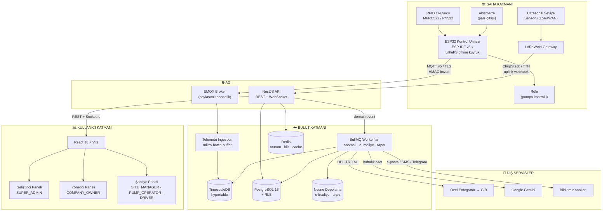
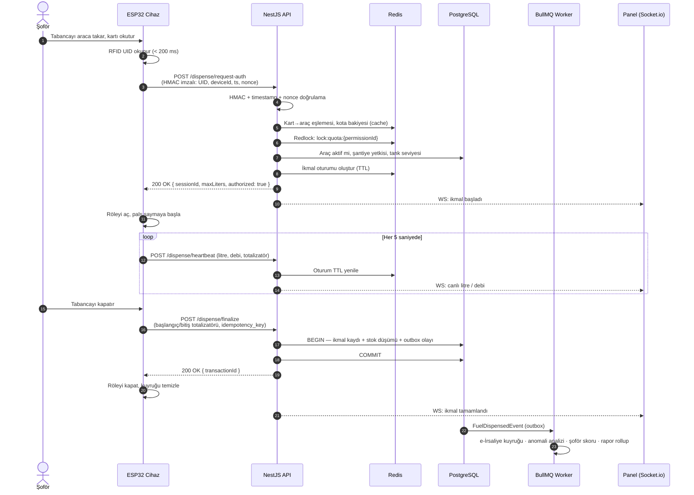
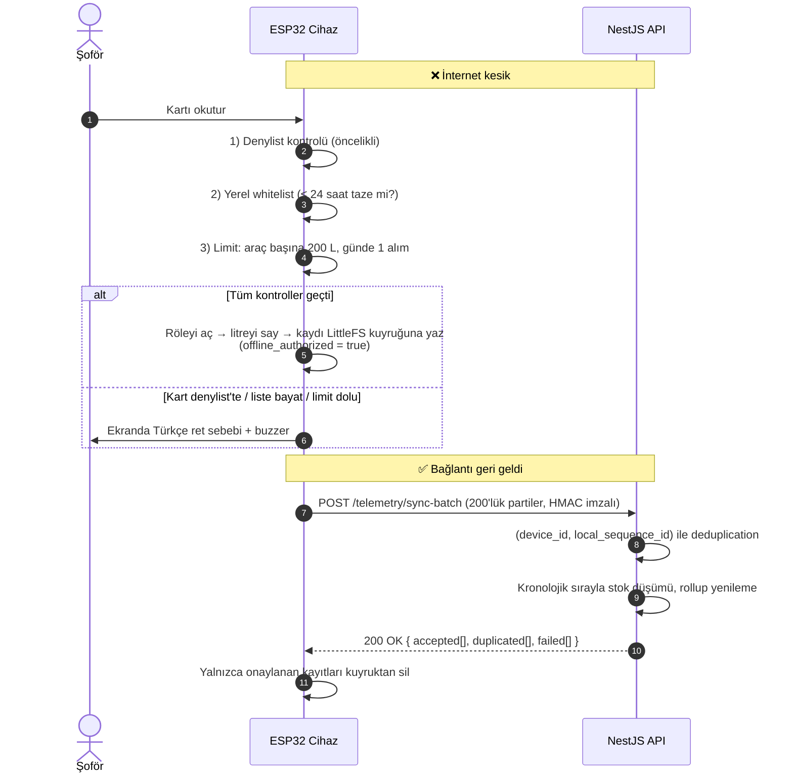
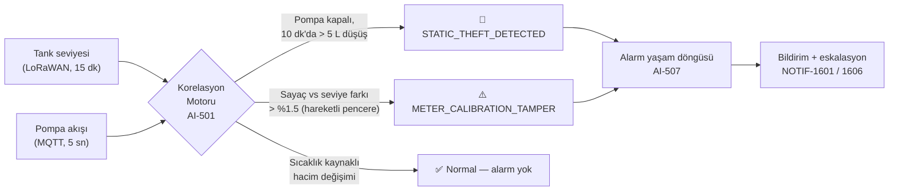
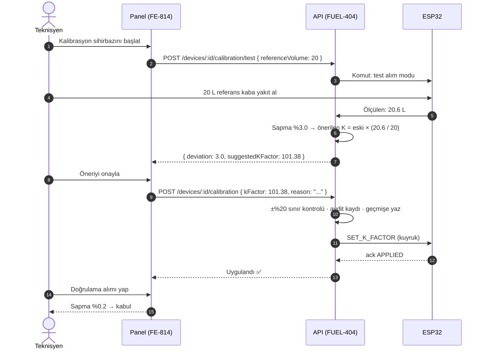

# 🛠️ PROJE REHBERİ — Ekip Çalışma Kılavuzu

> **Bu dokümanın amacı:** Projeye yeni katılan bir geliştiricinin, bu dosyayı okuyup GitHub issue listesinden modül koduyla bir iş alıp **kimseye soru sormadan** başlayabilmesi.
> **Okuma süresi:** ~30 dakika · **Ortam kurulumu:** ~30 dakika
> **Kural:** Konuşma ve doküman dili Türkçe; kod, değişken, endpoint ve tablo isimleri İngilizce.
> Terimler için: [`SOZLUK.md`](./SOZLUK.md) · İş listesi için: [`ISSUES_ROADMAP.md`](./ISSUES_ROADMAP.md) · Sunum için: [`SUNUM-REHBERI.md`](./SUNUM-REHBERI.md)

---

## İçindekiler

1. [Proje nedir, ne değildir](#1-proje-nedir-ne-değildir)
2. [Modül haritası (18 grup)](#2-modül-haritası-18-grup)
3. [Sistem mimarisi](#3-sistem-mimarisi)
4. [Veri akışı ve ikmal sekansı](#4-veri-akışı-ve-ikmal-sekansı)
5. [Teknoloji yığını ve gerekçeleri](#5-teknoloji-yığını-ve-gerekçeleri)
6. [Repo yapısı ve çalışma kuralları](#6-repo-yapısı-ve-çalışma-kuralları)
7. [Ortam kurulumu (adım adım)](#7-ortam-kurulumu-adım-adım)
8. [Veritabanı şeması](#8-veritabanı-şeması)
9. [API sözleşmesi](#9-api-sözleşmesi)
10. [MQTT topic şeması ve donanım protokolü](#10-mqtt-topic-şeması-ve-donanım-protokolü)
11. [Rol / yetki matrisi](#11-rol--yetki-matrisi)
12. [Rapor kataloğu](#12-rapor-kataloğu)
13. [Kritik mimari kararlar](#13-kritik-mimari-kararlar)
14. [Yol haritası](#14-yol-haritası)
15. [Test stratejisi](#15-test-stratejisi)
16. [Saha devreye alma checklist'i](#16-saha-devreye-alma-checklisti)
17. [Riskler ve önlemler](#17-riskler-ve-önlemler)

---

## 1. Proje nedir, ne değildir

### Ne yapıyoruz

Şantiyelerdeki yakıt pompalarını ve tankları internete bağlayıp, **araç bazlı yakıt alımını insan müdahalesi olmadan kayıt altına alan çok kiracılı (multi-tenant) bir SaaS platformu** kuruyoruz.

Temel akış tek cümlede: *Tabanca araca takılır → RFID okunur → sunucu 200 ms altında yetki verir → röle pompayı açar → akışmetre litreyi sayar → tabanca kapanır → değiştirilemez bir ikmal kaydı, stok düşümü ve e-İrsaliye oluşur.*

### Çözdüğümüz problemler

| Problem | Çözümümüz |
|---|---|
| Elle tutulan yakıt defteri, kayıt dışı ikmal | Otomatik, değiştirilemez kayıt (`FUEL-401`) |
| Yakıt kaçağı ve sifonlama | İki bağımsız ölçümün (sayaç + tank seviyesi) korelasyonu (`AI-501`) |
| Sayaca müdahale / bozuk sayaç | Sapma tespiti + uzaktan kalibrasyon (`AI-501.2`, `FUEL-404`) |
| Yetkisiz araç/kişi alımı | RFID + kota + kart blokajı (`FUEL-401.1`, `AUTH-210`) |
| İş makinesinin yakıtsız kalması | Seviye takibi + tahmini bitiş uyarısı (`INV-1504`) |
| Ortak şantiyede mahsuplaşma tartışması | Çapraz alım kotası + mahsuplaşma raporu (`FUEL-402`, `REP-715`) |
| Elle irsaliye kesme | GİB UBL-TR 1.2 e-İrsaliye otomasyonu (`COMP-601`) |
| Ay sonu raporlama yükü | 13 hazır rapor + zamanlanmış gönderim (`REP-700`) |

### Kapsam DIŞI (bilinçli olarak yapmıyoruz)

- **Ödeme/tahsilat entegrasyonu.** Lisans modeli tutulur (`BILL-17xx`), tahsilat yapılmaz.
- **Muhasebe/ERP defteri.** e-İrsaliye üretilir ve entegratöre iletilir; muhasebe kaydı müşterinin kendi sisteminde kalır.
- **Araç takip (GPS filo yönetimi).** Konum yalnızca şantiye geofence'i düzeyinde kullanılır; rota/hız takibi yoktur.
- **Plaka tanıma kamerası (ANPR).** İleride değerlendirilecek fikir; bu kapsamda yok.
- **Mobil uygulama.** Arayüz responsive web'dir; native uygulama yoktur (PWA yol haritasında).
- **Akaryakıt istasyonu perakende satışı.** Sistem kapalı devre şantiye ikmali içindir; POS/pompa otomasyonu ticari satış senaryosu kapsam dışıdır.
- **Pompa donanımının kendisi.** Mevcut pompa korunur; üzerine kontrol ünitesi eklenir.

---

## 2. Modül haritası (18 grup)

| Kod | Modül | Ne yapar | Kime bağlı | Katman |
|---|---|---|---|---|
| `ARCH-1xx` | Mimari & Multi-tenancy | Tenant izolasyonu (RLS), olay veri yolu, telemetri ingestion, feature-flag, onboarding | — (temel) | backend, database |
| `AUTH-2xx` | Kimlik & Güvenlik | JWT rotasyonu, RBAC, donanım HMAC doğrulaması, audit trail, otomatik kullanıcı üretimi | `ARCH` | backend |
| `IOT-3xx` | Donanım Haberleşmesi | MQTT ingestion, LoRaWAN decoder, offline batch sync, provisioning, komut kuyruğu, OTA servisi | `ARCH`, `AUTH` | backend |
| `FW-13xx` | ESP32 Firmware | Saha cihazının kendisi: RFID, röle, pals sayımı, offline kuyruk, HMAC, OTA, watchdog | `IOT`, `AUTH`, `DOC-1202` | firmware |
| `FUEL-4xx` | Akaryakıt Otomasyonu | İkmal handshake, heartbeat, kota motoru, hacim hesabı, K-factor kalibrasyonu, mutabakat | `IOT`, `ARCH` | backend |
| `FLEET-14xx` | Filo & Araç | Araç/sürücü kartları, RFID eşleştirme, km/motor-saat, tüketim hesabı, bakım | `ARCH` | backend |
| `INV-15xx` | Stok & Maliyet | Tank tanımı, tedarikçi, dolum irsaliyesi, birim fiyat, fire, envanter | `ARCH`, `FUEL` | backend |
| `AI-5xx` | Anomali & AI | Debi-seviye korelasyonu, tüketim anomalisi, mesai dışı alım, şoför skoru, alarm yaşam döngüsü | `FUEL`, `ARCH-103` | backend |
| `COMP-6xx` | Mevzuat | UBL-TR e-İrsaliye, entegratör istemcisi, devre kesici, KVKK | `FUEL` | backend |
| `REP-7xx` | Raporlama | Ortak rapor çatısı, stream Excel/PDF/CSV, şifreli arşiv, **13 rapor** | `ARCH-103.3`, tüm veri modülleri | backend |
| `FE-8xx` | Frontend | Üç panel, canlı telemetri, rol bazlı guard'lar, ekran envanteri | `AUTH`, `ARCH` | frontend |
| `NOTIF-16xx` | Bildirim & Alarm | E-posta, SMS, Telegram, webhook; abonelik, sessize alma, eskalasyon | `ARCH-102` | backend |
| `RES-9xx` | Dayanıklılık | Girdi doğrulama, global hata yönetimi, graceful shutdown/degradation | `ARCH` | backend |
| `TEST-10xx` | Test | Testcontainers, k6, Playwright, HIL, tenant izolasyon testi | tüm modüller | backend, infra |
| `OPS-11xx` | DevOps | Docker, CI/CD, ortam yönetimi, secret, yedekleme, izleme, alerting | `ARCH-100` | infra |
| `DOC-12xx` | Doküman | Swagger, **Donanım Entegrasyon Şartnamesi**, bu rehber, saha prosedürü, operatör el kitabı | tüm modüller | infra |
| `BILL-17xx` | Lisans (FAZ 5) | Paketler, cihaz/şantiye lisans sayacı, kullanım ölçümü | `ARCH-106` | backend |
| `HR-18xx` | İnsan Kaynakları (FAZ 5) | Personel izin takibi | `FLEET-1403` | backend |

**Bağımlılık yönü:** `ARCH` → `AUTH` → `IOT` → `FW` / `FUEL` → `AI` / `COMP` / `REP` → `FE`. `RES`, `TEST`, `OPS`, `DOC` yatay kesen modüllerdir.

---

## 3. Sistem mimarisi



### Katman sorumlulukları

| Katman | Sorumluluk | Güvenmediği taraf |
|---|---|---|
| **Firmware** | Ölçmek, röleyi güvenli sürmek, çevrimdışı çalışmak | Sunucuya körü körüne güvenmez — yerel limitleri vardır |
| **Backend** | Yetkilendirmek, kaydetmek, analiz etmek | Cihaza güvenmez — her paketin HMAC imzasını doğrular |
| **Veritabanı** | Tenant izolasyonunu **zorlamak** | Uygulama koduna güvenmez — RLS politikaları uygular |
| **Frontend** | Göstermek, kullanılabilir kılmak | Kendi guard'ları güvenlik değil kullanılabilirlik önlemidir |

---

## 4. Veri akışı ve ikmal sekansı

### 4.1 İkmal sekansı (mutlu yol)



### 4.2 Çevrimdışı akış (hibrit fail-open)



### 4.3 Kaçak tespiti akışı



---

## 5. Teknoloji yığını ve gerekçeleri

| Katman | Seçim | Neden bu? |
|---|---|---|
| Backend | **NestJS 10 + TypeScript** | Modül/DI yapısı bu ölçekte (18 modül) dosya kalabalığını yönetilebilir kılar; guard/interceptor mekanizması RLS context'i ve HMAC doğrulaması için doğal yer sağlar |
| ORM | **Drizzle ORM** | SQL'e yakın, tip güvenli; RLS ve TimescaleDB için gereken raw SQL'i engellemeden yazmaya izin verir (Prisma bu noktada zorlar) |
| Veritabanı | **PostgreSQL 16 + RLS** | Tenant izolasyonunu uygulama koduna değil veritabanına yaptırıyoruz; tek bir unutulmuş `WHERE` sızıntı üretmesin |
| Zaman serisi | **TimescaleDB** | 300 cihaz × 5 sn ≈ günde 5,2 M satır. Otomatik chunk + %80 üzeri sıkıştırma + continuous aggregate olmadan disk ve sorgu süresi kontrolden çıkar |
| Cache / kilit | **Redis + ioredis + Redlock** | 200 ms yetki bütçesi için sıcak veri önbelleği; kota yarışları için dağıtık kilit |
| Kuyruk | **BullMQ** | Kalıcı kuyruk, retry/backoff, DLQ ve tekrarlı (repeatable) job — e-İrsaliye ve anomali işleri için gerekli |
| Mesajlaşma | **EMQX 5 (MQTT v5)** | Paylaşımlı abonelik (`$share/`) çok örnekli backend'de mükerrer işlemeyi önler; LWT ile anlık offline tespiti |
| LoRaWAN | **ChirpStack / TTN** | Tank sensörleri için kilometrelerce menzil, düşük güç |
| Realtime | **Socket.io** | Panel canlı telemetrisi; otomatik yeniden bağlanma ve oda (room) modeli tenant izolasyonuna uyar |
| Frontend | **React 18 + Vite + TanStack Query v5 + Zustand** | Mevcut prototip bu yığında; TanStack Query sunucu durumu, Zustand canlı telemetri gibi istemci durumu için ayrışır |
| Firmware | **ESP-IDF v5.x** | Gerçek task watchdog, güvenli OTA + A/B rollback, NVS şifreleme, secure boot, brown-out detector. Röle süren bir cihazda Arduino'nun sunduğu güvenceler yetersiz |
| AI | **Google Gemini (`@google/genai`)** | Haftalık/aylık yönetim özeti; yapılandırılmış JSON çıktı ile doğrulanabilir |
| Mevzuat | **UBL-TR 1.2 + özel entegratör (adapter)** | Sağlayıcı henüz netleşmedi; adapter pattern ile tek sınıf değişimiyle geçiş yapılabilir |
| DevOps | **Docker multi-stage + GitHub Actions + Trivy** | <150 MB imaj, non-root, her PR'da güvenlik taraması |
| Test | **Vitest + Testcontainers + k6 + Playwright** | Gerçek PostgreSQL/Redis ile entegrasyon, gerçek tarayıcıyla e2e, gerçek yükle stres |
| Gözlemlenebilirlik | **Pino + Prometheus + Grafana + Sentry** | JSON yapısal log + `trace_id` korelasyonu |

---

## 6. Repo yapısı ve çalışma kuralları

### 6.1 Hedef klasör yapısı (`ARCH-100` sonrası)

```text
/
├── apps/
│   ├── backend/                  # NestJS API + worker'lar
│   │   ├── src/
│   │   │   ├── modules/          # arch, auth, iot, fuel, fleet, inventory, ai, compliance, reporting, notification
│   │   │   ├── db/schema/        # Drizzle tablo tanımları (tablo başına dosya)
│   │   │   ├── db/migrations/    # drizzle-kit + raw SQL (RLS, hypertable)
│   │   │   └── common/           # guard, interceptor, filter, tenant context
│   │   └── test/
│   └── frontend/                 # React + Vite (mevcut src/ buraya taşınır)
│       └── src/{pages,components,layouts,hooks,stores,api}
├── packages/
│   └── shared/                   # Ortak tip, enum, Zod şemaları (framework bağımsız)
├── firmware/                     # ESP-IDF projesi
│   ├── main/                     # uygulama görevleri
│   ├── components/               # rfid, flowmeter, relay, offline_queue, crypto, ota
│   └── test/                     # unit + HIL senaryoları
├── infra/
│   ├── docker/                   # Dockerfile'lar
│   ├── compose/                  # docker-compose geliştirme ortamı
│   └── monitoring/               # Prometheus kuralları, Grafana dashboard'ları
├── scripts/roadmap/              # Issue kataloğu ve senkronizasyon motoru
└── docs/                         # Bu klasör
```

### 6.2 Branch stratejisi

| Branch | Amaç | Kural |
|---|---|---|
| `main` | Üretime çıkan kod | Doğrudan push kapalı; yalnızca PR ile |
| `feat/<KOD>-kisa-aciklama` | Yeni özellik | Örn. `feat/FUEL-404-kfactor-kalibrasyon` |
| `fix/<KOD>-kisa-aciklama` | Hata düzeltme | Örn. `fix/IOT-301-reconnect-loop` |
| `chore/<KOD>-...` | Altyapı, bağımlılık, doküman | — |

**Kural:** Branch adı **her zaman modül kodunu içerir**. Böylece branch ↔ issue ↔ dokümantasyon zinciri kopmaz.

### 6.3 Commit kuralları (Conventional Commits + modül kodu)

```
<tip>(<modül-kodu>): <özet>

<gövde: neden yapıldı, hangi uç durumlar düşünüldü>

Refs: #<issue-no>
```

Örnek:
```
feat(FUEL-404.1): K-factor uzaktan kalibrasyon komutu ve ack takibi

Kalibrasyon komutu device_shadow üzerinden kuyruğa alınır; cihaz ack
göndermeden değişiklik "uygulandı" sayılmaz. ±%20 üzeri değişiklikler
ikinci onay ister. Tüm değişiklikler kalıcı geçmişe yazılır.

Refs: #97
```

Tipler: `feat`, `fix`, `chore`, `refactor`, `test`, `docs`, `perf`, `security`.

### 6.4 PR kuralları

- **Başlık:** `[MODÜL-KODU] Kısa açıklama` — örn. `[FUEL-404.1] K-factor kalibrasyon komutu`
- **Gövde:** ne yapıldı · nasıl test edildi · ekran görüntüsü (arayüz işiyse) · kabul kriterlerinin karşılandığının işaretlenmesi
- **Kapatma:** `Closes #<issue-no>`
- **Zorunlu geçmesi gerekenler:** lint, typecheck, unit test, Trivy taraması
- **Boyut:** 400 satırdan büyük PR'lar bölünmelidir; issue'lar zaten 0,5–3 günlük olacak şekilde parçalandı
- **Gözden geçirme:** En az 1 onay. `P0-blocker` ve `type:security` etiketli işlerde 2 onay.

### 6.5 Bir issue'ya nasıl başlanır

1. `ISSUES_ROADMAP.md`'den veya GitHub'dan bir issue seç — **bloklayanları kapanmış olmalı**.
2. Issue'yu kendine ata, `in progress` durumuna al.
3. Branch aç: `feat/<KOD>-...`
4. Issue gövdesindeki **Kapsam** maddelerini sırayla işaretleyerek ilerle.
5. **Kabul Kriterleri** bölümündeki her madde için test yaz.
6. **Teknik Notlar & Uç Durumlar** bölümünü atlamadan oku — oradaki uyarılar sahada yaşanmış/öngörülmüş sorunlardır.
7. PR aç, `Closes #<no>` yaz.

---

## 7. Ortam kurulumu (adım adım)

### 7.1 Gereksinimler

| Araç | Sürüm | Not |
|---|---|---|
| Node.js | ≥ 20 LTS | `argon2` native binding derlemesi için build araçları gerekebilir |
| pnpm | ≥ 9 | `corepack enable` ile gelir |
| Docker + Compose | güncel | Postgres/Timescale, Redis, EMQX için |
| Git | ≥ 2.40 | — |
| ESP-IDF | v5.x | Yalnızca firmware geliştirenler için |

### 7.2 Backend + Frontend

```bash
git clone https://github.com/rtosma/YAKITTAKIPSISTEMI.git
cd YAKITTAKIPSISTEMI

corepack enable && pnpm install

# 1) Altyapı servislerini başlat (Postgres+Timescale, Redis, EMQX, MinIO)
docker compose -f infra/compose/docker-compose.dev.yml up -d

# 2) Ortam değişkenleri
cp .env.example .env      # zorunlu alanlar .env.example içinde açıklanmıştır

# 3) Şema ve örnek veri
pnpm db:migrate
pnpm db:seed              # 2 tenant, 3 şantiye, 5 araç, 2 tank, 1 pompa, her rolden kullanıcı

# 4) Çalıştır
pnpm --filter backend dev     # http://localhost:3000  (Swagger: /api/v1/docs)
pnpm --filter frontend dev    # http://localhost:5173
```

**Seed kullanıcıları** (yalnızca geliştirme ortamı): `dev-superadmin`, `dev-owner`, `dev-sitemanager`, `dev-operator`, `dev-driver` — parolalar `pnpm db:seed` çıktısında yazar.

### 7.3 Firmware (ESP-IDF)

```bash
cd firmware
idf.py set-target esp32
idf.py menuconfig          # WiFi, sunucu adresi, kart okuyucu pinleri
idf.py build
idf.py -p /dev/ttyUSB0 flash monitor
```

İlk açılışta cihaz **kurulum modunda** AP açar (`FW-1317`): telefonla bağlanıp WiFi/APN, sunucu adresi ve claim kodu girilir.

### 7.4 Sık karşılaşılan kurulum sorunları

| Belirti | Sebep | Çözüm |
|---|---|---|
| `argon2` derleme hatası | Build araçları eksik | Linux: `build-essential python3` · macOS: Xcode CLT |
| Port çakışması (5432/6379/1883) | Yerelde başka servis çalışıyor | `infra/compose/.env` içinden portları değiştir |
| `relation "sensor_telemetry" does not exist` | Hypertable migration'ı atlanmış | `pnpm db:migrate` tekrar çalıştır; TimescaleDB eklentisinin yüklü olduğunu doğrula |
| MQTT bağlanamıyor | EMQX kimlik/ACL kurulmamış | Compose başlangıç betiği çalışmamıştır; `docker compose logs emqx` |
| RLS nedeniyle boş sonuç | Sorgu `withTenant()` dışında çalışıyor | Repository çağrısını sarmalayıcı içine al (`ARCH-101.2`) |

---

## 8. Veritabanı şeması

> Tam DDL `apps/backend/src/db/schema/` altındadır. Aşağıdaki tablo ana varlıkları ve kritik alanları özetler.
> **Kural:** Tenant'a ait her tabloda `tenant_id UUID NOT NULL` bulunur ve RLS etkindir.

### 8.1 Ana tablolar

| Tablo | Kritik alanlar | Notlar |
|---|---|---|
| `tenants` | `id`, `name`, `vkn_tckn` (uniq), `tax_office`, `license_status` (TRIAL/ACTIVE/SUSPENDED/CLOSED), `license_expires_at`, `active_modules` (JSONB), `contact_email` | RLS'in kök varlığı |
| `sites` | `id`, `tenant_id`, `name`, `code`, `latitude`, `longitude`, `geofence_radius_meters`, `emergency_stop_status`, `is_active` | Şantiye |
| `users` | `id`, `tenant_id`, `site_id`, `username` (uniq/tenant), `email`, `password_hash` (argon2id), `role`, `must_change_password`, `is_active`, `failed_login_count`, `locked_until` | `AUTH-201`, `AUTH-204` |
| `tanks` | `id`, `tenant_id`, `site_id`, `name`, `fuel_type`, `max_capacity_liters`, `dead_volume_liters`, `min_critical_threshold_liters`, `geometry` (JSONB), `strapping_table_id`, `lora_dev_eui`, `sensor_mount_height_mm`, `current_level_liters`, `temp_celsius`, `last_telemetry_at` | `current_level_liters` yalnızca önbellektir; gerçek kaynak telemetridir |
| `strapping_tables` | `id`, `tenant_id`, `tank_id`, `points` (JSONB: `[{mm, liters}]`), `version`, `uploaded_by`, `created_at` | Değişiklikte yeni sürüm; geçmiş hesap bozulmaz |
| `pumps` | `id`, `tenant_id`, `tank_id`, `device_id`, `nozzle_no`, `status` (IDLE/PUMPING/ERROR/EMERGENCY_LOCKED), `k_factor`, `totalizer_liters_lifetime`, `current_flow_rate_lpm`, `last_heartbeat_at` | Bir tank birden çok pompayı besleyebilir |
| `devices` | `id`, `tenant_id`, `site_id`, `serial_no` (uniq), `mac`, `model`, `hw_revision`, `firmware_version`, `secret_hash`, `secret_rotated_at`, `status`, `health_score`, `claimed_at` | `IOT-304`, `AUTH-202.3` |
| `device_shadow` | `device_id`, `desired` (JSONB), `reported` (JSONB), `last_synced_at` | `IOT-305` |
| `device_commands` | `id`, `device_id`, `type`, `payload` (JSONB), `status` (PENDING/SENT/ACKED/TIMEOUT/FAILED), `issued_by`, `issued_at`, `acked_at` | Komut geçmişi, audit |
| `vehicles` | `id`, `tenant_id`, `site_id`, `plate_or_code` (uniq/tenant), `vehicle_type`, `brand_model`, `fuel_type`, `tank_capacity_liters`, `measure_unit` (KM/HOUR), `fuel_quota_monthly_liters`, `is_fueling_blocked`, `is_active` | Plakasız iş makineleri için `code` |
| `rfid_tags` | `id`, `tenant_id`, `uid` (uniq), `assigned_type` (VEHICLE/DRIVER), `assigned_id`, `status` (ACTIVE/LOST/BLOCKED/REPLACED), `blocked_at` | Denylist kaynağı |
| `drivers` | `id`, `tenant_id`, `assigned_site_id`, `full_name`, `tc_no` (maskeli sunulur), `phone`, `license_classes`, `performance_score`, `is_active` | KVKK kapsamı |
| `fuel_transactions` | `id`, `tenant_id`, `site_id`, `tank_id`, `pump_id`, `vehicle_id`, `driver_id`, `start_totalizer`, `end_totalizer`, `pumped_liters`, `unit_cost`, `total_cost`, `duration_seconds`, `avg_flow_rate_lpm`, `auth_mode` (RFID/MANUAL/OFFLINE), `offline_authorized`, `device_time`, `server_received_at`, `idempotency_key` (uniq), `local_sequence_id`, `hash_signature`, `invoice_status` | **Değiştirilemez mali kayıt** — UPDATE/DELETE veritabanı düzeyinde kapalı |
| `dispense_sessions` | Redis'te tutulur (TTL) | Kalıcı değildir; yalnızca devam eden ikmaller |
| `quotas` / `cross_site_permissions` | `id`, `tenant_id`, `source_site_id`, `target_site_id`, `vehicle_id`, `liters`, `period` (DAILY/WEEKLY/MONTHLY/ONE_TIME), `valid_from`, `valid_to`, `rollover`, `consumed_liters`, `reserved_liters` | `FUEL-402` |
| `fuel_deliveries` | `id`, `tenant_id`, `tank_id`, `supplier_id`, `waybill_no`, `delivered_liters`, `measured_liters`, `unit_price`, `vat`, `sct`, `delivered_at`, `document_url` | Tank dolumu (`FUEL-408`) |
| `suppliers` | `id`, `tenant_id`, `name`, `vkn`, `contact` | `INV-1502` |
| `stock_reconciliations` | `id`, `tenant_id`, `tank_id`, `period_start`, `period_end`, `opening`, `deliveries`, `dispensed`, `theoretical_closing`, `measured_closing`, `difference_liters`, `difference_pct`, `loss_class` | `FUEL-409` |
| `odometer_readings` | `id`, `tenant_id`, `vehicle_id`, `period`, `value`, `unit`, `entered_by`, `corrected_from`, `created_at` | Append-only (`FLEET-1404`) |
| `calibration_history` | `id`, `tenant_id`, `device_id`, `old_k_factor`, `new_k_factor`, `change_pct`, `reason`, `reference_volume`, `measured_volume`, `deviation_pct`, `changed_by`, `ack_status`, `created_at` | Silinemez (`FUEL-404`) |
| `anomalies` | `id`, `tenant_id`, `site_id`, `type`, `severity`, `discrepancy_liters`, `confidence_score`, `status` (OPEN/ACKNOWLEDGED/INVESTIGATING/RESOLVED/FALSE_POSITIVE), `assigned_to`, `evidence` (JSONB), `resolved_at` | `AI-501`, `AI-507` |
| `audit_logs` | `id`, `tenant_id`, `user_id`, `ip`, `trace_id`, `action`, `target_type`, `target_id`, `before` (JSONB), `after` (JSONB), `created_at` | **Append-only**: UPDATE/DELETE PostgreSQL düzeyinde REVOKE |
| `e_invoices` | `id`, `tenant_id`, `transaction_id`, `document_no`, `uuid`, `status`, `gib_code`, `reject_reason`, `xml_url`, `pdf_url`, `sent_at`, `responded_at` | `COMP-601/602` |
| `notifications` | `id`, `tenant_id`, `user_id`, `event_type`, `channel`, `status`, `payload` (JSONB), `sent_at`, `read_at` | `NOTIF-1601` |

### 8.2 TimescaleDB hypertable

```sql
-- sensor_telemetry: ham telemetri (ARCH-103.1)
SELECT create_hypertable('sensor_telemetry', 'timestamp', chunk_time_interval => INTERVAL '1 day');

ALTER TABLE sensor_telemetry SET (
  timescaledb.compress,
  timescaledb.compress_segmentby = 'device_id',
  timescaledb.compress_orderby   = 'timestamp DESC'
);

SELECT add_compression_policy('sensor_telemetry', INTERVAL '90 days');
SELECT add_retention_policy('sensor_telemetry', INTERVAL '365 days');
```

| Alan | Tip | Açıklama |
|---|---|---|
| `timestamp` | TIMESTAMPTZ | Partition anahtarı (UTC) |
| `tenant_id`, `device_id` | UUID | RLS + segmentby |
| `device_type` | TEXT | TANK / PUMP / LORA_GATEWAY |
| `raw_level_mm`, `volume_liters`, `volume_liters_15c` | NUMERIC | Ham ve sıcaklık düzeltilmiş hacim |
| `flow_rate_lpm`, `totalizer_liters` | NUMERIC | Pompa verisi |
| `temp_c`, `rssi_dbm`, `snr`, `battery_volts` | NUMERIC | Sensör sağlığı |

**Saklama stratejisi:** ham veri 90 gün sıkıştırılmamış → 90-365 gün sıkıştırılmış (%80+ kazanç) → 365 gün sonrası düşürülür. **Rollup (continuous aggregate) verisi süresiz saklanır**; raporlar bunu okur. `fuel_transactions` ve `e_invoices` **hiçbir koşulda otomatik silinmez** (öneri: 10 yıl).

---

## 9. API sözleşmesi

> Taban yol: `/api/v1` · Kimlik: `Authorization: Bearer <access_token>` · Cihaz uçları: `X-Hardware-Signature` + `X-Device-Id`
> Tam ve güncel referans: **Swagger UI → `/api/v1/docs`** (`DOC-1201`)

### 9.1 Standart yanıt zarfı

```jsonc
// Başarılı
{ "success": true, "data": { /* ... */ }, "meta": { "page": 1, "pageSize": 50, "total": 1284 } }

// Hatalı
{ "success": false, "traceId": "0f9c1a...", "message": "Kota doldu",
  "code": "QUOTA_EXHAUSTED", "fields": { "liters": "Kalan kota: 0 L" } }
```

### 9.2 Uç nokta listesi (özet)

| Yöntem | Yol | Rol | Açıklama |
|---|---|---|---|
| `POST` | `/auth/login` | herkes | Giriş — access + refresh token |
| `POST` | `/auth/refresh` | herkes | Token rotasyonu (tek kullanımlık) |
| `POST` | `/auth/logout` | oturumlu | Oturumu sonlandır |
| `POST` | `/auth/change-password` | oturumlu | İlk giriş / normal değişiklik |
| `POST` | `/auth/forgot-password` · `/auth/reset-password` | herkes | Parola sıfırlama |
| `GET` | `/auth/sessions` · `DELETE /auth/sessions/:id` | oturumlu | Aktif oturumlar |
| `GET` | `/me` · `/me/modules` | oturumlu | Profil ve açık modüller |
| `POST` `GET` | `/admin/tenants` | SUPER_ADMIN | Firma provisioning ve liste |
| `PATCH` | `/admin/tenants/:id/modules` | SUPER_ADMIN | Modül aç/kapa |
| `POST` `GET` | `/sites` | COMPANY_OWNER | **Şantiye + kullanıcı/parola üretimi** |
| `GET` `POST` `PATCH` | `/vehicles` · `/drivers` | COMPANY_OWNER, SITE_MANAGER | Filo yönetimi |
| `POST` | `/rfid-tags/:uid/block` | COMPANY_OWNER | Kart blokajı → denylist |
| `GET` `POST` | `/tanks` · `/pumps` | COMPANY_OWNER | Varlık yönetimi |
| `POST` | `/tanks/:id/strapping-table` | COMPANY_OWNER | CSV cetvel yükleme |
| `POST` | `/devices/claim` | COMPANY_OWNER | Cihaz eşleştirme |
| `POST` | `/devices/:id/commands` | SUPER_ADMIN, COMPANY_OWNER | Uzaktan komut |
| `POST` | `/devices/:id/calibration` | COMPANY_OWNER | **K-factor değişikliği** (audit'li) |
| `POST` | `/devices/:id/calibration/test` | COMPANY_OWNER | Test alımı ve sapma hesabı |
| `POST` | **`/dispense/request-auth`** | 🔧 cihaz | **Yetki kontrolü — P95 < 200 ms** |
| `POST` | `/dispense/heartbeat` | 🔧 cihaz | 5 sn'de bir canlı durum |
| `POST` | **`/dispense/finalize`** | 🔧 cihaz | İkmali kesinleştir (idempotent) |
| `POST` | `/dispense/manual` | SITE_MANAGER + COMPANY_OWNER onayı | Manuel ikmal girişi |
| `POST` | **`/telemetry/sync-batch`** | 🔧 cihaz | Çevrimdışı toplu yükleme |
| `POST` | `/lorawan/uplink` | 🔧 ağ sunucusu | LoRaWAN webhook |
| `GET` | `/transactions` | tümü (kapsamlı) | İkmal hareketleri (filtre + sayfalama) |
| `POST` `GET` | `/odometer-readings` | SITE_MANAGER | Km / motor-saat girişi |
| `GET` `POST` | `/quotas` · `/cross-site-permissions` | COMPANY_OWNER | Çapraz alım ve kota |
| `GET` `POST` | `/deliveries` | COMPANY_OWNER | Tank dolumu (irsaliye) |
| `GET` | `/reconciliations` | COMPANY_OWNER | Mutabakat kayıtları |
| `GET` `PATCH` | `/anomalies` | SITE_MANAGER+ | Alarm listesi ve yaşam döngüsü |
| `GET` | `/reports` · `/reports/:key` | rapora göre | Rapor kataloğu ve üretimi |
| `POST` | `/reports/:key/export` | rapora göre | Excel / PDF / CSV (büyükse kuyruğa) |
| `POST` `GET` | `/archives` | COMPANY_OWNER | Şifreli ZIP arşiv |
| `GET` | `/e-invoices` | COMPANY_OWNER | e-İrsaliye durumları |
| `GET` | `/audit-logs` | COMPANY_OWNER, SUPER_ADMIN | Denetim kayıtları |
| `GET` | `/health/live` · `/health/ready` | herkes | Sağlık kontrolleri |

### 9.3 Kritik uç: `POST /dispense/request-auth`

```jsonc
// İstek (cihazdan, HMAC imzalı)
{
  "deviceId": "b3f1...",
  "nozzleNo": 1,
  "cardUid": "04A3B2C1",
  "timestamp": 1755500000,
  "nonce": "9f2c8a1b",
  "startTotalizer": 128456.72
}

// Yanıt — onaylandı
{ "success": true, "data": {
    "authorized": true,
    "sessionId": "sess_01H...",
    "vehicle": { "id": "...", "plate": "34 ABC 123", "fuelType": "DIESEL" },
    "maxLiters": 180.0,          // depo kapasitesi, kota ve limitlerin en küçüğü
    "maxDurationSeconds": 900,
    "heartbeatIntervalMs": 5000
} }

// Yanıt — reddedildi
{ "success": false, "code": "QUOTA_EXHAUSTED",
  "message": "Aylık kota doldu",
  "data": { "authorized": false, "displayMessage": "KOTA DOLDU" } }
```

**Ret kodları:** `CARD_UNKNOWN` · `CARD_BLOCKED` · `VEHICLE_BLOCKED` · `VEHICLE_INACTIVE` · `FUEL_TYPE_MISMATCH` · `QUOTA_EXHAUSTED` · `NO_SITE_PERMISSION` · `TANK_LOW` · `PUMP_LOCKED` · `DEVICE_UNCLAIMED` · `SIGNATURE_INVALID` · `TIMESTAMP_EXPIRED`

---

## 10. MQTT topic şeması ve donanım protokolü

> Bu bölüm özettir. Bağlayıcı ve **test vektörlü** tam şartname: `DOC-1202` — *Donanım Entegrasyon Şartnamesi v1.0*.
> Sunucu ile firmware arasındaki tek doğruluk kaynağı o belgedir; ikisi ayrışırsa saha tümden durur.

### 10.1 Topic şeması

| Yön | Topic | QoS | Açıklama |
|---|---|---|---|
| Cihaz → Sunucu | `telemetry/v1/{tenantId}/{siteId}/{deviceType}/{deviceId}/data` | 1 | Periyodik telemetri |
| Cihaz → Sunucu | `telemetry/v1/{tenantId}/{siteId}/pump/{deviceId}/heartbeat` | 1 | İkmal sırasında 5 sn |
| Cihaz → Sunucu | `events/v1/{tenantId}/{deviceId}/alarm` | 1 | Kartsız akış, sayaç arızası, panik reset |
| Cihaz → Sunucu | `status/v1/{tenantId}/{deviceId}/online` (LWT) | 1 | Bağlantı durumu |
| Sunucu → Cihaz | `command/v1/{tenantId}/{deviceId}/req` | 1 | Komut (kalibrasyon, kilit, saat, whitelist) |
| Cihaz → Sunucu | `command/v1/{tenantId}/{deviceId}/ack` | 1 | Komut onayı |

**Yatay ölçekleme:** backend abonelikleri `$share/ingest/telemetry/v1/#` biçiminde **paylaşımlı abonelik** kullanır; aksi halde her örnek aynı mesajı işler ve mükerrer kayıt oluşur.

### 10.2 Paket imzalama (özet)

```
imzalanacak = kanonik_json(payload) + "." + timestamp + "." + nonce
signature   = HMAC-SHA256(imzalanacak, deviceSecret)   → hex, X-Hardware-Signature
```

- **Kanonik JSON:** anahtarlar alfabetik sırada, boşluksuz, ondalıklar sabit basamakla. İki taraf bayt bayt aynı üretmelidir.
- **Timestamp penceresi:** ±30 saniye (batch sync ucu muaf — orada koruma `local_sequence_id` + imzadır).
- **Nonce:** her pakette benzersiz, sunucuda 120 sn TTL ile saklanır; tekrar reddedilir.
- **Doğrulama:** `crypto.timingSafeEqual` ile sabit zamanlı karşılaştırma.

### 10.3 Komut protokolü

```jsonc
// Sunucu → Cihaz
{ "commandId": "cmd_01H...", "type": "SET_K_FACTOR",
  "payload": { "kFactor": 98.42 }, "issuedAt": 1755500000, "expiresAt": 1755586400 }

// Cihaz → Sunucu (ack)
{ "commandId": "cmd_01H...", "status": "APPLIED", "appliedAt": 1755500123,
  "reported": { "kFactor": 98.42 } }
```

Komut tipleri: `SET_K_FACTOR` · `FORCE_CUTOFF` · `LOCK_PUMP` / `UNLOCK_PUMP` · `SYNC_TIME` · `UPDATE_WHITELIST` · `UPDATE_DENYLIST` · `SET_OFFLINE_POLICY` · `ROTATE_SECRET` · `OTA_UPDATE` · `REBOOT`

**Kurallar:** komutlar idempotenttir · ack alınmadan "uygulandı" gösterilmez · çelişen komutlarda en yenisi kazanır · **ikmal sırasında `SET_K_FACTOR` ve `OTA_UPDATE` ertelenir**.

### 10.4 K-factor kalibrasyon akışı



---

## 11. Rol / yetki matrisi

**Kural:** Varsayılan **deny**. Dekoratörü olmayan endpoint erişime kapalıdır (`AUTH-201.4`).
Tenant izolasyonu veritabanı (RLS), şantiye izolasyonu uygulama katmanı tarafından sağlanır.

| İşlem | SUPER_ADMIN | COMPANY_OWNER | SITE_MANAGER | PUMP_OPERATOR | DRIVER |
|---|:---:|:---:|:---:|:---:|:---:|
| **Firma / Platform** ||||||
| Tüm firmaları görme | ✅ | ❌ | ❌ | ❌ | ❌ |
| Firma oluşturma / dondurma | ✅ | ❌ | ❌ | ❌ | ❌ |
| Modül aç / kapa | ✅ | ❌ | ❌ | ❌ | ❌ |
| Sistem logları, canlı log akışı | ✅ | ❌ | ❌ | ❌ | ❌ |
| **Şantiye ve Kullanıcı** ||||||
| Şantiye oluşturma (+ kullanıcı/parola üretimi) | ✅ | ✅ | ❌ | ❌ | ❌ |
| Şantiye düzenleme / pasifleştirme | ✅ | ✅ | ❌ | ❌ | ❌ |
| Kullanıcı oluşturma / rol atama | ✅ | ✅ | ❌ | ❌ | ❌ |
| Kendi parolasını değiştirme | ✅ | ✅ | ✅ | ✅ | ✅ |
| **Filo** ||||||
| Araç / sürücü tanımlama | ✅ | ✅ | ⚠️ kendi şantiyesi | ❌ | ❌ |
| RFID kart eşleştirme | ✅ | ✅ | ⚠️ kendi şantiyesi | ❌ | ❌ |
| Kart bloke etme | ✅ | ✅ | ⚠️ kendi şantiyesi | ❌ | ❌ |
| Araç limiti tanımlama | ✅ | ✅ | ❌ | ❌ | ❌ |
| Km / motor-saat girişi | ✅ | ✅ | ✅ | ✅ | ❌ |
| **Tank / Cihaz** ||||||
| Tank ve pompa tanımlama | ✅ | ✅ | ❌ | ❌ | ❌ |
| Strapping table yükleme | ✅ | ✅ | ❌ | ❌ | ❌ |
| Cihaz eşleştirme (claim) | ✅ | ✅ | ⚠️ kendi şantiyesi | ❌ | ❌ |
| **K-factor kalibrasyonu** | ✅ | ✅ | ❌ | ❌ | ❌ |
| Uzaktan komut gönderme | ✅ | ⚠️ sınırlı | ❌ | ❌ | ❌ |
| Firmware OTA başlatma | ✅ | ❌ | ❌ | ❌ | ❌ |
| **İkmal** ||||||
| Canlı ikmal ekranı | ✅ | ✅ | ✅ | ✅ | ❌ |
| Acil durdurma | ✅ | ✅ | ✅ | ✅ | ❌ |
| Pompa kilidini açma | ✅ | ✅ | ✅ | ❌ | ❌ |
| Manuel ikmal girişi (talep) | ✅ | ✅ | ✅ | ✅ | ❌ |
| Manuel ikmal **onayı** (2. onay) | ✅ | ✅ | ❌ | ❌ | ❌ |
| İkmal hareketlerini görme | ✅ | ✅ | ⚠️ kendi şantiyesi | ⚠️ kendi şantiyesi | ⚠️ kendi kayıtları |
| **Çapraz alım** ||||||
| Çapraz alım izni / kota tanımlama | ✅ | ✅ | ❌ | ❌ | ❌ |
| Kota kullanımını görme | ✅ | ✅ | ✅ | ❌ | ❌ |
| **Stok / Maliyet** ||||||
| Tank dolumu (irsaliye) girişi | ✅ | ✅ | ✅ | ❌ | ❌ |
| Tedarikçi ve birim fiyat yönetimi | ✅ | ✅ | ❌ | ❌ | ❌ |
| Fire kaydı oluşturma | ✅ | ✅ | ⚠️ talep | ❌ | ❌ |
| **Anomali / Alarm** ||||||
| Alarmları görme | ✅ | ✅ | ⚠️ kendi şantiyesi | ⚠️ kendi şantiyesi | ❌ |
| Alarm atama / kapatma | ✅ | ✅ | ✅ | ❌ | ❌ |
| **Rapor** ||||||
| İkmal, stok, tüketim raporları | ✅ | ✅ | ⚠️ kendi şantiyesi | ❌ | ❌ |
| Maliyet ve bütçe raporu | ✅ | ✅ | ❌ | ❌ | ❌ |
| **Sürücü bazlı rapor** (kişisel veri) | ✅ | ✅ | ❌ | ❌ | ❌ |
| Denetim (audit) raporu | ✅ | ✅ | ❌ | ❌ | ❌ |
| Arşiv paketi oluşturma / indirme | ✅ | ✅ | ❌ | ❌ | ❌ |
| **Mevzuat** ||||||
| e-İrsaliye listesi ve durumu | ✅ | ✅ | ❌ | ❌ | ❌ |
| Belge iptal / yeniden gönderim | ✅ | ✅ | ❌ | ❌ | ❌ |

⚠️ = yalnızca kendi şantiyesi/kaydı kapsamında.

---

## 12. Rapor kataloğu

**Tüm raporlarda ortak:** tarih aralığı + çoklu filtre · sunucu taraflı sayfalama · **Excel (stream) + PDF + CSV** export · zamanlanmış otomatik gönderim (cron → e-posta) · rol bazlı görünürlük · tenant izolasyonu · Excel'de otomatik **GENEL TOPLAM** satırı.

| # | Rapor | Kaynak veri | Ana filtreler | Yetkili roller | Issue |
|---|---|---|---|---|---|
| 1 | **İkmal Hareket Raporu** | `fuel_transactions` | tarih, şantiye, araç, sürücü, tank, yetki tipi | OWNER, SITE_MANAGER⚠️ | `REP-711` |
| 2 | **Araç Bazlı Tüketim** (L/100km, L/saat) | `fuel_transactions` + `odometer_readings` | dönem, araç tipi, şantiye, sapma eşiği | OWNER, SITE_MANAGER⚠️ | `REP-712` |
| 3 | **Şantiye Tüketim ve Stok** | işlemler + dolumlar + telemetri rollup | dönem, şantiye, yakıt tipi | OWNER, SITE_MANAGER⚠️ | `REP-713` |
| 4 | **Tank Mutabakat ve Fire** | `stock_reconciliations` + `loss_records` | dönem, tank, fark eşiği | OWNER | `REP-714` |
| 5 | **Çapraz Alım ve Mahsuplaşma** | işlemler + `cross_site_permissions` | dönem, firma çifti, şantiye | OWNER | `REP-715` |
| 6 | **Anomali ve Alarm** | `anomalies` | tip, durum, şiddet, tarih | OWNER, SITE_MANAGER⚠️ | `REP-716` |
| 7 | **Cihaz Sağlık ve Kesinti** | presence + `devices` + sağlık skoru | cihaz, şantiye, tarih | SUPER_ADMIN, OWNER | `REP-717` |
| 8 | **Kalibrasyon Geçmişi** | `calibration_history` | cihaz, kullanıcı, değişim % | OWNER | `REP-718` |
| 9 | **Maliyet ve Bütçe** | işlemler + `price_history` | dönem, şantiye, araç, yakıt tipi | OWNER | `REP-719` |
| 10 | **Sürücü Bazlı** (kişisel veri) | işlemler + `drivers` + skor | dönem, şantiye, skor aralığı | OWNER | `REP-720` |
| 11 | **e-İrsaliye Durum** | `e_invoices` | durum, GİB kodu, tarih | OWNER | `REP-721` |
| 12 | **Denetim (Audit)** | `audit_logs` | kullanıcı, işlem tipi, tarih | OWNER, SUPER_ADMIN | `REP-722` |
| 13 | **Yönetici Özet Dashboard** | rollup + KPI'lar | dönem, şantiye | OWNER, SITE_MANAGER⚠️ | `REP-723` |
| 14 | *AI Aylık Yönetim Raporu* (FAZ 5) | tüm veriler + Gemini | dönem | OWNER | `REP-724` |

**Performans kuralı:** raporlar ham telemetri taramaz; TimescaleDB continuous aggregate (`ARCH-103.3`) üzerinden çalışır. Dashboard hedefi < 1 sn, 100.000 satırlık export hedefi < 150 MB bellek.

---

## 13. Kritik mimari kararlar

Bu kararlar tartışıldı, gerekçelendirildi ve **değiştirilmeden önce ekipte konuşulmalıdır**.

### K1 — Tenant izolasyonu veritabanı seviyesinde (RLS)
Uygulama katmanındaki `WHERE tenant_id = ?` filtreleri unutulabilir. PostgreSQL RLS + `FORCE ROW LEVEL SECURITY` ile izolasyon veritabanı tarafından zorlanır. Her sorgu `withTenant()` sarmalayıcısı içinde, `SET LOCAL` ile çalışır — `SET` kullanmak bağlantı havuzunda **başka kiracıya sızıntı** üretir; bu, sistemdeki en tehlikeli tek satırlık hatadır. `ARCH-101`

### K2 — Hibrit sınırlı fail-open
Sunucuya ulaşılamadığında: **denylist** kontrolü → yerel whitelist (≤ 24 saat taze) → araç başına 200 L + günde 1 alım. Şantiye durmaz, kaçak riski sınırlı kalır. Tam fail-close seçeneği tenant bazında açılabilir. Çevrimdışı alımlar `offline_authorized` bayrağıyla ayrı raporlanır. `FUEL-410`, `FW-1310`

### K3 — Kota kontrolü kesintide fail-close
K2'nin **tersi**: Redis erişilemezse kota kilidi alınamaz, bu durumda kota gerektiren işlem reddedilir. Gerekçe: kota aşımı (mali/hukuki uyuşmazlık) riski, kısa süreli kesinti riskinden ağırdır. İki karar birbirine karıştırılmamalıdır. `RES-905`

### K4 — Röle çıkışı donanımsal olarak pull-down
MCU resetlendiğinde, kilitlendiğinde veya brown-out yaşandığında röle **kendiliğinden kapanmalıdır**. Yazılım kontrolü ikincil savunmadır. `FW-1303`

### K5 — İkmal kaydı değiştirilemez
`fuel_transactions` üzerinde UPDATE/DELETE veritabanı düzeyinde kapalıdır. Düzeltme, ayrı bir düzeltme kaydıyla yapılır. Litre iki totalizatör okuması farkından hesaplanır; cihazın bildirdiği toplam litreye körü körüne güvenilmez, %1'i aşan fark kaydı "doğrulama bekliyor" işaretler. `FUEL-401.4`

### K6 — Transactional outbox
Veritabanı yazımı ile olay yayımı aynı transaction'da olur. Aksi halde "kaydettim ama olayı yayımlayamadım" durumu stok/e-İrsaliye tutarsızlığı üretir. Tüketiciler idempotenttir. `ARCH-102.1`

### K7 — İki bağımsız ölçüm
Sayaç (pompa) ve seviye (tank) birbirinden bağımsız ölçülür ve sürekli karşılaştırılır. Tek ölçüme dayanan sistem, o ölçüme yapılan müdahaleyi göremez. `AI-501`

### K8 — ESP-IDF, Arduino değil
Gerçek task watchdog, güvenli OTA + A/B rollback, NVS şifreleme, secure boot ve brown-out detector; röle süren ve para değerinde ölçüm yapan bir cihazda zorunludur. `FW-1301`

### K9 — Offline kuyruk sunucu onayı olmadan temizlenmez
Cihaz, hangi kayıtların kabul edildiğini kayıt bazında öğrenmeden kuyruğunu silmez. Kuyruk dolduğunda **en eski kayıt silinmez**, yeni ikmal reddedilir — mali kayıt kaybı kabul edilemez. `FW-1309`, `IOT-303.1`

### K10 — K-factor değişikliği denetim altındadır
Doğrudan faturalanan litreyi belirlediği için yetkisiz değişiklik gizli bir hırsızlık aracıdır. Yetki COMPANY_OWNER ve üzeriyle sınırlı, ±%20 üzeri değişiklik ikinci onay ister, tüm geçmiş silinemez şekilde saklanır, cihaz ack'i olmadan "uygulandı" gösterilmez. `FUEL-404`

---

## 14. Yol haritası

| Faz | Hafta | Milestone | Issue | Çıktı |
|---|---|---|---|---|
| **FAZ 1** | 1-3 | Çekirdek Altyapı & Güvenlik | 35 | Monorepo, RLS multi-tenancy, JWT + HMAC, audit trail, Docker + CI, geliştirme ortamı |
| **FAZ 2** | 4-6 | IoT Haberleşme & Akaryakıt Otomasyonu | 63 | MQTT ingestion, ESP32 firmware, ikmal handshake, kota motoru, K-factor kalibrasyonu, offline sync, filo/tank tanımları, saha panelleri |
| **FAZ 3** | 7-9 | Anomali, Mevzuat & Raporlama | 71 | Hırsızlık motoru, e-İrsaliye, 13 rapor, bildirim kanalları, tüketim analizi |
| **FAZ 4** | 10-12 | Test, Stres Testi & Canlıya Çıkış | 17 | Testcontainers + k6 + Playwright + HIL, izleme/alerting, yedekleme tatbikatı, saha prosedürü |
| **FAZ 5** | sonrası | Kapsam Genişletme (Backlog) | 12 | Lisans/abonelik, İK, bakım-lastik, envanter, laboratuvar, AI aylık rapor |

### Paralel şeritler (3 kişilik ekip önerisi)

| Şerit | FAZ 1 | FAZ 2 | FAZ 3 | FAZ 4 |
|---|---|---|---|---|
| **Backend** | `ARCH-1xx`, `AUTH-2xx`, `RES-9xx` | `IOT-3xx`, `FUEL-4xx`, `FLEET`, `INV` | `AI-5xx`, `COMP-6xx`, `REP-7xx`, `NOTIF` | `TEST-100x`, hata düzeltme |
| **Firmware** | `DOC-1202` şartname, donanım prototipi | `FW-1301…1314` | `FW-1315…1317`, OTA | `TEST-1005` HIL |
| **Frontend/DevOps** | `OPS-110x`, `FE-804` | `FE-805…811`, `FE-801` | `FE-812…816` | `FE-818`, `OPS-1104…1110` |

**Kritik yol:** `ISSUES_ROADMAP.md` → *Kritik Yol* bölümünde 38 issue'luk zincir ve en riskli üç geçiş listelenmiştir.

---

## 15. Test stratejisi

| Seviye | Araç | Kapsam | Ne zaman çalışır |
|---|---|---|---|
| **Birim** | Vitest | Hesap motorları (hacim, kota, tüketim, K-factor), doğrulayıcılar, yardımcılar | Her commit |
| **Entegrasyon** | Vitest + Testcontainers | Gerçek PostgreSQL/Timescale + Redis + EMQX ile ikmal döngüsü | Her PR |
| **Tenant izolasyonu** | Vitest + Swagger şeması | Tüm endpoint'lerde çapraz erişim denemesi — **zorunlu geçer** | Her PR |
| **E2E** | Playwright | Üç panelin kritik akışları | Merge öncesi + nightly |
| **Yük / stres** | k6 | 1.000 paket/sn telemetri, 200 eşzamanlı yetki, büyük export | Nightly |
| **Kaos / kesinti** | toxiproxy + simülatör | Ağ kesintisi, bağımlılık çökmesi, batch sync bütünlüğü | Sürüm öncesi |
| **Firmware HIL** | ESP-IDF test + HIL düzeneği | Pals sayımı, röle güvenliği, güç kesintisi, offline kuyruk | Her firmware sürümü |

### Coverage hedefleri

| Alan | Hedef | Gerekçe |
|---|---|---|
| Hesap motorları (`FUEL-403`, `FLEET-1405`, `INV-1503`) | **%90** | Yanlış hesap doğrudan mali kayıp |
| Backend genel | %70 | — |
| Frontend | %50 | E2E ile desteklenir |

### Canlıya çıkış için zorunlu testler

- ✅ `TEST-1003` tenant izolasyon sızıntı testi — **%100 geçmeli**
- ✅ `TEST-1001` uçtan uca ikmal döngüsü
- ✅ `TEST-1002` P95 < 200 ms, event loop lag < 50 ms
- ✅ `TEST-1005` güç kesintisinde totalizatör koruma (20 tekrar)
- ✅ `TEST-1007` 72 saatlik kesinti simülasyonunda sıfır kayıt kaybı
- ✅ `OPS-1106` restore tatbikatı yapılmış ve süresi ölçülmüş

---

## 16. Saha devreye alma checklist'i

> Tam prosedür: `DOC-1206`. Aşağıdaki liste kabul formunun özetidir; **imzalanmadan şantiye canlıya alınmaz**.

### Kurulum öncesi
- [ ] Pompa tipi, akışmetre modeli ve elektrik altyapısı doğrulandı
- [ ] Şantiyede internet (WiFi/4G) kapsama ve sinyal gücü ölçüldü
- [ ] Tank geometrisi ve strapping table temin edildi
- [ ] Cihaz, RFID kartlar ve seviye sensörü sahaya ulaştı
- [ ] Şantiye, tank, pompa ve araçlar panelde tanımlandı

### Montaj
- [ ] Kontrol ünitesi monte edildi, **topraklama yapıldı** (elektriksel gürültü en sık arıza kaynağı)
- [ ] Akışmetre pals kablosu çekildi, ekranlama yapıldı
- [ ] Röle bağlantısı yapıldı ve **pull-down** davranışı test edildi
- [ ] RFID anten konumu ve okuma mesafesi doğrulandı
- [ ] Ultrasonik sensör monte edildi, **montaj yüksekliği panele girildi**

### Yapılandırma
- [ ] Cihaz konfigürasyon portalından ağ ayarları yapıldı
- [ ] Claim kodu ile cihaz doğru tenant/şantiye/tanka eşleştirildi
- [ ] Saat senkronu doğrulandı (RTC + NTP)
- [ ] Firmware sürümü güncel, sürüm envanterine yazıldı

### Kalibrasyon ve kabul
- [ ] Sensör referans ölçümüyle doğrulandı (bilinen seviye ↔ hesaplanan litre)
- [ ] **Test alımı yapıldı, sapma ±%0,5 altına çekildi** (`FUEL-404.2`)
- [ ] Doğrulama alımı yapıldı ve kalibrasyon geçmişine yazıldı
- [ ] Yetkili kartla ikmal başarılı, kayıt panele düştü
- [ ] Yetkisiz kart reddedildi, ekranda Türkçe mesaj göründü
- [ ] Kota dolu senaryosu test edildi
- [ ] **İnternet kesildi:** çevrimdışı alım yapıldı, bağlantı gelince kayıt senkronlandı
- [ ] **Güç kesildi:** totalizatör korundu, yarım ikmal raporlandı
- [ ] Acil durdurma test edildi
- [ ] 24 saat kesintisiz online kaldı

### Teslim
- [ ] Şantiye kullanıcısı oluşturuldu, parola teslim edildi, ilk giriş yapıldı
- [ ] Operatör el kitabı ve tek sayfalık özet kart pompaya asıldı
- [ ] Bildirim alıcıları ve eskalasyon zinciri tanımlandı
- [ ] Kabul formu imzalandı

---

## 17. Riskler ve önlemler

| # | Risk | Etki | Olasılık | Önlem | İlgili iş |
|---|---|---|---|---|---|
| R1 | **Firmware-sunucu imza uyumsuzluğu** — kanonik serileştirme farkı tüm paketleri geçersiz kılar | 🔴 Saha tümden durur | Orta | `DOC-1202`'de **test vektörleri**; iki taraf da aynı vektörlerle doğrulanır | `DOC-1202`, `FW-1308` |
| R2 | **RLS sızıntısı** — `SET LOCAL` yerine `SET` kullanımı | 🔴 Veri sızıntısı, sözleşme ihlali | Düşük | Sarmalayıcı zorunlu + ESLint kuralı + zorunlu izolasyon testi | `ARCH-101.2`, `TEST-1003` |
| R3 | **Yanlış alarm bombardımanı** — eşikler kalibre edilmezse gerçek alarm ciddiye alınmaz | 🟠 Sistem güvenilirliğini kaybeder | Yüksek | 2 hafta gözlem modu, hareketli pencere, yanlış pozitif geri beslemesi | `AI-501`, `AI-507` |
| R4 | **Sıcaklık düzeltmesi atlanması** — yaz genleşmesi fire sanılır | 🟠 Sürekli hatalı mutabakat | Orta | ASTM D1250 zorunlu; ham ve 15 °C hacim ayrı saklanır | `FUEL-403.2` |
| R5 | **Offline kuyruk taşması** — uzun kesintide kayıt kaybı | 🔴 Mali kayıt kaybı | Düşük | 5.000 kayıt kapasite, %90'da uyarı, taşmada yeni ikmal reddi | `FW-1309` |
| R6 | **Manuel giriş kötüye kullanımı** — otomasyonu bypass | 🟠 Kaçak kapısı | Orta | Çift onay, ayrı raporlama, oran eşiği uyarısı | `FUEL-405` |
| R7 | **K-factor manipülasyonu** | 🔴 Gizli hırsızlık | Düşük | Yetki kısıtı, ±%20 ikinci onay, silinemez geçmiş, kalibrasyon raporu | `FUEL-404`, `REP-718` |
| R8 | **Entegratör kesintisi** — belgeler birikir | 🟠 Mevzuat gecikmesi | Orta | Circuit breaker + kalıcı kuyruk + durum yoklama | `COMP-602.2` |
| R9 | **Elektriksel gürültü** — pompa motoru pals/SPI hattını bozar | 🟠 Hatalı ölçüm | Yüksek | Ekranlı kablo, topraklama, donanımsal PCNT + debounce, saha kabul testi | `FW-1304`, `DOC-1206` |
| R10 | **Şantiye 4G kalitesi** — sürekli kopma | 🟠 Operasyonel gürültü | Yüksek | Hibrit fail-open, debounce'lu offline bildirimi, exponential backoff | `FUEL-410`, `IOT-301.2` |
| R11 | **TimescaleDB disk büyümesi** | 🟠 Maliyet ve performans | Orta | 90 gün sıkıştırma, 365 gün retention, rollup üzerinden raporlama | `ARCH-103`, `ARCH-107` |
| R12 | **KVKK ihlali** — TC/telefon loglara düşer | 🔴 Yasal yaptırım | Orta | Pino redaksiyonu, dış servise maskeleme, otomatik log taraması | `COMP-606`, `RES-902` |
| R13 | **Ekip bağımlılığı** — firmware tek kişide | 🟠 Darboğaz | Yüksek | `DOC-1202` + HIL simülatörü ile firmware'siz backend geliştirme | `TEST-1005` |
| R14 | **Kapsam kayması** — FAZ 5 kalemleri öne çekilir | 🟠 Canlıya çıkış gecikir | Yüksek | Milestone disiplini; FAZ 5 backlog kilitli | — |

---

## 📎 Ekler

- **İş listesi ve issue numaraları:** [`ISSUES_ROADMAP.md`](./ISSUES_ROADMAP.md)
- **Terimler:** [`SOZLUK.md`](./SOZLUK.md)
- **Müşteri sunumu:** [`SUNUM-REHBERI.md`](./SUNUM-REHBERI.md)
- **Donanım şartnamesi:** `DOC-1202` issue'su kapandığında `docs/DONANIM-SARTNAMESI.md`
- **Saha prosedürü:** `DOC-1206` issue'su kapandığında `docs/SAHA-DEVREYE-ALMA.md`
- **Operatör el kitabı:** `DOC-1207` issue'su kapandığında `docs/OPERATOR-EL-KITABI.md`
- **Issue kataloğunun kaynağı:** `scripts/roadmap/catalog/*.mjs` — yeni iş paketi eklemek için katalogu güncelleyip `node scripts/roadmap/sync.mjs --issues` çalıştırın.

---

_Bu rehber kod ile birlikte güncellenir. Eskimiş bir rehber, rehber olmamasından kötüdür — bir kararı değiştirdiğinizde ilgili bölümü aynı PR'da güncelleyin._
