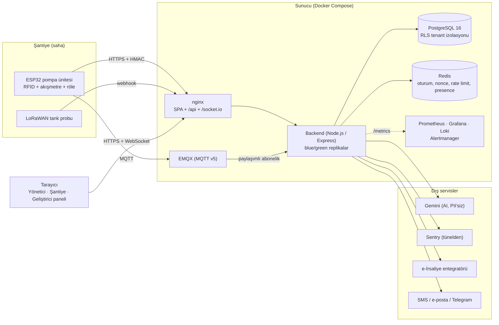
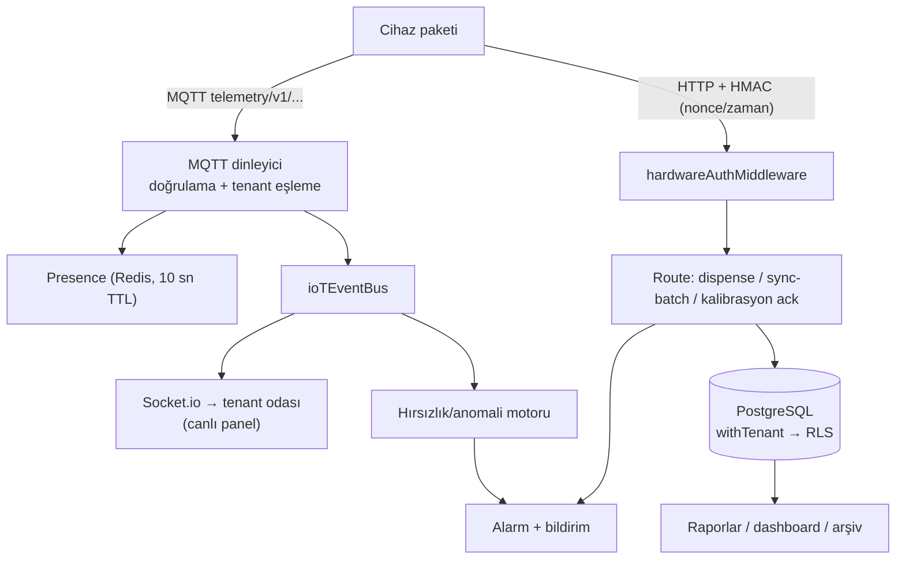
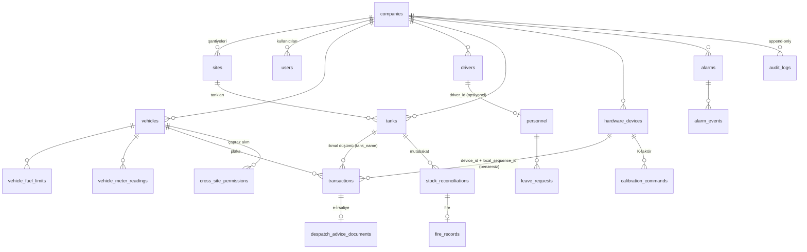
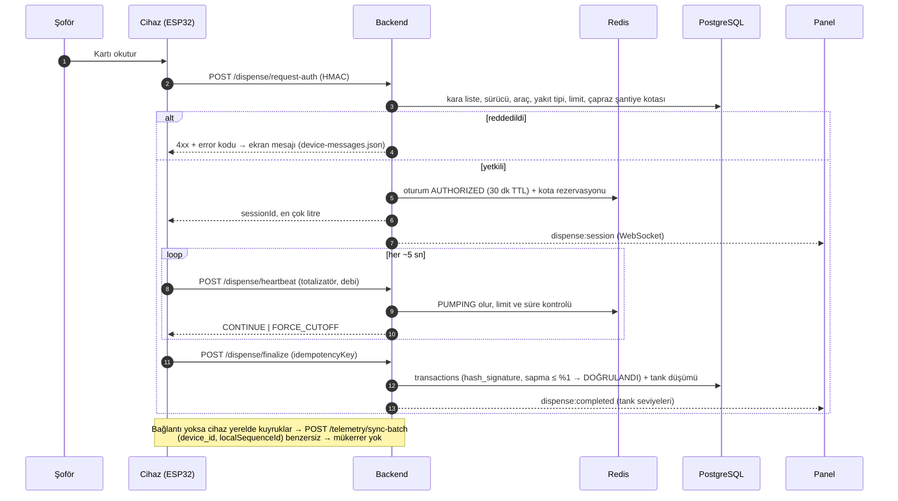

# Yakıt Takip Sistemi — Proje Rehberi (ekip çalışma rehberi)

> **Başarı kriteri:** projeye yeni katılan bir geliştirici bu belgeyi okuyup, issue listesinden bir iş alıp **kimseye soru sormadan** başlayabilmeli.
> Bu rehber kodla birlikte güncellenir: veritabanı şeması, rol matrisi, uç sayıları ve rapor kataloğu **koddan üretilir** ve CI'da güncel mi diye denetlenir (`node scripts/generate-project-guide.mjs --check`). Eskimiş rehber, rehber olmamasından kötüdür.

**Hızlı yol (30 dakika):** [§7 Ortam kurulumu](#7-ortam-kurulumu-adım-adım) → [§6 Çalışma kuralları](#6-repo-yapısı-branch-commit-ve-pr-kuralları) → [§2 Modül haritası](#2-modül-haritası-18-grup) → bir issue seç.
Terimler için `docs/SOZLUK.md` (DOC-1205). Diğer belgeler: [Donanım entegrasyonu](HARDWARE_INTEGRATION_GUIDE.md) · [Saha kurulum](SAHA_KURULUM.md) · [Operatör kitabı](OPERATOR_EL_KITABI.md) · [Ortamlar](ENVIRONMENTS.md) · [Dağıtım/geri alma](DEPLOY_ROLLBACK.md) · [Gözlemlenebilirlik](OBSERVABILITY.md) · [Uyarılar/runbook](ALERTING.md) · [KVKK](KVKK_ENVANTER.md) · [Saklama](DATA_RETENTION.md) · [Yedekleme](BACKUP_RESTORE.md) · [Kaos testi](CHAOS_TESTING.md) · [Sırlar](SECRETS.md) · [Test planı](../TEST_PLAN.md).

---

## 1. Proje amacı, kapsamı ve kapsam dışı

**Ne:** şantiyelerdeki akaryakıt tanklarını ve pompaları izleyen, ikmali **RFID kartıyla yetkilendiren**, stok/tüketim/maliyeti raporlayan, kaçak ve anomalileri yakalayan, e-İrsaliye üreten **çok kiracılı (multi-tenant) SaaS**. Sahada ESP32 tabanlı pompa kontrol üniteleri (RFID okuyucu, akışmetre, röle) HTTPS (HMAC imzalı) ve MQTT ile sunucuya konuşur; yönetim/şantiye panelleri React SPA'dır.

**Kapsam içi:** çok kiracılı veri izolasyonu · RFID'li ikmal oturumu (yetki → akış → sonlandırma) · çevrimdışı çalışma ve toplu senkron · tank/stok/mutabakat/fire · çapraz şantiye kota/mahsuplaşma · filo (araç, sürücü, bakım, belge) · anomali/hırsızlık tespiti ve AI analizi · e-İrsaliye (UBL-TR) · raporlama ve şifreli arşiv · bildirimler · KVKK/saklama · gözlemlenebilirlik, yedekleme, sıfır kesintili dağıtım.

**Kapsam dışı (bilinçli):** cihaz **firmware'i bu depoda yok** (FW-13xx ayrı iş; `hardware/` altında yalnızca eski bir prototip) · gerçek e-Fatura entegratör bağlantısı (arayüz + devre kesici hazır, canlı entegratör yok) · TimescaleDB/hypertable (ARCH-103, henüz kurulmadı — bkz. §9.2) · Kubernetes (dağıtım Docker Compose + nginx blue/green) · mobil uygulama.

> **Ticket'lardan bilinçli sapmalar** (çoğu issue NestJS/BullMQ/Drizzle/K8s varsayar; kod tabanı **Express + ham SQL + Redis** kullanır). Sapmalar ilgili dosyada "KAPSAM UYARLAMASI" yorumuyla gerekçelendirilir; yeni iş alırken ticket'ı **koddaki gerçek desenle** eşleştirin (§5.5).

---

## 2. Modül haritası (18 grup)

Issue kodları `GRUP-NNN` biçimindedir; kodda ilgili yorumlarda ve commit başlıklarında geçer (`grep -rn "FUEL-401" backend/src`).

| Grup | Ne yapar | Bağlı olduğu | Kodda nerede | Ana belge / test |
|---|---|---|---|---|
| **ARCH** Mimari | AsyncLocalStorage + PostgreSQL RLS ile tenant izolasyonu, olay yolu, tenant yaşam döngüsü (dondur/sil/dışa aktar), saklama politikası | — (temel) | `backend/src/context/`, `db/withTenant.ts`, `db/schema.sql`, `services/retentionService.ts` | [DATA_RETENTION](DATA_RETENTION.md) · `test_195_*`, `test_arch107_*`, `test_arch108_*` |
| **AUTH** Kimlik | JWT (access/refresh rotasyonu), Argon2id, rol/site kapsamı, cihaz HMAC, denetim günlüğü, TOTP, hesap kilidi | ARCH | `middleware/authMiddleware.ts`, `middleware/hardwareAuthMiddleware.ts`, `services/tokenService.ts`, `utils/auditLog.ts` | [HW guide §2](HARDWARE_INTEGRATION_GUIDE.md) · `test_auth2*` |
| **IOT** Telemetri | MQTT v5 dinleyici (paylaşımlı abonelik), LoRaWAN payload çözücü, presence, çevrimdışı toplu senkron (`sync-batch`), cihaz sağlığı | ARCH, AUTH | `iot/mqttClient.ts`, `services/lorawanUplinkService.ts`, `routes` (`/telemetry`) | [HW guide §3-4,7](HARDWARE_INTEGRATION_GUIDE.md) · `test_iot30*`, [CHAOS](CHAOS_TESTING.md) |
| **FUEL** İkmal | RFID'li ikmal oturumu (Redis durum makinesi), çapraz şantiye kota (Redlock benzeri kilit), strapping tablosu, kalibrasyon, mutabakat/fire, manuel çift onay | ARCH, AUTH, IOT | `services/dispenseSessionService.ts`, `db/tenantDb.ts`, `fuel/` | [HW guide §5,9](HARDWARE_INTEGRATION_GUIDE.md) · `test_fuel4*` |
| **FLEET** Filo | Araç/sürücü, km-motor saati, yakıt limiti, bakım, belge, lastik, uyum tarihleri, sürücü davranış skoru | FUEL | `fleet/`, `db/tenantDb.ts` | `test_fleet14*` |
| **INV** Envanter | Tank tanımı, yakıt alım/dolum irsaliyesi, depo/parça envanteri, maliyet yöntemi, laboratuvar | FUEL | `db/tenantDb.ts` | `test_inv15*` |
| **AI** Anomali | Debi↔tank korelasyonu (hırsızlık), Gemini tüketim analizi, mesai dışı/anomali, alarm yaşam döngüsü, sürücü/cihaz skoru | FUEL, IOT | `services/theftDetectionService.ts`, `services/consumptionAnomalyService.ts` | `test_ai50*` |
| **COMP** Mevzuat | e-İrsaliye UBL-TR XML, entegratör istemcisi + devre kesici, mükellef sorgusu, KVKK | FUEL | `compliance/`, `privacy/`, `services/privacyService.ts` | [KVKK](KVKK_ENVANTER.md) · `test_comp60*` |
| **REP** Rapor | Rapor çatısı (`reports/`), 13 ana rapor + alt görünümler, CSV/PDF/JSON, PII maskesi, zamanlanmış teslim, şifreli arşiv, yönetici dashboard'u | tüm veri | `backend/src/reports/`, `services/reportScheduleService.ts`, `services/tenantArchiveService.ts` | §11 · `test_rep7*` |
| **NOTIF** Bildirim | Uygulama-içi/e-posta/SMS/Telegram/webhook, tercihler, yeniden deneme + dead-letter, devre kesici | AI, FUEL | `notifications/`, `services/notificationService.ts` | `test_notif16*` |
| **BILL** Faturalama | Paket/limitler, ek modüller, kullanım ölçümü, lisans uyarıları | ARCH | `services/usageMeteringService.ts`, `services/licenseWarningService.ts` | `test_bill17*` |
| **HR** Personel | Personel kaydı, izin talebi/onayı, izin bakiyesi ve araç zimmet çakışması | FLEET | `services/personnelLeaveService.ts` | `test_hr1801_*` |
| **FE** Frontend | React SPA: Yönetici / Şantiye / Geliştirici panelleri, Socket.io canlı veri, rol koruması, sessiz token yenileme | AUTH | `frontend/src/` | `frontend/src/**/*.test.*`, `frontend/e2e/` |
| **FW** Firmware | ESP32 pompa ünitesi (RFID, akışmetre, röle, MQTT/HTTPS, offline kuyruk, OTA, ekran) | IOT, FUEL | **bu depoda yok** — sözleşme: `docs/HARDWARE_INTEGRATION_GUIDE.md`, `docs/operator/device-messages.json` | HIL testleri (TEST-1005, açık) |
| **RES** Dayanıklılık | Zod doğrulama, global hata yönetimi, yapısal log, graceful degradation, health/ready, Sentry | tümü | `middleware/errorHandler.ts`, `services/readinessService.ts`, `observability/` | [ERROR_TRACKING](ERROR_TRACKING.md) · `test_res90*` |
| **TEST** Test | Entegrasyon, yük (k6), kaos, e2e, sözleşme testleri | tümü | `backend/test/`, `scripts/test-*.mjs`, `frontend/e2e/` | §13 · [TEST_PLAN](../TEST_PLAN.md) |
| **OPS** DevOps | Docker, CI/CD, ortamlar, sıfır kesinti + geri alma, yedek/PITR, izleme, uyarı/runbook | tümü | `.github/workflows/`, `docker-compose*.yml`, `scripts/`, `deploy/` | [DEPLOY_ROLLBACK](DEPLOY_ROLLBACK.md) · [OBSERVABILITY](OBSERVABILITY.md) · [BACKUP_RESTORE](BACKUP_RESTORE.md) |
| **DOC** Doküman | Bu rehber, sözlük, sunum, donanım şartnamesi, saha/operatör kitapları | — | `docs/` | `scripts/test-doc*.mjs` |

---

## 3. Diyagramlar

### 3.1 Sistem mimarisi



### 3.2 Telemetri ve olay veri akışı



### 3.3 Veritabanı ilişkileri (çekirdek)

Tam tablo/sütun listesi §9.1'de (koddan üretilir); aşağıdaki şema çekirdek ilişkileri gösterir. **Her tenant tablosunda `tenant_id` + RLS vardır.**



### 3.4 İkmal sekansı (RFID → akış → sonlandırma)



---

## 4. Teknoloji yığını ve gerekçeleri

| Katman | Seçim | Neden |
|---|---|---|
| Backend | Node.js 20 + Express + TypeScript | Tek dil (frontend ile), zengin ekosistem (MQTT, Socket.io, PDF/Excel), olay güdümlü I/O yükü için uygun. NestJS **kullanılmıyor** (ticket'lar varsayar): daha az soyutlama, açık akış |
| Veritabanı | PostgreSQL 16, **ham SQL** (`pg`) | Satır düzeyi güvenlik (RLS) ile tenant izolasyonu DB'de zorlanır; ORM'in RLS bağlamını taşıma riski yok. Şema `schema.sql` (idempotent, expand-only) |
| Önbellek/durum | Redis | Dağıtık ikmal oturumu (replikalar arası paylaşım), nonce/replay, rate limit, presence TTL |
| Mesajlaşma | EMQX (MQTT v5) | Cihazlar için hafif, QoS 1, LWT ile anlık offline tespiti; paylaşımlı abonelik ile çok replika |
| Kimlik | Argon2id + JWT (15 dk access + döner refresh) + cihazlar için HMAC-SHA256 | Parola kırma maliyeti; refresh çalınmasına karşı rotasyon; cihazda tarayıcı yok → imzalı istek |
| Doğrulama | Zod | Girdi şeması tek yerde; OpenAPI ile uyumlu |
| Frontend | React 19 + Vite + Tailwind v4 | Hızlı derleme; `socket.io-client` ile canlı veri |
| Gözlem | Prometheus + Grafana + Loki + Alertmanager, Sentry | Metrik/log/uyarı kendi yığınımızda; hata izleme tünelli ve PII'siz |
| Dağıtım | Docker Compose + nginx blue/green | Tek makine/az sayıda sunucu için yeterli; K8s işletme yükü gereksiz. Sıfır kesinti + tek komut geri alma |
| Test | tsx betikleri (gerçek servislerle), vitest (frontend), Playwright, k6, kaos paketi | Mock yerine **gerçek Postgres/Redis/EMQX**; mutasyon testi alışkanlığı (§13) |
| Bilinçli olmayanlar | TimescaleDB, BullMQ, Drizzle, NestJS, K8s | Ticket'larda geçer, kodda yok; yerine setInterval süpürücüleri (Redis'siz idempotent), ham SQL, Express, Compose |

---

## 5. Kritik mimari kararlar ve gerekçeleri

### 5.1 Tenant izolasyonu: AsyncLocalStorage + RLS
Her istek `authenticateJWT` ile bir **tenant bağlamı** (AsyncLocalStorage) kurar; tüm sorgular `withTenant()` içinde `SET LOCAL ROLE app_user` + `app.current_tenant_id` ile çalışır ve **PostgreSQL RLS** satırları filtreler. **Neden:** uygulama katmanındaki bir `WHERE tenant_id=…` unutulması veri sızıntısıdır; RLS bunu DB düzeyinde imkânsız kılar. Kuralları: yeni tenant tablosu `tenant_id` + `ENABLE/FORCE RLS` + politika taşır (`check-rls-coverage` CI'ı zorlar); ham `pool.query` yalnızca izinli dosyalarda (`check-no-raw-pool-query`); sistem genelindeki bakım işleri `adminDb`/yönetim bağlantısını kullanır ve `tenant_id` filtresini elle yazar.

### 5.2 Cihaz güveni: HMAC + tek kullanımlık nonce
Cihaz istekleri `X-Timestamp` (±30 sn) + `X-Nonce` (Redis'te tek kullanımlık, 120 sn) + gövdeyi imzalayan HMAC-SHA256 taşır. **Neden:** cihazda oturum/parola yoktur; yakalanan paketin tekrarı (replay) ve gövde değişikliği engellenir. Nonce deposu Redis'tir: **Redis çökerse cihaz istekleri 503 (fail-closed)** — replay koruması atlanamaz; kayıp yoktur çünkü cihaz kuyruğu korur ([CHAOS_TESTING](CHAOS_TESTING.md)). Cihaz sırları DB'de AES-256-GCM ile şifreli; tek seferlik **claim** akışıyla verilir.

### 5.3 Çevrimdışı ve idempotency
Sahada internet kesilir. Cihaz ikmalleri yerelde `localSequenceId` ile kuyruklar; bağlantı gelince `sync-batch` yollar. **`(device_id, local_sequence_id)` DB'de benzersizdir** → aynı batch tekrar gönderilse (yanıt kaybolduysa, ikinci kesinti olduysa) mükerrer kayıt oluşmaz (`DUPLICATE_SKIPPED`). Cihaz yalnızca `ACCEPTED`/`DUPLICATE_SKIPPED` kayıtları siler. **Neden:** ağ kesintisinde en pahalı hata mali kaydın kaybı veya çift yazılmasıdır; "tam bir kez" garantisi istemci-sunucu koordinasyonuyla değil DB kısıtıyla verilir. Kaos testi bunu 72 saatlik kesinti, %35 paket kaybı ve sunucu çökmesi altında doğrular.

### 5.4 Fail-open politikası (FUEL-410)
Sunucuya ulaşılamazken ikmali tamamen durdurmak şantiyeyi felç eder; tamamen serbest bırakmak denetimi yok eder. **Sınırlı fail-open:** cihaz, sunucudan periyodik çektiği **whitelist + limit önbelleğiyle** çevrimdışı ikmale izin verir (`GET /telemetry/fail-open-policy`); önbellek tazeliği (`whitelistFreshnessHours`) ve çevrimdışı limit dolunca durur. Çevrimdışı ikmaller sonradan `sync-batch` ile gelir ve negatif stok/limit aşımı mutabakata düşer. **Neden:** sahada ikmal durursa iş durur; serbest bırakırsak denetim kalkar — sınır (tazelik + limit) ikisinin arasındaki bilinçli orta yoldur.

### 5.5 K-faktör (kalibrasyon) akışı
Akışmetrenin pals/litre katsayısı yanlışsa tüm ikmaller sapar. Akış: portal `POST /devices/{id}/calibration` → sunucu **komut** üretir, K **değişmez** → cihaz uygular ve `calibration-ack` (`appliedKFactor` zorunlu) yollar → **K yalnızca ACK ile güncellenir**. Değişim **%20'yi** aşarsa ikinci yetkili onayı ister. Referans kap ile test alımı sapmayı ve önerilen K'yı hesaplar; geçmiş **silinemez** (audit). **Neden:** uzaktan yanlış K tüm filoyu bozar → iki aşamalı, cihaz-onaylı, izlenebilir. Saha prosedürü: [SAHA_KURULUM §4.6](SAHA_KURULUM.md).

### 5.6 Değişmezlik ve mali kayıt
İkmal kaydı `hash_signature` (HMAC) taşır; e-İrsaliye belgeleri, denetim günlüğü ve kalibrasyon geçmişi DB düzeyinde **append-only** (`REVOKE UPDATE/DELETE`). Mali tablolar **asla otomatik silinmez** ([DATA_RETENTION](DATA_RETENTION.md)); KVKK anonimleştirme yalnızca kişisel alanları çevirir, tutar/plaka/tarih/mühür korunur. **Neden:** mali/denetim kaydının sonradan değiştirilebilir olması hem yasal hem güven sorunudur; kişisel veri silme hakkı ile mali bütünlük birlikte sağlanmalıdır.

### 5.7 Şema değişikliği: expand-only
`schema.sql` idempotent ve dağıtımda tek transaction'da uygulanır; eski replika yeni şemayla çalışmak zorundadır (blue/green). Bu yüzden **yalnızca genişleten** (yeni tablo/sütun/indeks) değişiklikler serbesttir; yıkıcı ifade `-- MIGRATION-CONTRACT: <gerekçe>` ister (`check-migration-safety`). Geri alma bu kurala dayanır ([DEPLOY_ROLLBACK §5](DEPLOY_ROLLBACK.md)).

### 5.8 Diğer kararlar (kısa)
Zero-downtime blue/green + drain ([DEPLOY_ROLLBACK](DEPLOY_ROLLBACK.md)) · PII: log/dış servis/Sentry'de kişisel veri yok ([KVKK](KVKK_ENVANTER.md)) · süpürücüler `setInterval` + advisory lock (BullMQ yok) · Socket.io yayınları tenant odasına (`tenant:{id}`).

---

## 6. Repo yapısı, branch, commit ve PR kuralları

```
backend/            Express API (src/: routes, db, services, middleware, reports, iot, compliance, privacy, retention, observability …)
  test/             Entegrasyon testleri (gerçek servislerle; tek tek `tsx test/<dosya>.ts`)
frontend/           Vite + React SPA (src/pages: customer | santiye | developer)
docs/               Bu rehber ve tüm belgeler   (operator/, saha-kurulum/, chaos-reports/, deploy-drills/, restore-drills/)
scripts/            Guard (check-*), üretici (generate-*), sözleşme testleri (test-*.mjs), dağıtım/rollback, yedek betikleri
deploy/  docker/    Ortam şablonları, izleme yapılandırması, EMQX
.github/workflows/  ci-cd.yml (kalite kapıları → staging → onaylı production)
```

**Branch:** hedef dal `main`; birleşmeden önce CI yeşil olmalıdır. Önerilen iş dalı adları `feat/<KOD>-kısa-ad` · `fix/<KOD>-…` · `docs/<KOD>-…`. Uzun ömürlü dal kullanılıyorsa sık `main`'e birleştirin. Etiket `vX.Y.Z` = production dağıtımı (onay gerekir).

**Commit:** [Conventional Commits](https://www.conventionalcommits.org) + issue kodu, gövde **Türkçe** ve *neden*'i anlatır: `feat(REP-723): yönetici özet dashboard'u`. Tipler `feat|fix|docs|chore|test|refactor`; kırıcı değişiklik `feat(x)!:`. Değişiklik günlüğü ve sürüm önerisi commit'lerden üretilir (`scripts/generate-changelog.mjs`). Ticket'tan **sapma** yaptıysanız commit gövdesinde ve kodda `KAPSAM UYARLAMASI` ile gerekçesini yazın.

**PR kontrol listesi (birleşmeden önce):**
1. İlgili testler yazıldı ve **gerçek servislerle** yeşil (fixture değerleri elle hesaplandı, §13).
2. Guard'lar yeşil: `node scripts/check-*.mjs` (RLS, ham pool, process.env, env örneği, rate-limit hijyeni, workflow YAML, bağımlılık denetimi, PII log, migrasyon güvenliği).
3. Yeni tenant tablosu → RLS + `retentionCatalog.ts` sınıflandırması + (kişisel veri ise) `piiInventory.ts`.
4. Yeni ortam değişkeni → `config/env.ts` + `backend/.env.example` + dağıtım şablonları (`check-env-example-sync`, `test-ops1104`).
5. Belge etkileniyorsa güncellendi (üretilen bölümler için `node scripts/generate-project-guide.mjs`).
6. Gizli değer yok (`gitleaks`); sahte belirteçler `// gitleaks:allow`.
7. **Mutasyon kontrolü:** kritik davranışı bilerek bozup testin kırıldığını görün (testin gerçekten koruduğunu kanıtlar).

CI kapıları `.github/workflows/ci-cd.yml`'dedir (kalite ve testler → güvenlik taraması → staging otomatik → production onaylı + duman testi + otomatik geri alma).

---

## 7. Ortam kurulumu (adım adım)

**Hedef: 30 dakika** (çoğu Docker imaj indirme/derleme süresidir; **ilk yeni-geliştirici ölçümü** bu belgenin Test Notudur — sonucu §14'e yazın).

**Gereksinimler:** Docker 24+ ve Docker Compose v2, Git, (yerel geliştirme için) Node.js 20 + npm. Cihaz/firmware **gerekmez**.

### 7.1 Docker Compose ile (önerilen, ~10-15 dk)

```bash
git clone <depo-adresi> YAKITTAKIPSISTEMI && cd YAKITTAKIPSISTEMI

# 1) Ortam dosyası ve sırlar: yer tutucuları rastgele değerlerle doldurur (rastgele üretim: openssl)
cp .env.example .env
while grep -qE '__CHANGE_ME_RUN_openssl_rand_-hex_[0-9]+__' .env; do
  n=$(grep -oE -m1 'hex_[0-9]+__' .env | head -1 | tr -dc 0-9)
  sed -i "0,/__CHANGE_ME_RUN_openssl_rand_-hex_${n}__/s//$(openssl rand -hex "$n")/" .env
done            # macOS'ta: sed -i '' …

# 2) Yığını başlat (PostgreSQL + Redis + EMQX + backend + frontend; şema ve demo veri otomatik yüklenir)
docker compose up -d --build

# 3) Doğrula
curl -s localhost:3000/api/v1/health          # {"status":"UP", ..., "version":"dev"}
curl -s localhost:3000/api/v1/health/ready    # 200 = PostgreSQL + Redis + MQTT hazır
```

Panel: **http://localhost:3000**. Demo hesaplar (`123456` parolasıyla — **yalnızca geliştirme verisi**): `admin` (SUPER_ADMIN → `/admin`), `camsa` (COMPANY_OWNER → `/panel`), `gebze-santiye` (SITE_MANAGER), `pompa-op-01` (PUMP_OPERATOR). API dokümanı: Swagger UI `/api-docs` **backend'in kendi portunda** (yerel geliştirmede `http://localhost:5000/api-docs`, §7.2; Compose'ta backend yayınlanmadığı ve nginx yalnızca `/api/` yolunu ilettiği için tarayıcıdan erişilmez). İlk girişte parola değiştirme istenebilir.

Backend host'a yayınlanmaz (yalnızca nginx `:3000`); backend'e doğrudan `docker compose exec backend …` veya test-runner imajıyla erişilir (§7.3). Durdurma: `docker compose down` (**`-v` KULLANMAYIN** — veritabanı volume'unu siler).

### 7.2 Yerelde geliştirme (hot reload)

```bash
docker compose up -d postgres redis emqx            # bağımlılıklar
cd backend && npm install && cp .env.example .env    # .env'deki __CHANGE_ME__ değerlerini yukarıdaki döngüyle doldurun
npm run dev                                          # http://localhost:5000  (tsx watch)
cd ../frontend && npm install && npm run dev         # http://localhost:3000  (vite; /api → :5000 proxy)
```
Tip denetimi: `npm run lint` (kökten: backend + frontend `tsc --noEmit`).

### 7.3 Testleri çalıştırma

- **Backend entegrasyon testi** (gerçek Postgres/Redis, çalışan yığına karşı): backend imajının `builder` aşamasından bir test imajı derleyip aynı ağ isim alanında çalıştırın:
  ```bash
  docker build --target builder -t yakit-test-runner backend/
  docker run --rm --network container:$(docker compose ps -q backend) --env-file .env \
    -e POSTGRES_HOST=postgres -e REDIS_HOST=redis -e API_URL=http://localhost:5000/api/v1 \
    yakit-test-runner npx tsx test/test_fuel401_dispense_session.ts
  ```
  (`docker` CLI gerektiren testler — kaos, res905 — **host'tan** çalışır: `cd backend && set -a && . ../.env && set +a && npx tsx test/test_test1007_chaos.ts`.)
- **Frontend:** `cd frontend && npx vitest run` (birim) · `npx playwright test` (e2e).
- **Sözleşme/guard:** `node scripts/check-rls-coverage.mjs`, `node scripts/test-ops1104.mjs`, `node scripts/test-doc1206.mjs` … (docker gerekmez).
- Tek test dosyası kuralı: `/auth/login` çağıran her test dosyası önce rate-limit anahtarlarını temizler (`check-test-rate-limit-hygiene`).

### 7.4 Firmware / cihaz
Firmware bu depoda **yok** (FW-1301 iskeleti açık). Cihaz olmadan geliştirme: testler cihaz HMAC isteklerini **simüle eder** (`backend/test/test_fuel401_dispense_session.ts`, `test_test1007_chaos.ts` içindeki cihaz simülatörü). Protokol sözleşmesi [HARDWARE_INTEGRATION_GUIDE](HARDWARE_INTEGRATION_GUIDE.md); ekran mesajları `docs/operator/device-messages.json`; sahaya kurulum [SAHA_KURULUM](SAHA_KURULUM.md). Eski prototip: `hardware/esp32veriakışı.cpp` (referans değil, tarihsel).

### 7.5 Sık kurulum sorunları
| Belirti | Çözüm |
|---|---|
| `JWT_SECRET … tanımlanmalıdır` / `HW_SECRET_… tanımlanmalıdır` | `.env` eksik veya yer tutucu kaldı → §7.1'deki döngüyü çalıştırın (`grep CHANGE_ME .env` boş dönmeli) |
| Backend açılmıyor: "ARCH-110 doğrulaması başarısız" | `.env` değeri geçersiz (ör. 64 hex olması gereken anahtar); mesaj hangi anahtar olduğunu söyler |
| Port çakışması (3000/5432/1883) | Çakışan servisi durdurun veya `docker-compose.yml` port eşlemesini değiştirin |
| Şema değişikliği görünmüyor | `schema.sql` yalnızca **boş** volume'da otomatik çalışır; mevcut DB'ye: `docker compose exec -T postgres sh -c 'psql -U "$POSTGRES_USER" -d "$POSTGRES_DB" -v ON_ERROR_STOP=1' < backend/src/db/schema.sql` (iki kez çalıştırmak güvenlidir) |
| Frontend 502 | Backend henüz hazır değil (`docker compose ps`); backend yeniden oluşturulduysa `docker exec yakittakip_frontend nginx -s reload` |

---

## 8. API sözleşmesi ve MQTT şeması

<!-- ÜRETİLEN:ENDPOINT:BAŞLA (scripts/generate-project-guide.mjs — ELLE DEĞİŞTİRMEYİN) -->
Toplam **275 REST ucu** (`/api/v1` altında). Kimlik doğrulama türüne göre: **cihaz HMAC** 9 · **JWT + rol kısıtı** 221 · **JWT (tüm roller)** 29 · **kimliksiz** 16 (giriş, sağlık, parola sıfırlama, indirme bağlantıları, Sentry tüneli).

Kaynak gruplarına göre: `/vehicles` 20 · `/auth` 16 · `/tanks` 13 · `/admin` 12 · `/hardware-devices` 12 · `/companies` 11 · `/devices` 10 · `/notifications` 10 · `/fleet` 9 · `/transactions` 8 · `/drivers` 7 · `/quotas` 7 · `/personnel` 6 · `/inventory-items` 6 · `/lab-samples` 6 · `/alarms` 6 · `/manual-dispense-requests` 6 · `/report-schedules` 6 · `/privacy` 6 · `/leave-requests` 5 · `/sites` 5 · `/telemetry` 5 · `/rfid-cards` 5 · `/fire-records` 5 · `/policies` 4 · `/anomaly-flags` 4 · `/firmware-rollouts` 4 · `/dispense` 4 · `/recipients` 4 · `/health` 3 · `/meter-readings` 3 · `/despatch-advice-transmissions` 3 · `/vehicle-documents` 3 · `/reports` 3 · `/fuel-budgets` 3 · `/retention` 3 · `/archives` 3 · `/cross-site-permissions` 3 · `/usage-metering` 2 · `/maintenance-records` 2 · `/tires` 2 · `/inventory` 2 · `/ai` 2 · `/firmware-artifacts` 2 · `/fuel-intakes` 2 · `/stock-reconciliations` 2 · `/tenant-info` 1 · `/fuel-stock-summary` 1 · `/leave-calendar` 1 · `/lab` 1 · `/dashboard` 1 · `/report-deliveries` 1 · `/despatch-advice-documents` 1 · `/taxpayers` 1 · `/lorawan` 1 · `/audit-logs` 1.
<!-- ÜRETİLEN:ENDPOINT:BİTİŞ -->

**Sözleşme kuralları**
- Taban: `/api/v1`. Etkileşimli referans: **Swagger UI** (backend portunda `/api-docs`, §7.1); donanım tarafı ayrıntısı [HARDWARE_INTEGRATION_GUIDE](HARDWARE_INTEGRATION_GUIDE.md).
- **Kimlik:** panel uçları `Authorization: Bearer <JWT>` (15 dk; süresi dolunca istemci sessizce `POST /auth/refresh`); cihaz uçları 4 HMAC başlığı (`X-Device-ID`, `X-Timestamp`, `X-Nonce`, `X-Hardware-Signature`).
- **Başarılı yanıt:** `{ "success": true, "data": … }` (bazı eski uçlar doğrudan nesne döner). **Hata:** `{ "success": false, "error": "KOD", "message": "…", "traceId": "…" }`; `traceId` her yanıtta `X-Trace-ID` başlığıyla da gelir ve loglarla/Sentry ile eşleşir ([ERROR_TRACKING](ERROR_TRACKING.md)).
- **Durum kodları:** 400/422 doğrulama · 401 kimlik · 403 yetki · 404 · 409 çakışma/idempotency · 429 rate limit · **503** geçici bağımlılık arızası (DB/Redis; `Retry-After`) — istemciler 5xx/429'da üstel geri çekilmeyle yeniden dener.
- **Sayfalama/filtre:** liste uçları `?page&pageSize` ve alan filtreleri; rapor uçları `GET /reports/{id}` (JSON, filtre/sıralama/sayfalama) ve `GET /reports/{id}/export?format=csv|pdf` (akışlı).
- **Rate limit:** giriş 10/15 dk/IP · cihaz 300/dk/cihaz · webhook/Sentry tüneli IP başına.
- **Gerçek zamanlı:** Socket.io `/socket.io`, JWT ile el sıkışma, `tenant:{tenantId}` odası; olaylar `telemetry:data`, `device:status`, `dispense:session`, `dispense:completed`, `tank:negative-stock-alarm`.

### MQTT topic şeması

```
telemetry/v1/{tenantId}/{siteId}/{deviceType}/{deviceId}/data     ← cihaz yayınlar (JSON veya LoRaWAN hex)
telemetry/v1/{tenantId}/{siteId}/{deviceType}/{deviceId}/status   ← ONLINE/OFFLINE (LWT: OFFLINE, QoS 1)
command/v1/{deviceId}                                             ← sunucu → cihaz (SET_K_FACTOR, FORCE_CUTOFF, …)
```
MQTT v5, `clean=false`, QoS 1; backend `$share/...` paylaşımlı abonelikle dinler (çok replika, mesaj tek kez işlenir). Presence: ~8-10 sn'de bir mesaj yoksa 10 sn TTL ile OFFLINE. Ayrıntı: [HW guide §3](HARDWARE_INTEGRATION_GUIDE.md).

---

## 9. Veritabanı

### 9.1 Şema (tablo / alan)

<!-- ÜRETİLEN:VERITABANI:BAŞLA (scripts/generate-project-guide.mjs — ELLE DEĞİŞTİRMEYİN) -->
**70 tablo**, 67 tanesinde satır düzeyi güvenlik (RLS, tenant izolasyonu). "Saklama sınıfı" [DATA_RETENTION.md](DATA_RETENTION.md)'deki katalogdandır.

| Tablo | Sütunlar (ad:tip) | Tenant RLS | Saklama sınıfı |
|---|---|---|---|
| `companies` | id:varchar(64), name:varchar(255), tax_number:varchar(32), code:varchar(32), city:varchar(128), license_status:varchar(16), license_expiry:date, modules:jsonb, package:varchar(32), created_at:timestamp, account_status:varchar(20), frozen_at:timestamp, frozen_by:varchar(64), frozen_reason:text, deletion_scheduled_at:timestamp, deletion_requested_by:varchar(64), deletion_reason:text, fuel_cost_method:varchar(32), archive_period_days:integer, archive_last_generated_at:timestamp | — | ana veri |
| `tenant_deletion_approvals` | tenant_id:varchar(64), approved_by:varchar(64), approved_at:timestamp | RLS | KORUMALI (mali) |
| `platform_audit_log` | id:varchar(64), deleted_tenant_id:varchar(64), tenant_name:varchar(255), action:varchar(64), actor_user_id:varchar(64), detail:jsonb, created_at:timestamp | — | KORUMALI (mali) |
| `company_module_addons` | tenant_id:varchar(64), module_name:varchar(64), added_at:timestamp, added_by:varchar(64) | RLS | ana veri |
| `usage_metering_records` | id:varchar(64), tenant_id:varchar(64), period_label:varchar(7), active_device_count:integer, device_days:integer, dispense_count:integer, telemetry_packet_count:integer, edocument_count:integer, computed_at:timestamp | RLS | KORUMALI (mali) |
| `vehicles` | id:varchar(64), tenant_id:varchar(64), plate:varchar(32), brand_model:varchar(128), vehicle_type:varchar(64), rfid_tag:varchar(64), site_name:varchar(128), status:varchar(32), fuel_capacity_liters:numeric(10,2), assigned_driver_name:varchar(128), created_at:timestamp, fuel_type:varchar(64), meter_type:varchar(16), year_of_manufacture:integer, avg_consumption_expectation:numeric(10,2) | RLS | ana veri |
| `vehicle_site_assignments` | id:varchar(64), tenant_id:varchar(64), vehicle_id:varchar(64), from_site_name:varchar(128), to_site_name:varchar(128), changed_by:varchar(64), changed_at:timestamp | RLS | ana veri |
| `tanks` | id:varchar(64), tenant_id:varchar(64), name:varchar(128), capacity_liters:numeric(10,2), current_level_liters:numeric(10,2), fuel_type:varchar(64), site_name:varchar(128), status:varchar(32), created_at:timestamp, low_stock_threshold_liters:numeric(10,2), reorder_lead_days:integer | RLS | ana veri |
| `drivers` | id:varchar(64), tenant_id:varchar(64), name:varchar(128), tc_no:varchar(11), phone:varchar(32), license_type:varchar(64), rfid_card_id:varchar(64), site_name:varchar(128), status:varchar(32), created_at:timestamp, deactivated_at:timestamp, anonymized_at:timestamp | RLS | ana veri |
| `personnel` | id:varchar(64), tenant_id:varchar(64), full_name:varchar(128), tc_no:varchar(11), role_title:varchar(64), site_name:varchar(128), driver_id:varchar(64), annual_leave_entitlement_days:numeric(5,1), hire_date:date, status:varchar(16), created_at:timestamp, deactivated_at:timestamp, anonymized_at:timestamp | RLS | ana veri |
| `leave_requests` | id:varchar(64), tenant_id:varchar(64), personnel_id:varchar(64), leave_type:varchar(16), start_date:date, end_date:date, day_count:numeric(5,1), reason:text, status:varchar(16), requested_by:varchar(64), site_approved_by:varchar(64), site_approved_at:timestamp, company_approved_by:varchar(64), company_approved_at:timestamp, rejection_reason:text, created_at:timestamp | RLS | ana veri |
| `transactions` | id:varchar(64), tenant_id:varchar(64), site_name:varchar(128), vehicle_plate:varchar(32), driver_name:varchar(128), tank_name:varchar(128), amount_liters:numeric(10,2), flow_rate_lpm:numeric(10,2), pump_status:varchar(32), type:varchar(32), rfid_auth:boolean, created_at:timestamp, idempotency_key:varchar(128), hash_signature:varchar(64), verification_status:varchar(32), fuel_type:varchar(64), device_id:varchar(64), local_sequence_id:bigint, unit_cost_liters:numeric(12,4), total_cost:numeric(14,2) | RLS | KORUMALI (mali) |
| `cross_site_permissions` | id:varchar(64), tenant_id:varchar(64), vehicle_plate:varchar(32), driver_name:varchar(128), home_site:varchar(128), target_site:varchar(128), allowed_liters:numeric(10,2), used_liters:numeric(10,2), expiry_date:date, status:varchar(32), created_at:timestamp | RLS | ana veri |
| `hardware_devices` | id:varchar(64), tenant_id:varchar(64), device_id:varchar(64), name:varchar(128), site_name:varchar(128), encrypted_secret:text, encrypted_secret_previous:text, previous_secret_expires_at:timestamp, secret_rotated_at:timestamp, status:varchar(32), created_at:timestamp, serial_number:varchar(128), mac_address:varchar(32), model:varchar(128), hardware_revision:varchar(64), k_factor:numeric(10,4), last_fail_open_policy_id:varchar(64), last_rfid_denylist_version:varchar(64), last_rfid_denylist_pull_at:timestamp, tank_name:varchar(128), firmware_version:varchar(32), last_seen_at:timestamp, last_reported_rssi:integer, last_reported_battery_pct:numeric(5,2), last_reported_low_battery:boolean, last_clock_drift_ms:bigint | RLS | ana veri |
| `device_claim_codes` | id:varchar(64), tenant_id:varchar(64), code:varchar(32), site_name:varchar(128), device_name:varchar(128), status:varchar(32), expires_at:timestamp, redeemed_device_id:varchar(64), redeemed_at:timestamp, created_at:timestamp | RLS | ana veri |
| `calibration_commands` | id:varchar(64), tenant_id:varchar(64), device_id:varchar(64), previous_k_factor:numeric(10,4), new_k_factor:numeric(10,4), reason:text, reference_measurement:jsonb, requested_by:varchar(64), requires_second_approval:boolean, approved_by:varchar(64), approved_at:timestamp, status:varchar(32), sent_at:timestamp, acked_at:timestamp, is_rollback:boolean, created_at:timestamp | RLS | KORUMALI (mali) |
| `calibration_test_intakes` | id:varchar(64), tenant_id:varchar(64), device_id:varchar(64), tank_name:varchar(128), reference_volume_liters:numeric(10,3), measured_liters:numeric(10,3), ambient_temperature_celsius:numeric(5,2), k_factor_at_test:numeric(10,4), deviation_ratio:numeric(6,4), proposed_k_factor:numeric(10,4), verifies_calibration_command_id:varchar(64), requested_by:varchar(64), created_at:timestamp | RLS | KORUMALI (mali) |
| `fail_open_policies` | id:varchar(64), tenant_id:varchar(64), site_name:varchar(128), offline_dispense_allowed:boolean, max_liters_per_vehicle:numeric(10,2), max_daily_dispenses_per_vehicle:integer, whitelist_freshness_hours:integer, fail_close:boolean, updated_by:varchar(64), created_at:timestamp | RLS | ana veri |
| `consumption_anomaly_reports` | id:varchar(64), tenant_id:varchar(64), period_days:integer, period_start:timestamp, period_end:timestamp, vehicle_count:integer, anomaly_count:integer, anomalies:jsonb, model_name:varchar(64), generated_by:varchar(64), created_at:timestamp | RLS | ana veri |
| `despatch_advice_documents` | id:varchar(64), tenant_id:varchar(64), transaction_id:varchar(64), document_number:varchar(32), ettn:uuid, issue_year:integer, sequence_no:integer, created_at:timestamp, recipient_tax_id:varchar(16), delivery_mode:varchar(16), is_correction:boolean, corrects_document_id:varchar(64) | RLS | KORUMALI (mali) |
| `despatch_advice_counters` | tenant_id:varchar(64), issue_year:integer, last_sequence:integer | RLS | KORUMALI (mali) |
| `despatch_advice_transmissions` | id:varchar(64), tenant_id:varchar(64), despatch_advice_document_id:varchar(64), transaction_id:varchar(64), document_number:varchar(32), ettn:uuid, vehicle_plate:varchar(32), provider:varchar(32), status:varchar(16), attempt_count:integer, last_error:text, provider_reference:varchar(128), xml_snapshot:text, queued_at:timestamp, sent_at:timestamp, updated_at:timestamp | RLS | KORUMALI (mali) |
| `despatch_advice_documents_status` | despatch_advice_document_id:varchar(64), tenant_id:varchar(64), transaction_id:varchar(64), status:varchar(16), reject_reason:text, rejected_at:timestamp, cancel_reason:text, cancellation_certificate_ref:varchar(128), cancelled_at:timestamp, superseded_by_document_id:varchar(64), updated_at:timestamp | RLS | KORUMALI (mali) |
| `tank_strapping_tables` | id:varchar(64), tenant_id:varchar(64), tank_name:varchar(128), source:varchar(32), points:jsonb, cylinder_config:jsonb, point_count:integer, notes:varchar(256), imported_by:varchar(64), created_at:timestamp | RLS | ana veri |
| `rfid_card_blacklist` | id:varchar(64), tenant_id:varchar(64), card_uid:varchar(64), status:varchar(16), reason:varchar(256), replaced_by_card_uid:varchar(64), reported_by:varchar(64), created_at:timestamp, updated_at:timestamp | RLS | ana veri |
| `fuel_quotas` | id:varchar(64), tenant_id:varchar(64), vehicle_plate:varchar(32), site_name:varchar(128), period_type:varchar(16), limit_liters:numeric(12,2), carryover_policy:varchar(16), period_start:timestamp, period_end:timestamp, carried_over_liters:numeric(12,2), valid_from:date, valid_until:date, status:varchar(16), created_by:varchar(64), created_at:timestamp, updated_at:timestamp | RLS | ana veri |
| `fuel_quota_history` | id:varchar(64), tenant_id:varchar(64), quota_id:varchar(64), period_start:timestamp, period_end:timestamp, effective_limit_liters:numeric(12,2), consumed_liters:numeric(12,2), carried_over_to_next_liters:numeric(12,2), closed_at:timestamp | RLS | KORUMALI (mali) |
| `fuel_intake_receipts` | id:varchar(64), tenant_id:varchar(64), tank_id:varchar(64), tank_name:varchar(128), site_name:varchar(128), supplier_name:varchar(160), waybill_no:varchar(64), delivery_date:date, tanker_plate:varchar(32), declared_liters:numeric(12,2), unit_price:numeric(12,4), temperature_c:numeric(6,2), density_kg_m3:numeric(8,2), level_before_liters:numeric(12,2), level_after_liters:numeric(12,2), measured_liters:numeric(12,2), declared_liters_15c:numeric(12,2), measured_liters_15c:numeric(12,2), discrepancy_liters:numeric(12,2), discrepancy_pct:numeric(8,4), added_liters:numeric(12,2), status:varchar(32), window_start:timestamp, window_end:timestamp, waybill_image_url:varchar(512), note:text, created_by:varchar(64), created_at:timestamp | RLS | KORUMALI (mali) |
| `stock_reconciliations` | id:varchar(64), tenant_id:varchar(64), tank_id:varchar(64), tank_name:varchar(128), site_name:varchar(128), period_type:varchar(16), period_start:timestamp, period_end:timestamp, opening_book_liters:numeric(12,2), intake_liters:numeric(12,2), dispensed_liters:numeric(12,2), test_intake_liters:numeric(12,2), closing_book_liters:numeric(12,2), physical_liters:numeric(12,2), physical_temp_c:numeric(6,2), physical_liters_15c:numeric(12,2), variance_liters:numeric(12,2), variance_pct:numeric(8,4), tolerance_pct:numeric(6,3), evaporation_allowance_pct:numeric(8,4), classification:varchar(24), status:varchar(24), source:varchar(16), note:text, created_by:varchar(64), created_at:timestamp | RLS | KORUMALI (mali) |
| `fire_records` | id:varchar(64), tenant_id:varchar(64), tank_id:varchar(64), tank_name:varchar(128), site_name:varchar(128), reconciliation_id:varchar(64), record_date:date, quantity_liters:numeric(10,2), variance_direction:varchar(10), classification:varchar(24), description:text, status:varchar(24), requires_dual_approval:boolean, first_approver_id:varchar(64), first_approver_role:varchar(32), first_approved_at:timestamp, second_approver_id:varchar(64), second_approver_role:varchar(32), second_approved_at:timestamp, rejected_by:varchar(64), rejected_at:timestamp, rejection_reason:text, created_by:varchar(64), created_at:timestamp | RLS | KORUMALI (mali) |
| `manual_dispense_requests` | id:varchar(64), tenant_id:varchar(64), site_name:varchar(128), vehicle_plate:varchar(32), driver_name:varchar(128), tank_id:varchar(64), tank_name:varchar(128), liters:numeric(10,2), dispensed_at:timestamp, reason:text, document_url:varchar(512), status:varchar(24), requested_by:varchar(64), first_approver_id:varchar(64), first_approver_role:varchar(32), first_approved_at:timestamp, second_approver_id:varchar(64), second_approver_role:varchar(32), second_approved_at:timestamp, rejected_by:varchar(64), rejected_at:timestamp, rejection_reason:text, transaction_id:varchar(64), created_at:timestamp | RLS | KORUMALI (mali) |
| `users` | id:varchar(64), tenant_id:varchar(64), username:varchar(64), password_hash:varchar(255), role:varchar(32), site_name:varchar(128), created_at:timestamp, must_change_password:boolean, temp_password_expires_at:timestamp, email:varchar(255), email_bounced_at:timestamp, phone:varchar(32) | RLS | ana veri |
| `site_working_hours` | id:varchar(64), tenant_id:varchar(64), site_name:varchar(128), start_minute:integer, end_minute:integer, working_days:integer[], is_24_7:boolean, rapid_repeat_window_minutes:integer, updated_by:varchar(64), updated_at:timestamp, created_at:timestamp | RLS | ana veri |
| `transaction_anomaly_flags` | id:varchar(64), tenant_id:varchar(64), transaction_id:varchar(64), anomaly_type:varchar(32), severity:varchar(16), site_name:varchar(128), vehicle_plate:varchar(32), driver_name:varchar(128), transaction_at:timestamp, amount_liters:numeric(10,2), detail:jsonb, status:varchar(16), reviewed_by:varchar(64), reviewed_at:timestamp, review_note:text, detected_at:timestamp | RLS | KORUMALI (mali) |
| `user_totp` | user_id:varchar(64), tenant_id:varchar(64), secret_base32:varchar(64), enabled:boolean, enabled_at:timestamp, recovery_code_hashes:text[], recovery_codes_total:integer, last_used_at:timestamp, created_at:timestamp, updated_at:timestamp | RLS | ana veri |
| `alarms` | id:varchar(64), tenant_id:varchar(64), alarm_key:varchar(200), category:varchar(40), severity:varchar(16), title:varchar(300), site_name:varchar(128), subject_type:varchar(32), subject_id:varchar(128), status:varchar(20), assignee_id:varchar(64), event_count:integer, first_seen_at:timestamp, last_seen_at:timestamp, snoozed_until:timestamp, escalation_level:integer, escalated_at:timestamp, resolution_note:text, resolved_by:varchar(64), resolved_at:timestamp, source_ref:jsonb, created_at:timestamp, updated_at:timestamp | RLS | silinebilir |
| `alarm_events` | id:varchar(64), tenant_id:varchar(64), alarm_id:varchar(64), detail:jsonb, occurred_at:timestamp | RLS | silinebilir |
| `vehicle_meter_readings` | id:varchar(64), tenant_id:varchar(64), vehicle_id:varchar(64), vehicle_plate:varchar(32), meter_type:varchar(16), reading_value:numeric(12,2), reading_at:timestamp, period_label:varchar(16), source:varchar(16), is_suspicious:boolean, suspicion_reasons:text[], override_approved:boolean, override_reason:text, approved_by:varchar(64), corrects_reading_id:varchar(64), note:text, entered_by:varchar(64), created_at:timestamp | RLS | ana veri |
| `recipient_taxpayers` | id:varchar(64), tenant_id:varchar(64), tax_id:varchar(16), tax_id_type:varchar(8), title:varchar(300), address:varchar(500), tax_office:varchar(160), is_einvoice_obligated:boolean, obligation_checked_at:timestamp, obligation_source:varchar(24), missing_fields:text[], status:varchar(16), created_by:varchar(64), created_at:timestamp, updated_at:timestamp | RLS | ana veri |
| `vehicle_fuel_limits` | id:varchar(64), tenant_id:varchar(64), vehicle_id:varchar(64), vehicle_plate:varchar(32), period_type:varchar(16), limit_liters:numeric(10,2), enforcement:varchar(16), status:varchar(16), temp_increase_liters:numeric(10,2), temp_increase_until:date, temp_increase_reason:text, temp_increase_approved_by:varchar(64), created_by:varchar(64), created_at:timestamp, updated_at:timestamp | RLS | ana veri |
| `vehicle_maintenance_records` | id:varchar(64), tenant_id:varchar(64), vehicle_id:varchar(64), vehicle_plate:varchar(32), maintenance_type:varchar(32), performed_at:date, odometer_value:numeric(12,2), cost_amount:numeric(12,2), operations_description:text, next_due_date:date, next_due_meter_value:numeric(12,2), created_by:varchar(64), created_at:timestamp | RLS | ana veri |
| `vehicle_compliance_deadlines` | id:varchar(64), tenant_id:varchar(64), vehicle_id:varchar(64), vehicle_plate:varchar(32), deadline_type:varchar(32), issued_at:date, due_date:date, reference_no:varchar(64), note:text, created_by:varchar(64), created_at:timestamp | RLS | ana veri |
| `vehicle_tires` | id:varchar(64), tenant_id:varchar(64), vehicle_id:varchar(64), vehicle_plate:varchar(32), position:varchar(16), brand_model:varchar(128), installed_at:date, installed_meter_value:numeric(12,2), expected_lifespan_km:numeric(10,2), tread_depth_mm:numeric(5,2), tread_depth_measured_at:date, status:varchar(16), replaced_at:date, created_by:varchar(64), created_at:timestamp, updated_at:timestamp | RLS | ana veri |
| `vehicle_documents` | id:varchar(64), tenant_id:varchar(64), vehicle_id:varchar(64), vehicle_plate:varchar(32), document_type:varchar(32), file_name:varchar(255), mime_type:varchar(64), file_size_bytes:integer, file_content:bytea, expiry_date:date, uploaded_by:varchar(64), uploaded_at:timestamp | RLS | KORUMALI (mali) |
| `vehicle_document_download_links` | document_id:varchar(64), tenant_id:varchar(64), download_token_hash:varchar(64), expires_at:timestamp, created_at:timestamp | RLS | ana veri |
| `inventory_items` | id:varchar(64), tenant_id:varchar(64), code:varchar(64), name:varchar(200), unit:varchar(32), site_name:varchar(128), storage_location:varchar(128), critical_stock_level:numeric(12,2), current_stock:numeric(12,2), status:varchar(16), created_by:varchar(64), created_at:timestamp, updated_at:timestamp | RLS | ana veri |
| `inventory_movements` | id:varchar(64), tenant_id:varchar(64), item_id:varchar(64), item_code:varchar(64), movement_type:varchar(16), quantity:numeric(12,2), balance_after:numeric(12,2), related_vehicle_id:varchar(64), related_maintenance_record_id:varchar(64), note:text, created_by:varchar(64), created_at:timestamp | RLS | KORUMALI (mali) |
| `lab_samples` | id:varchar(64), tenant_id:varchar(64), sample_type:varchar(32), site_name:varchar(128), location:varchar(200), reference_no:varchar(64), collected_at:date, status:varchar(16), note:text, created_by:varchar(64), created_at:timestamp, updated_at:timestamp | RLS | KORUMALI (mali) |
| `lab_test_results` | id:varchar(64), tenant_id:varchar(64), sample_id:varchar(64), test_type:varchar(64), tested_at:date, result_value:numeric(12,4), unit:varchar(32), spec_min:numeric(12,4), spec_max:numeric(12,4), conformity:varchar(16), note:text, created_by:varchar(64), created_at:timestamp | RLS | KORUMALI (mali) |
| `sites` | id:varchar(64), tenant_id:varchar(64), name:varchar(128), location:varchar(255), created_at:timestamp | RLS | ana veri |
| `audit_logs` | id:varchar(64), tenant_id:varchar(64), user_id:varchar(64), trace_id:varchar(64), ip_address:varchar(64), action:varchar(64), target_type:varchar(64), target_id:varchar(64), before_value:jsonb, after_value:jsonb, created_at:timestamp | RLS | silinebilir |
| `tenant_archives` | id:varchar(64), tenant_id:varchar(64), requested_by:varchar(64), period_days:integer, trigger_type:varchar(16), status:varchar(16), file_data:bytea, file_size_bytes:bigint, manifest_sha256:varchar(64), download_token_hash:varchar(64), download_count:integer, last_downloaded_at:timestamp, error_message:text, expires_at:timestamp, created_at:timestamp, completed_at:timestamp | RLS | yönetilen |
| `driver_behavior_scores` | id:varchar(64), tenant_id:varchar(64), driver_name:varchar(128), site_name:varchar(128), period_days:integer, transaction_count:integer, score:integer, offhours_ratio_pct:numeric(5,2), rapid_repeat_ratio_pct:numeric(5,2), consumption_deviation_ratio_pct:numeric(5,2), cancelled_ratio_pct:numeric(5,2), manual_entry_ratio_pct:numeric(5,2), detail:jsonb, computed_at:timestamp | RLS | silinebilir |
| `device_presence_events` | id:varchar(64), tenant_id:varchar(64), device_id:varchar(64), site_name:varchar(128), status:varchar(16), occurred_at:timestamp | RLS | silinebilir |
| `device_health_scores` | id:varchar(64), tenant_id:varchar(64), device_id:varchar(64), site_name:varchar(128), period_days:integer, sample_count:integer, score:integer, offline_ratio_pct:numeric(5,2), packet_loss_ratio_pct:numeric(5,2), telemetry_error_ratio_pct:numeric(5,2), signal_battery_penalty_pct:numeric(5,2), clock_drift_penalty_pct:numeric(5,2), detail:jsonb, computed_at:timestamp | RLS | silinebilir |
| `firmware_artifacts` | id:varchar(64), version:varchar(32), hardware_revision:varchar(64), channel:varchar(16), artifact_url:varchar(512), sha256:varchar(64), signature:text, created_by:varchar(64), created_at:timestamp | — | ana veri |
| `firmware_rollouts` | id:varchar(64), tenant_id:varchar(64), firmware_artifact_id:varchar(64), site_name:varchar(128), current_stage_pct:integer, target_device_count:integer, failure_threshold_pct:numeric(5,2), status:varchar(24), halted_reason:text, halted_at:timestamp, started_by:varchar(64), created_at:timestamp | RLS | ana veri |
| `firmware_rollout_devices` | id:varchar(64), tenant_id:varchar(64), rollout_id:varchar(64), device_id:varchar(64), stage_pct:integer, command_id:varchar(64), status:varchar(24), failure_reason:text, dispatched_at:timestamp, resolved_at:timestamp | RLS | ana veri |
| `notifications` | id:varchar(64), tenant_id:varchar(64), event_type:varchar(64), idempotency_key:varchar(128), user_id:varchar(64), title:text, body:text, channel:varchar(16), priority:varchar(16), status:varchar(24), attempts:integer, variables:jsonb, read_at:timestamp, delivered_at:timestamp, created_at:timestamp | RLS | silinebilir |
| `sms_monthly_usage` | tenant_id:varchar(64), year_month:varchar(7), sent_count:integer, monthly_limit:integer, limit_alarm_raised:boolean, updated_at:timestamp | RLS | ana veri |
| `tenant_notification_channels` | tenant_id:varchar(64), telegram_bot_token_encrypted:text, telegram_chat_id:varchar(64), webhook_url:varchar(512), webhook_secret_encrypted:text, webhook_consecutive_failures:integer, webhook_disabled_at:timestamp, updated_at:timestamp | RLS | ana veri |
| `user_notification_preferences` | id:varchar(64), tenant_id:varchar(64), user_id:varchar(64), event_type:varchar(64), channel:varchar(16), enabled:boolean, updated_at:timestamp | RLS | ana veri |
| `user_notification_mutes` | id:varchar(64), tenant_id:varchar(64), user_id:varchar(64), event_type:varchar(64), muted_until:timestamp, created_at:timestamp | RLS | ana veri |
| `report_schedules` | id:varchar(64), tenant_id:varchar(64), report_id:varchar(64), filters:jsonb, format:varchar(16), period_type:varchar(16), send_hour_local:integer, day_of_week:integer, day_of_month:integer, recipient_user_ids:text[], skip_if_empty:boolean, site_scope:varchar(128), enabled:boolean, created_by:varchar(64), next_run_at:timestamp, created_at:timestamp, updated_at:timestamp | RLS | ana veri |
| `report_deliveries` | id:varchar(64), tenant_id:varchar(64), schedule_id:varchar(64), period_key:varchar(32), status:varchar(24), attempts:integer, row_count:integer, delivery_mode:varchar(16), file_data:bytea, file_size_bytes:integer, download_token_hash:varchar(64), expires_at:timestamp, last_error:text, sent_at:timestamp, created_at:timestamp | RLS | silinebilir |
| `cross_site_denials` | id:varchar(64), tenant_id:varchar(64), vehicle_plate:varchar(32), home_site:varchar(128), target_site:varchar(128), requested_liters:numeric(10,2), reason:varchar(32), permission_id:varchar(64), allowed_liters:numeric(10,2), used_liters:numeric(10,2), source:varchar(16), occurred_at:timestamp | RLS | silinebilir |
| `fuel_budgets` | id:varchar(64), tenant_id:varchar(64), site_name:varchar(128), month:varchar(7), amount_try:numeric(14,2), created_by:varchar(64), created_at:timestamp, updated_at:timestamp | RLS | ana veri |
| `tenant_retention_settings` | tenant_id:varchar(64), data_class:varchar(32), retention_days:integer, updated_by:varchar(64), updated_at:timestamp | RLS | ana veri |
| `retention_archives` | id:varchar(64), tenant_id:varchar(64), data_class:varchar(32), cutoff_at:timestamp, retention_days:integer, row_count:integer, oldest_at:timestamp, newest_at:timestamp, file_data:bytea, file_size_bytes:bigint, sha256:varchar(64), created_at:timestamp | RLS | yönetilen |
| `data_subject_requests` | id:varchar(64), tenant_id:varchar(64), request_type:varchar(16), subject_type:varchar(16), subject_id:varchar(64), requester_note:text, status:varchar(16), received_by:varchar(64), received_at:timestamp, due_at:timestamp, completed_at:timestamp, handled_by:varchar(64), reject_reason:text, result:jsonb | RLS | ana veri |
<!-- ÜRETİLEN:VERITABANI:BİTİŞ -->

### 9.2 Zaman serisi (TimescaleDB hypertable) stratejisi — **henüz uygulanmadı**
Bugün ham telemetri **kalıcı bir tabloya yazılmaz** (olay veri yolu + Redis presence; ikmal/kritik olaylar ilişkisel tablolara gider). Planlanan (ARCH-103): `sensor_telemetry` **hypertable** (chunk 1 gün, gerekirse `device_id` space partition), 90 gün sonra **sıkıştırma** (`segmentby=device_id`, `orderby=timestamp DESC`), 1 yıl sonra ham chunk düşürme (ARCH-107 ile uyumlu, ham telemetri sınıfı `EXTERNAL`→`PURGEABLE`), RLS hypertable'a da uygulanır, 200 ms altı "son 24 saat" sorgusu. **Uyarı:** sıkıştırılmış chunk'a UPDATE yapılamaz — 90 günden eski çevrimdışı batch verisi için özel yol gerekir (IOT-303 ile birlikte ele alın). Bu kurulmadan önce telemetri saklamaya dayanan bir özellik tasarlamayın.

---

## 10. Rol / yetki matrisi

Beş rol: **SUPER_ADMIN** (platform sahibi, tüm firmalar), **COMPANY_OWNER** (firma yöneticisi), **SITE_MANAGER** (şantiye şefi — yalnızca kendi şantiyesi), **PUMP_OPERATOR** (saha ikmal operatörü, salt-okunur ağırlıklı), **DRIVER** (sürücü; en kısıtlı). Kural tek yerde (`authorizeRoles` + rol sabitleri); UI koruması yalnızca kolaylıktır, **yetkiyi sunucu zorlar**. Kişisel veri görünürlüğü ayrıca rol bazlıdır ([KVKK §2](KVKK_ENVANTER.md)).

<!-- ÜRETİLEN:ROLLER:BAŞLA (scripts/generate-project-guide.mjs — ELLE DEĞİŞTİRMEYİN) -->
**O** = okuma (GET) yapabilir · **Y** = yazma/işlem (POST/PUT/PATCH/DELETE) yapabilir · **—** = erişemez. Kaynak: `routes.ts` (`authorizeRoles` ve rol sabitleri); kimlik doğrulaması olan ama rol kısıtı olmayan uçlar **tüm rollere** açıktır (site kapsamı ve PII maskesi ayrıca uygulanır — bkz. [KVKK_ENVANTER.md](KVKK_ENVANTER.md)). Ek kural: `SITE_MANAGER` yalnızca kendi şantiyesinin verisini görür (`siteScopeFor`).

| Kaynak grubu | `SUPER_ADMIN` | `COMPANY_OWNER` | `SITE_MANAGER` | `PUMP_OPERATOR` | `DRIVER` |
|---|:-:|:-:|:-:|:-:|:-:|
| Alarmlar (`/alarms`) | O/Y | O/Y | O/Y | — | — |
| Araç belgeleri (`/vehicle-documents`) | O/Y | O/Y | O/Y | — | — |
| Araçlar (`/vehicles`) | O/Y | O/Y | O/Y | O | O |
| Bakım kayıtları (`/maintenance-records`) | O | O | O | — | — |
| Bildirimler (`/notifications`) | O/Y | O/Y | O/Y | O/Y | O/Y |
| Cihaz claim ve kalibrasyon (`/devices`) | O/Y | O/Y | — | — | — |
| Çapraz şantiye alım izinleri (`/cross-site-permissions`) | O/Y | O/Y | O/Y | O | O |
| Dashboard (`/dashboard`) | O | O | O | — | — |
| Denetim günlüğü (`/audit-logs`) | O | O | — | — | — |
| Donanım cihazları ve sağlık (`/hardware-devices`) | O/Y | O/Y | O | — | — |
| e-İrsaliye alıcı mükellefleri (`/recipients`) | O/Y | O/Y | O/Y | — | — |
| e-İrsaliye belgeleri (`/despatch-advice-documents`) | O | O | O | — | — |
| e-İrsaliye iletimi (`/despatch-advice-transmissions`) | O/Y | O/Y | O | — | — |
| Envanter / depo (`/inventory`) | O/Y | O/Y | O | — | — |
| Envanter kalemleri (`/inventory-items`) | O/Y | O/Y | O/Y | — | — |
| Fail-open politikası (`/policies`) | O/Y | O/Y | — | — | — |
| Filo tüketim ve uyum (`/fleet`) | O/Y | O/Y | O | — | — |
| Fire kayıtları (`/fire-records`) | O/Y | O/Y | O/Y | — | — |
| Firma (tenant) yönetimi (`/companies`) | O/Y | O/Y | O | O | O |
| Firmware dağıtımı (OTA) (`/firmware-rollouts`) | O/Y | O/Y | — | — | — |
| Firmware imajları (`/firmware-artifacts`) | O/Y | O | — | — | — |
| İkmal hareketleri (`/transactions`) | O/Y | O/Y | O/Y | O | O |
| İkmal oturumu (cihaz) (`/dispense`) | Y | Y | Y | Y | — |
| İzin takvimi (`/leave-calendar`) | O | O | O | — | — |
| İzin talepleri (`/leave-requests`) | O/Y | O/Y | O/Y | — | — |
| Kimlik doğrulama / oturum (`/auth`) | O/Y | O/Y | O/Y | O/Y | O/Y |
| Km / motor saati okumaları (`/meter-readings`) | O/Y | O/Y | O/Y | — | — |
| Kullanım ölçümü (faturalama) (`/usage-metering`) | O/Y | O/Y | — | — | — |
| KVKK veri sahibi başvuruları (`/privacy`) | O/Y | O/Y | — | — | — |
| Laboratuvar / kalite (`/lab`) | O | O | O | — | — |
| Laboratuvar numuneleri (`/lab-samples`) | O/Y | O/Y | O/Y | — | — |
| Lastik takibi (`/tires`) | O/Y | O/Y | O/Y | — | — |
| Manuel ikmal talepleri (çift onay) (`/manual-dispense-requests`) | O/Y | O/Y | O/Y | Y | — |
| Mesai dışı / anomali işaretleri (`/anomaly-flags`) | O/Y | O/Y | O/Y | — | — |
| Mükellef sorgusu (VKN) (`/taxpayers`) | Y | Y | Y | Y | Y |
| Personel ve izin (`/personnel`) | O/Y | O/Y | O/Y | — | — |
| Platform yönetimi (SUPER_ADMIN) (`/admin`) | O/Y | — | — | — | — |
| Raporlar (`/reports`) | O | O | O | O | O |
| RFID kart yönetimi (`/rfid-cards`) | O/Y | O/Y | O/Y | — | — |
| Stok mutabakatı (`/stock-reconciliations`) | O | O | O | — | — |
| Sürücüler (`/drivers`) | O/Y | O/Y | O/Y | O | O |
| Şantiyeler (`/sites`) | O/Y | O/Y | O/Y | O | O |
| Şifreli arşivler (`/archives`) | O/Y | O/Y | — | — | — |
| Tanklar ve stok (`/tanks`) | O/Y | O/Y | O/Y | O | O |
| Tenant bağlamı (tanı) (`/tenant-info`) | O | O | O | O | O |
| Veri saklama politikası (`/retention`) | O/Y | O/Y | — | — | — |
| Yakıt alım (dolum) (`/fuel-intakes`) | O | O | O | — | — |
| Yakıt bütçeleri (`/fuel-budgets`) | O/Y | O/Y | — | — | — |
| Yakıt kotaları (`/quotas`) | O/Y | O/Y | O/Y | O | O |
| Yakıt stok özeti (`/fuel-stock-summary`) | O | O | O | — | — |
| Yapay zeka analizleri (`/ai`) | O/Y | O/Y | — | — | — |
| Zamanlanmış raporlar (`/report-schedules`) | O/Y | O/Y | O/Y | — | — |
<!-- ÜRETİLEN:ROLLER:BİTİŞ -->

---

## 11. Rapor kataloğu

<!-- ÜRETİLEN:RAPORLAR:BAŞLA (scripts/generate-project-guide.mjs — ELLE DEĞİŞTİRMEYİN) -->
**26 rapor tanımı** (REP-711…723; ana rapor + alt görünümler). Yeni rapor = `reports/definitions/` altına tanım + `reports/index.ts`'e bir satır. Roller: SA=SUPER_ADMIN, CO=COMPANY_OWNER, SM=SITE_MANAGER, PO=PUMP_OPERATOR, DR=DRIVER. Çıktılar: JSON, CSV, PDF (rol bazlı PII maskesi — REP-720).

| Rapor kodu | Başlık | Roller | Sütun |
|---|---|---|:-:|
| `rep-711` | İkmal Hareket Raporu | SA CO SM PO | 12 |
| `rep-712` | Araç Bazlı Tüketim Raporu | SA CO SM | 13 |
| `rep-713` | Şantiye Bazlı Tüketim ve Stok Raporu | SA CO SM | 16 |
| `rep-713-tank` | Tank Bazlı Stok Detayı (REP-713) | SA CO SM | 18 |
| `rep-714` | Tank Mutabakat ve Fire Raporu | SA CO SM | 18 |
| `rep-714-fire-sinifi` | Fire Sınıfına Göre Kırılım (REP-714) | SA CO SM | 9 |
| `rep-715` | Çapraz Alım Raporu | SA CO SM | 10 |
| `rep-715-mahsup` | Şantiye Çiftleri Net Mahsuplaşma (REP-715) | SA CO SM | 16 |
| `rep-715-red` | Reddedilen Çapraz Alım Denemeleri (REP-715) | SA CO SM | 12 |
| `rep-716` | Anomali ve Alarm Raporu | SA CO SM | 12 |
| `rep-716-tip` | Alarm Tipi Kırılımı (REP-716) | SA CO SM | 11 |
| `rep-717` | Cihaz Sağlık ve Kesinti Raporu | SA CO SM | 13 |
| `rep-717-kesinti` | Cihaz Kesinti Dökümü (REP-717) | SA CO SM | 6 |
| `rep-717-firmware` | Firmware Sürüm Dağılımı (REP-717) | SA CO SM | 7 |
| `rep-718` | Kalibrasyon Geçmişi Raporu | SA CO SM | 15 |
| `rep-719` | Maliyet ve Bütçe Raporu | SA CO SM | 14 |
| `rep-719-yakit-tipi` | Yakıt Tipi Bazında Maliyet (REP-719) | SA CO SM | 9 |
| `rep-719-arac` | Araç Bazında Maliyet (REP-719) | SA CO SM | 8 |
| `rep-720` | Sürücü Bazlı Rapor | SA CO SM | 11 |
| `rep-720-skor` | Sürücü Skor Bileşenleri (REP-720) | SA CO SM | 18 |
| `rep-721` | e-İrsaliye Durum Raporu | SA CO SM | 19 |
| `rep-721-durum` | e-İrsaliye Durum Sayaçları (REP-721) | SA CO SM | 7 |
| `rep-721-bosluk` | e-İrsaliye Numara Boşlukları (REP-721) | SA CO | 6 |
| `rep-722` | Denetim (Audit) Raporu | SA CO | 12 |
| `rep-723` | Yönetici Özeti — Şantiye KPI (REP-723) | SA CO SM | 9 |
| `rep-723-tank` | Tank Doluluk Durumu (REP-723) | SA CO SM | 9 |
<!-- ÜRETİLEN:RAPORLAR:BİTİŞ -->

Rapor çatısı (`reports/`): SQL-tanımlı (tablo/sütun/filtre **sabit kodlu**, istemciden asla gelmez), `?format=csv|pdf` akışlı çıktı, rol bazlı PII maskesi, denetimli indirme (`audit_logs`), zamanlanmış teslim (e-posta/bağlantı) ve şifreli arşiv (REP-702).

---

## 12. Yol haritası: faz → modül → issue

Orijinal faz planı için [ISSUES_ROADMAP.md](../ISSUES_ROADMAP.md). Aşağıdaki tablo **anlık durumdur** (2026-09-21; güncel liste için `curl -s "https://api.github.com/repos/rtosma/YAKITTAKIPSISTEMI/issues?state=open&per_page=100"`).

| Faz | Odak | Gruplar | Durum (kod) | Açık iş / not |
|---|---|---|---|---|
| **1** Çekirdek altyapı & güvenlik | tenant izolasyonu, kimlik, doğrulama, hata yönetimi, Docker/CI | ARCH, AUTH, RES, OPS | tamam | ARCH-100/104/105/106/109 (monorepo, ortak paket, onboarding, feature flag, migration stratejisi) açık |
| **2** IoT & ikmal otomasyonu | MQTT, LoRaWAN, ikmal oturumu, kota, canlı panel | IOT, FUEL, FE-801 | tamam | IOT-301.3 (worker parse), IOT-307 (saat sapması); **ARCH-103.x TimescaleDB** açık |
| **3** Anomali, mevzuat, rapor | hırsızlık/AI, e-İrsaliye, rapor çatısı, arşiv, KVKK | AI, COMP, REP, NOTIF, INV, FLEET, BILL, HR | büyük ölçüde tamam | COMP-602/604 (entegratör), REP-724 (AI aylık rapor); ARCH-102.x (event bus, DLQ) |
| **4** Test, yayın, işletme | test, dağıtım, izleme, dokümantasyon | TEST, OPS, DOC, RES | işletme altyapısı tamam | TEST-1001/1004/1005/1006; DOC-1203…1207; RES-907 tamam |
| **FE** Frontend ekranları | panel ekranları | FE | kısmi | FE-805…819 (geliştirici paneli, sihirbazlar, canlı ikmal, rapor merkezi, i18n, responsive) açık |
| **FW** Firmware | ESP32 firmware'i | FW | başlanmadı (depoda yok) | FW-1300…1317 (epic + iskelet, RFID, röle, pals, WiFi/GSM, MQTT/TLS, HMAC, offline kuyruk, OTA, ekran, portal) |

---

## 13. Test stratejisi

| Katman | Nasıl | Nerede |
|---|---|---|
| Entegrasyon (ana) | Gerçek Postgres/Redis/EMQX'e karşı, HTTP + doğrudan SQL; fixture sayıları **elle hesaplanır**; test sonunda temizlik | `backend/test/*.ts` |
| Sözleşme / drift | Belge↔kod, şablon↔şema, katalog↔belge tutarlılığı (docker gerekmez) | `scripts/test-*.mjs`, `generate-*.mjs --check` |
| Guard (statik) | RLS kapsamı, ham pool, `process.env`, PII log, migrasyon güvenliği, workflow, bağımlılık, gitleaks | `scripts/check-*.mjs` |
| Frontend | vitest (birim/bileşen) + Playwright (e2e) | `frontend/src/**/*.test.*`, `frontend/e2e/` |
| Kaos / dayanıklılık | Bağımlılık çökmeleri, 72 sa kesinti, paket kaybı | [CHAOS_TESTING](CHAOS_TESTING.md) |
| Yük | k6 | `scripts/load-test/` |
| Operasyonel tatbikat | Dağıtım/rollback, yedek geri yükleme, uyarı zinciri | `docs/deploy-drills/`, `docs/restore-drills/`, `test-ops1108 --live` |
| Sahada | Devreye alma kabulü (KRT-01…10), kullanılabilirlik testi | [SAHA_KURULUM](SAHA_KURULUM.md), [operator/KULLANILABILIRLIK_TESTI](operator/KULLANILABILIRLIK_TESTI.md) |

**Kültür:** (1) mock yerine gerçek bağımlılık; (2) test yazınca **mutasyonla** kanıtla (davranışı boz → test kırılmalı); (3) belge iddiası = test edilen iddia (drift testleri); (4) tekrarlanabilirlik (tohumlu kaos, sabit tarihli fixture, kendi verisini temizleyen test); (5) her kabul kriteri için ölçülebilir eşik. Ayrıntılı plan: [TEST_PLAN.md](../TEST_PLAN.md).

**Saha devreye alma kontrol listesi:** [SAHA_KURULUM.md](SAHA_KURULUM.md) + imzalanabilir [form](saha-kurulum/DEVREYE_ALMA_FORMU.html).

---

## 14. Riskler ve önlemler

| Risk | Etki | Önlem (kodda/belgede) |
|---|---|---|
| Tenant veri sızıntısı | Kritik | RLS + FORCE, CI RLS kapsam kontrolü, tenant bağlamı olmayan sorgu = hata |
| Cihaz sırrı sızıntısı | Yüksek | Claim tek seferlik, sırlar AES-GCM'li, rotasyon (`rotate-secret`), HMAC + nonce |
| Yanlış K-faktör (mali sapma) | Yüksek | ACK-only + %20 ikinci onay + referans kap doğrulaması, geçmiş silinemez |
| İnternet kesintisi | Orta | Cihaz kuyruğu + idempotent senkron + sınırlı fail-open; kaos testiyle kanıtlı |
| Bağımlılık çökmesi (Redis/DB/MQTT) | Orta-Yüksek | Tanımlı davranış matrisi (fail-closed/açık), readiness, uyarılar ([CHAOS_TESTING](CHAOS_TESTING.md)) |
| Şema değişikliği ile kesinti | Yüksek | expand-only + blue/green + tek komut geri alma + migrasyon kapısı |
| Veri kaybı | Kritik | Şifreli yedek + sürekli WAL (PITR, RPO ≤ 15 dk) + düzenli geri yükleme tatbikatı |
| KVKK ihlali (log/dış servis) | Yüksek | Log temizleyici, Sentry/Gemini PII'siz, rol maskesi, anonimleştirme ([KVKK](KVKK_ENVANTER.md)) |
| Firmware ekibine bağımlılık | Yüksek | Protokol şartnamesi + mesaj kataloğu tek kaynak; cihaz simülatörü ile firmware'siz geliştirme. **Firmware henüz yok — büyük risk** |
| Bilgi tekelleşmesi | Orta | Bu rehber + runbook'lar + drift testleri; issue başına "KAPSAM UYARLAMASI" gerekçesi |

**Rehber doğrulama kaydı** (Test Notu: yeni katılan biri §7'yi izleyerek ortamı kurar ve süre ölçülür):

| Tarih | Kişi (rol) | Süre (dk) | Takıldığı adımlar / düzeltmeler |
|---|---|---|---|
| _(ilk yeni geliştirici ölçümünde doldurulacak)_ | | | |

---

*Bu belge: DOC-1203. Üretilen bölümler: `scripts/generate-project-guide.mjs`. Doğrulama: `scripts/test-doc1203.mjs`.*
