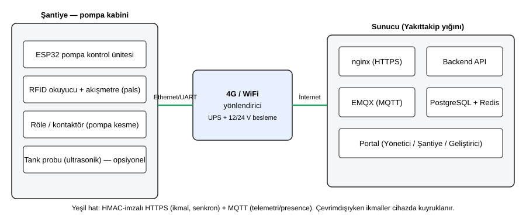
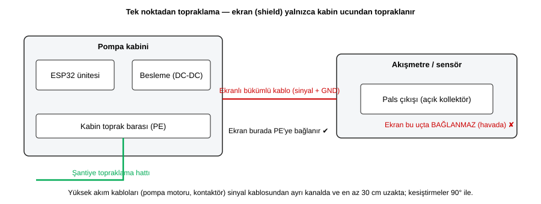

# Saha kurulum ve devreye alma prosedürü (DOC-1206)

> **Amaç:** yeni bir şantiyenin devreye alınmasını kişiye bağlı olmaktan çıkarıp tekrarlanabilir bir prosedüre dönüştürmek.
> **Kural:** [imzalı devreye alma formu](saha-kurulum/DEVREYE_ALMA_FORMU.html) tamamlanmadan şantiye **canlıya alınmaz** (bkz. §8).
> Cihaz/protokol ayrıntıları: [HARDWARE_INTEGRATION_GUIDE.md](HARDWARE_INTEGRATION_GUIDE.md) · sırlar: [SECRETS.md](SECRETS.md) · sorun anında: [runbooks/field.md](runbooks/field.md) · operatör eğitimi için: [OPERATOR_EL_KITABI.md](OPERATOR_EL_KITABI.md) (DOC-1207).

**Kim, ne kadar sürede?** 1 saha teknisyeni + 1 yetkili elektrikçi (elektrik işleri) + portalda yetkili kullanıcı (`COMPANY_OWNER`/`SUPER_ADMIN`). Kurulum + kalibrasyon + kabul testleri ≈ 1 iş günü; **24 saatlik izleme** sonrası imza (toplam ≈ 2 gün).

**Bu belgedeki fotoğraflar:** her adımda bir `[FOTO-nn]` yeri ve çekim tarifi vardır ([foto/README.md](saha-kurulum/foto/README.md)); görseller **pilot devreye almada** çekilip eklenir (henüz eklenmedi — belge bu yüzden "fotoğraflı" hâle pilotta gelir). Şematik çizimler bu belgeye gömülüdür.

**Firmware notu:** repoda cihaz firmware'i yoktur (FW-13xx ayrı bir iştir). Cihaza özgü ekran/buton ayrıntıları (portal adresi, AP adı, LED anlamları) **firmware sürüm notunda** yer alır; bu belge yalnızca sunucu tarafını ve firmware'den beklenen davranışı (sayısal kabul kriterleri dahil) tanımlar.

---

## 1. Kurulum öncesi hazırlık (saha ekibi yola çıkmadan)

### 1.1 Donanım listesi

| # | Kalem | Not |
|---|---|---|
| 1 | ESP32 pompa kontrol ünitesi (+ kutu, montaj plakası) | Cihaz kimliği (`deviceId`) etiketi kutunun üstünde |
| 2 | RFID okuyucu ve **kart/anahtarlık** (sürücü başına 1) | Kart numaraları Excel'de, kimlik bilgisiyle **ayrı** tutulmaz |
| 3 | Akışmetre (pals çıkışlı) ve **üretici K-faktör** değeri (pals/litre) | K-faktör kalibrasyonun başlangıç değeridir (§4.6) |
| 4 | Röle/kontaktör (pompa kesme), sigortalar, klemensler | Kontaktör bobin gerilimi ile röle uyumu kontrol edilmeli |
| 5 | RTC modülü (DS3231) ve pil | Zaman doğruluğu HMAC için zorunlu (KRT-02) |
| 6 | 4G/WiFi yönlendirici, SIM (APN bilgisi), anten | Sinyal ölçümü için telefon/ölçüm uygulaması |
| 7 | UPS veya akü destekli besleme (12/24 V DC-DC) | Şebeke kesintisinde cihaz en az ikmali bitirecek süre ayakta kalmalı |
| 8 | Ekranlı bükümlü kablo (sinyal), ayrı güç kablosu, kablo kanalı, etiketler | Yüksek akım kabloları ayrı kanalda |
| 9 | **Kalibre edilmiş referans kap** (sertifikalı; öneri: ≥ 20 L) ve **iki** boş kap | Sertifika tarihi geçerli olmalı; formda seri no yazılır |
| 10 | Toprak direnci ölçer, multimetre, termometre, düz/yıldız tornavida, sıkma anahtarı | Ölçüm sonuçları forma yazılır |
| 11 | Yazılı iş izni ve **yanıcı ortam** güvenlik ekipmanları | Aşağıdaki güvenlik notuna bakın |

> **Güvenlik:** yakıt ikmal alanı yanıcı/parlayıcı ortamdır. Elektrik işlerini yalnızca yetkili elektrikçi yapar; ekipmanın bulunduğu bölgeye uygunluğu (ex-proof/ATEX gereksinimi) **şantiye güvenlik sorumlusu ve yerel mevzuata göre** belirlenir — bu belge bu gereksinimi yerine koymaz. Kaynak/kıvılcım işlerinde iş izni alınır, pompa enerjisiz ve kilitli-etiketli (LOTO) çalışılır.

### 1.2 Ağ gereksinimleri (şantiye tarafı)

| Gereksinim | Değer |
|---|---|
| Çıkış (giden) bağlantı | Sunucuya HTTPS (üretimde TLS terminasyonlu; yığının nginx'i `/api/v1`'i sunar) ve **MQTT `1883`** (EMQX; WebSocket `8083` cihaz için gerekmez) |
| Gelen bağlantı / port yönlendirme | **Gerekmez** (cihaz her zaman dışarı bağlanır) |
| DNS | Sunucu alan adı çözülebilmeli |
| Saat | NTP (UDP 123) erişimi **veya** RTC; sapma ≤ ±30 sn (HMAC toleransı) |
| Veri hacmi | Düşük (telemetri ~8-10 sn'de bir küçük paket); çevrimdışı biriken ikmaller bağlantı gelince toplu gönderilir |
| Sinyal kalitesi | Kurulum noktasında 4G'de yeterli sinyal (öneri: ≥ 2 çubuk / RSRP kötü değil); zayıfsa harici anten |

Şantiye ağında yalnızca cihazın sunucu ve NTP'ye çıkmasına izin veren **ayrı bir VLAN/SSID** önerilir; cihaza yönetim arayüzü dışarıdan açılmaz.

### 1.3 Elektrik ve montaj koşulları

- Besleme: cihaz gerilimine uygun regüleli DC (12/24 V), **ayrı sigortalı hat**; motor/kontaktör beslemesiyle **aynı hattan çekilmez**.
- **Topraklama:** pompa kabininde tek bir toprak barası (PE); toprak direnci ölçülüp forma yazılır (öneri: şantiye topraklama standardınıza göre; tipik hedef ≤ 10 Ω — projenizin elektrik şartnamesi bağlayıcıdır).
- **Ekranlı kablo:** ekran (shield) **yalnızca kabin ucunda** PE'ye bağlanır (§4.3, şema).
- Ortam: kabin IP korumalı (toz/su), doğrudan güneş ve titreşimden korunmuş; ünite çalışma sıcaklık aralığında.
- Montaj yeri: pompa/akışmetreye kablo boyu kısa; sinyal kablosu güç kablosundan **en az 30 cm** ayrı, kesişme varsa 90°.

`[FOTO-01]` — kurulacak kabin ve mevcut topraklama barası (geniş çekim).



### 1.4 Portalda önceden yapılacaklar (COMPANY_OWNER / SUPER_ADMIN)

| Ne | Nasıl |
|---|---|
| Şantiye + şantiye şefi hesabı | `POST /sites` `{ "siteName": "...", "location": "..." }` (şantiye ve `SITE_MANAGER` kullanıcısı birlikte oluşur; üretilen geçici parola şantiye şefine **güvenli kanaldan** iletilir) |
| Tank(lar) | `POST /tanks` `{ "name", "capacityLiters", "currentLevelLiters", "fuelType", "siteName" }` — **başlangıç seviyesi fiziksel ölçümle** (çubuk/probe) girilir |
| Araçlar | `POST /vehicles` (plaka, RFID etiketi, şantiye) |
| Sürücüler ve RFID kartları | `POST /drivers` `{ name, tcNo, phone, rfidCardId, siteName }` (kişisel veri — yalnızca yetkili roller görür, bkz. [KVKK_ENVANTER.md](KVKK_ENVANTER.md)); araç–sürücü zimmeti |
| Cihaz **claim kodu** | `POST /devices/claim-codes` `{ "siteName", "deviceName", "expiresInMinutes" }` → tek kullanımlık, varsayılan **15 dk**. **Kodu sahada, konfigürasyon adımının hemen öncesinde üretin** (süresi dolarsa yenisi alınır) |

`[FOTO-02]` — portalda şantiye/tank kaydı ekranı.

**Hazırlık çıkış kriteri:** şantiye, tank(lar), araç/sürücü/kart kayıtları tamam; sertifikalı referans kap ve üretici K-faktör elde.

---

## 2. Devreye alma akışı (özet)

```
Montaj → Konfigürasyon portalı → Claim → Doğrulama (presence/zaman) → Sensör kalibrasyonu → Test alımı
       → Uçtan uca ikmal → Offline senaryosu → 24 saat izleme → Kabul ve imza
```

Her aşamanın **çıkış kriteri** vardır; kriter sağlanmadan sonraki aşamaya geçilmez. Sayısal kabul kriterlerinin tamamı §3'te (KRT-01…KRT-10) ve imzalanabilir formda aynı numaralarla yer alır.

---

## 3. Sayısal kabul kriterleri (devreye alma kabulü)

| Kod | Kriter | Ölçüm yöntemi | Eşik |
|---|---|---|---|
| **KRT-01** | Cihaz sunucuya **claim** edildi; doğru şantiyeye/tanka bağlı | `GET /hardware-devices` → cihaz kaydı, `status` aktif, `site_name` doğru; `PATCH /hardware-devices/{deviceId}/tank` ile tank eşlemesi | 1 cihaz = 1 kayıt, şantiye+tank doğru |
| **KRT-02** | Cihaz saati doğru | Cihazın gönderdiği `X-Timestamp` ile sunucu saati farkı (cihaz konfigürasyon ekranı/log); HMAC istekleri `401` almıyor | **≤ ±30 sn** (HMAC penceresi) |
| **KRT-03** | Test alımı sapması | Referans kap ile **iki ardışık** test alımı (`POST /devices/{id}/test-intake`); sapma = \|ölçülen − referans\| / referans | her ikisi **≤ %0,5** |
| **KRT-04** | Kalibrasyon kaydı tam | Geçerli K-faktör `ONAYLANDI` (cihaz ACK); doğrulama alımı `verifiesCalibrationCommandId` ile yapıldı | son komut `ONAYLANDI`, doğrulama alımı KRT-03'ü sağlıyor |
| **KRT-05** | Uçtan uca ikmal | Kayıtlı kart → ikmal → sonlandırma; kayıt `DOĞRULANDI`; tank düşümü = totalizatör farkı | tank Δ = ikmal litresi (± ölçüm hassasiyeti), kayıt `DOĞRULANDI` |
| **KRT-06** | **Offline senaryosu doğrulandı** | WAN ≥ **10 dk** kesikken **≥ 3 ikmal**; bağlantı gelince senkron | 3/3 `ACCEPTED`, tekrar gönderimde 0 mükerrer (`DUPLICATE_SKIPPED`), tank Δ = toplam litre |
| **KRT-07** | **24 saat kesintisiz online** | `GET /hardware-devices/{deviceId}/online-sla` | `offlineSeconds = 0` ve `totalSeconds ≥ 86400` |
| **KRT-08** | Elektriksel gürültü (sahte pals) yok | Röle **açık** (akış yok), **10 dk** izleme: totalizatör artışı | **0 pals**; 24 sa içinde yeniden başlatma (reset/brown-out) sayısı = 0 |
| **KRT-09** | Güvenlik | Geçici parolalar değiştirildi; kullanılmış claim kodu, açık/kullanılmamış kod kalmadı; secret yalnızca cihazda | tamamı EVET |
| **KRT-10** | Eğitim ve imza | Şantiye şefi/pompa operatörü eğitildi (DOC-1207); form imzalı | üç imza tamam |

---

## 4. Adım adım devreye alma

### 4.1 Montaj — kabin içi (elektrikçi + teknisyen)

1. İş izni al; **pompayı enerjisiz ve kilitli-etiketli** yap.
2. Montaj plakasını kabine sabitle; ünite, besleme (DC-DC + sigorta) ve **toprak barasını** yerleştir. Tüm kabloları **etiketle** (kaynak-hedef).
3. Besleme hattını bağla; polariteyi ölç, **henüz enerji verme**.

`[FOTO-03]` — kabin içi düzen, sigorta, toprak barası, kablo etiketleri okunur.

### 4.2 Montaj — akışmetre, röle, RFID

1. **Akışmetre:** akış yönüne (gövde oku) dikkat ederek boruya monte et; boru içi hava cebi olmayacak şekilde (dolu boru) yerleştir. Pals çıkışını ekranlı kabloyla üniteye taşı.
2. **Röle/kontaktör:** pompa kesme hattını röleden geçir; **arıza durumunda pompa durur** (fail-safe: röle enerjisizken pompa kapalı olacak şekilde). Yüksek akım kabloları sinyal kablosundan ayrı kanalda.
3. **RFID okuyucu:** operatörün kolay ulaşacağı yere, metalden ≥ birkaç cm uzağa monte et.

`[FOTO-04]` akışmetre bağlantısı · `[FOTO-05]` röle/kontaktör.

### 4.3 Topraklama ve ekran (en sık saha arızası kaynağı)

Elektriksel gürültü ve topraklama sorunları sahada **en sık** arıza nedenidir (sahte pals, RFID okumama, rastgele reset). Kurallar:

- Tüm toprak noktaları **tek** PE barasında birleşir (yıldız); **toprak döngüsü** oluşturma.
- Sinyal kablosunun **ekranı yalnızca kabin ucunda** PE'ye bağlanır, sensör ucunda havada bırakılır (aksi halde toprak döngüsü).
- Motor/kontaktör kabloları sinyal kablosundan **≥ 30 cm** ayrı kanalda; kesişme 90°.
- Kontaktör bobinine **RC snubber/varistör** takılır (anahtarlama gürültüsünü keser).
- Toprak direncini ölç ve forma yaz.



`[FOTO-06]` — ekranın PE'ye bağlandığı nokta (yakın çekim) ve toprak direnci ölçüm ekranı.

**Çıkış kriteri:** görsel kontrol + toprak direnci kaydı. Enerji ancak **elektrikçi onayı** ile verilir.

### 4.3.1 Sahte pals (gürültü) testi — KRT-08

Enerjiyi verdikten sonra, **röle açıkken** (pompa çalışmıyor, akış yok) totalizatör değerini kaydet; **10 dk** bekle; değeri tekrar oku. Artış **0** olmalıdır. Artış varsa: ekran/toprak/ayrım kurallarını (§4.3) yeniden gözden geçir — kalibrasyona **geçme**.

### 4.4 Konfigürasyon portalı ve claim

1. Cihaza enerji ver; **firmware sürüm notundaki** yönteme göre cihazın konfigürasyon portalını aç (FW-1317).
2. Portalda gir: **WiFi SSID/parola veya APN** (4G), **sunucu adresi** (API ve MQTT), **cihaz kimliği** (`deviceId`: `^[A-Za-z0-9_-]{3,64}$`, global benzersiz, etiketle aynı) ve **şantiye adı**. Cihaz saatini NTP ile eşitle.
3. Portalda (sunucu) **claim kodunu şimdi üretin** (§1.4) ve cihaza girin. Cihaz `POST /devices/claim` çağırır:
   `{ code, deviceId, serialNumber?, macAddress?, model?, hardwareRevision? }` → yanıtta **secret yalnızca bir kez** gelir; cihaz bunu flash'a (mümkünse secure element) kaydeder. **Secret'ı ekran görüntüsü/mesaj/kâğıt olarak SAKLAMAYIN.**
4. Kod `410` (süresi dolmuş) veya `409` (kullanılmış) dönerse yeni kod üretin.

`[FOTO-07]` — konfigürasyon ekranı (**secret ve claim kodu görünmemeli**).

### 4.5 Doğrulama (KRT-01, KRT-02)

1. `GET /hardware-devices` → cihaz kaydını, `site_name`'i ve durumunu doğrula.
2. Tank eşlemesi: `PATCH /hardware-devices/{deviceId}/tank` `{ "tankName": "..." }`.
3. **Presence:** portalda cihaz **ONLINE** görünmeli (cihaz her ~8-10 sn'de `/data` veya `/status:ONLINE` yayınlar; sunucu 10 sn TTL tutar). Cihazı kapatınca LWT ile anında **OFFLINE** görünmeli.
4. **Saat:** HMAC istekleri `401 UNAUTHORIZED_DEVICE`/zaman aşımı almıyorsa saat penceresi içindedir; cihaz ekranındaki/log'daki saati telefondan doğrula (**≤ ±30 sn**, KRT-02).

`[FOTO-08]` — portalda cihaz AKTİF/ONLINE.

### 4.6 Sensör kalibrasyonu — K-faktör (KRT-03, KRT-04)

**Ne:** akışmetrenin pals/litre katsayısı (K-faktör) gerçek hacme göre doğrulanır ve gerekirse düzeltilir. **Neden:** %1'lik K-faktör hatası tüm ikmallerde %1 stok/mali sapma demektir.

**Ön koşul:** cihazın **başlangıç K-faktörü** olmalı (yoksa test alımı `409 NO_BASELINE_K_FACTOR` verir). Yoksa üretici değerini uygula:

```
POST /devices/{deviceId}/calibration
{ "newKFactor": <üretici K>, "reason": "Başlangıç kalibrasyonu (üretici değeri)" }
```

Sunucu bir `commandId` üretir; cihaz komutu alır, K'yı yazar ve `POST /telemetry/calibration-ack` ile `ACK` + **fiilen uyguladığı** `appliedKFactor` bildirir. K-faktör **yalnızca ACK ile** güncellenir. Değişim mevcut değerin **%20'sinden büyükse** ikinci bir yetkili onayı gerekir (`POST /devices/{deviceId}/calibration/{commandId}/approve`) ve komut o zamana kadar cihaza gönderilmez.

**Referans kap ile test alımı (adım adım):**

1. Referans kabı **düz zeminde**, temiz ve kuru; hacmini ve sertifika tarihini forma yaz. Ortam sıcaklığını ölç (`ambientTemperatureCelsius`).
2. Tankın seviyesini ve totalizatörü not et. Pompayı **kabın üstüne kadar değil, işaretli seviyeye** doldur; köpük/taşma olmamasına dikkat et (yavaş, sabit debi).
3. Kaptaki gerçek hacmi **göz hizasında** okuyup `referenceVolumeLiters`, cihazın/portalın ölçtüğü değeri `measuredLiters` olarak gir:

```
POST /devices/{deviceId}/test-intake
{ "tankName": "...", "siteName": "...", "referenceVolumeLiters": 20.00, "measuredLiters": 20.06,
  "ambientTemperatureCelsius": 24 }
```

   Yanıtta `deviation_ratio` (sapma) ve `recommendedKFactor` döner. **Test alımı normal ikmal olarak faturalanmaz ama tanktan düşer** (stok doğru kalır).
4. **En az iki** test alımı yap; tek ölçüm yanıltıcı olabilir (sunucu son iki ölçümün ortalamasını önerir; tek ölçümde uyarır).
5. **Karar:**

| Durum | Yapılacak |
|---|---|
| İki ardışık alımın **her ikisinin** sapması ≤ **%0,5** | ✅ **KRT-03 sağlandı**; K-faktör doğru — kalibrasyon değişikliği gerekmez |
| Sapma > %0,5 | `recommendedKFactor`'ı uygula (`POST /devices/{id}/calibration`, `referenceMeasurement` doldur) → cihaz **ACK** → **doğrulama alımı** (`verifiesCalibrationCommandId` = o komut; komut `ONAYLANDI` olmalı) → yeniden iki ardışık alım ≤ %0,5 |
| 3 denemede hâlâ > %0,5 | **Durdur:** mekanik neden ara (hava cebi, akışmetre yönü, filtre tıkanıklığı, ekran/toprak — §4.3, §6) |

6. Geri alma gerekirse: `POST /devices/{id}/calibration/rollback` (bir önceki K'ya döner, aynı ACK döngüsü).

`[FOTO-09]` referans kap ve okuma · `[FOTO-10]` kabın dolu seviyesi + portal sonucu.

**Çıkış kriteri (KRT-03, KRT-04):** iki ardışık ≤ %0,5 alım + son kalibrasyon komutu `ONAYLANDI` (`GET /devices/{id}/calibration-history`, `GET /devices/{id}/test-intakes`).

### 4.7 Uçtan uca ikmal testi (KRT-05)

1. Kayıtlı bir sürücü kartını okut → araç zimmeti/kota kontrolü geçer, pompa açılır (`POST /dispense/request-auth`).
2. Gerçek bir ikmal yap (araç veya bidon); pompalama sırasında cihaz heartbeat gönderir.
3. Bitir → kayıt oluşur (`POST /dispense/finalize`); portalda ikmal kaydını aç: `verification_status = DOĞRULANDI`, litre = totalizatör farkı, **tank seviyesi aynı litre kadar düştü**.
4. **Olumsuz testler:** bilinmeyen kart → reddedilir; izinli olmayan araç → reddedilir; ikmal ortasında **fiziksel acil durdurma** → pompa anında kesilir (donanımsal kesme) ve kayıt o ana kadarki litreyle kapanır; **limit testi:** araç için düşük bir litre limiti tanımlayıp (`PUT /vehicles/{id}/fuel-limit`) aşın → heartbeat yanıtındaki `FORCE_CUTOFF` ile pompa kesilir.

`[FOTO-11]` — kart okutma anı (kart no görünmemeli) ve ikmal kaydı.

### 4.8 Offline senaryosu (KRT-06)

1. Yönlendiricinin **WAN bağlantısını kes** (fişi çek) — süreyi başlat (**≥ 10 dk**). Portalda cihaz OFFLINE görünür.
2. Kesikken **3 ikmal** yap (fail-open politikası çevrimdışı yetkiye izin veriyorsa: `GET /policies/fail-open`; kart önbellekte olmalı). Cihaz ikmalleri yerel kuyruğa yazar (`localSequenceId` monoton artan).
3. Bağlantıyı geri ver. Cihaz `POST /telemetry/sync-batch` ile kuyruğu gönderir. Beklenen: **3/3 `ACCEPTED`**, ikmaller portalda **cihaz zamanıyla** görünür, tank toplam litre kadar düşer.
4. **Mükerrer testi:** cihaz kuyruğu temizlendiyse fiziksel tekrar gönderim gerekmez (sunucu `(deviceId, localSequenceId)` ile tekrarı zaten engeller — `DUPLICATE_SKIPPED`); senkron sırasında bağlantıyı bir kez daha kesip geri verin: portalda **yine 3 kayıt** olmalı (6 değil).
5. `ERROR` dönen kayıt varsa (ör. `NEGATIVE_STOCK_DETECTED`) tank seviyesi kaydını düzeltip mutabakata bırakın; **kayıp/mükerrer yok** kriteri sağlanmadan geçmeyin.

`[FOTO-12]` — çekili WAN fişi ve cihazın çevrimdışı göstergesi.

### 4.9 24 saat izleme (KRT-07, KRT-08)

Cihazı **hiç müdahale etmeden** 24 saat çalışır bırakın (normal ikmaller sürebilir). Sonunda:

- `GET /hardware-devices/{deviceId}/online-sla` → `offlineSeconds = 0`, `totalSeconds ≥ 86400` (KRT-07). Bu kontrol, **cihazın ilk görüldüğü andan** ölçtüğü için 24 saat dolmadan yeterli değildir.
- Cihaz yeniden başlatma sayısı **0** (KRT-08).
- (Önerilen) `GET /hardware-devices/health-scores` — sağlık skoru ve sinyal/pil cezaları makul.
- Kesinti olduysa **kabul verilmez**: nedeni (güç, sinyal, topraklama) gider, 24 saat yeniden başlar.

`[FOTO-13]` — online SLA ekranı.

---

## 5. Kalibrasyon prosedürü — özet ve kabul kriterleri

| Adım | Kabul |
|---|---|
| Başlangıç K-faktör (üretici) ACK'li | komut `ONAYLANDI` |
| En az 2 referans kap alımı | her ikisi sapma **≤ %0,5** (KRT-03) |
| Sapma > %0,5 ise düzeltme + doğrulama alımı | doğrulama alımı da ≤ %0,5 (KRT-04) |
| Değişim > %20 | ikinci onay (ayrı yetkili) |
| Kayıt | kalibrasyon geçmişi silinemez (denetim izi); sertifikalı kap seri no + tarih forma yazılır |

Kalibrasyon **yılda en az bir kez** ve akışmetre/filtre/boru değişiminde tekrarlanır (periyot işletme politikanıza göre kısaltılabilir).

---

## 6. Sık karşılaşılan saha sorunları ve çözümleri

| Belirti | Olası neden | Çözüm |
|---|---|---|
| Röle açıkken totalizatör artıyor (sahte pals) | Ekran iki uçtan topraklı / eksik topraklama; sinyal kablosu güç kablosuyla paralel; kontaktör snubber yok | §4.3: ekranı yalnızca kabin ucunda bağla, ≥ 30 cm ayır, snubber/varistör tak, toprak barasını tek noktada birleştir; §4.3.1 testini tekrarla |
| Test alımı sapması > %0,5 ve K düzeltince de dalgalı | Boruda hava cebi, akışmetre ters/eğik, filtre tıkalı, düşük debi | Boruyu havalandır, yönü/dikliği düzelt, filtreyi temizle; sabit debiyle tekrar |
| Cihaz rastgele yeniden başlıyor | Zayıf/dalgalı besleme, ortak hat, brown-out | Ayrı sigortalı besleme, UPS/regüle DC, kablo kesitini artır; motor hattından ayır |
| RFID kart okumuyor/aralıklı | Metal yüzey, gürültü, zayıf topraklama, kart çipi hasarlı | Okuyucuyu metalden uzaklaştır, topraklamayı düzelt, kartı değiştir (eskisini `POST /rfid-cards/{uid}/block`) |
| `401 UNAUTHORIZED_DEVICE` / imza hatası | Saat sapması > ±30 sn, yanlış `deviceId`, secret kaybı | NTP/RTC düzelt; kimliği kontrol et; secret kaybolduysa `POST /hardware-devices/{deviceId}/rotate-secret` |
| `429 TOO_MANY_REQUESTS` | Aşırı istek (dakikada 300 sınırı) | Firmware'de exponential backoff; istek sıklığını düşür |
| Cihaz sürekli ONLINE↔OFFLINE geçiyor | Zayıf sinyal, yönlendirici yeniden başlıyor, NAT zaman aşımı | Anten/konum, sinyal ölç, keepalive'ı (~8-10 sn) doğrula, yönlendirici güç kaynağını kontrol et |
| Claim `410`/`409` | Kod süresi doldu / kullanıldı | Yeni claim kodu üret (§1.4); kodu hemen kullan |
| Çevrimdışı ikmaller portalda yok | Senkron çalışmadı (saat/HMAC/ağ) | Bağlantıyı doğrula; cihaz kuyruğunu koru; `sync-batch` yanıtındaki `ERROR`'ları incele |
| Tank seviyesi test sonrası tutarsız | Test alımı düşümü hesaba katılmadı / başlangıç seviyesi yanlış | Başlangıç seviyesini fiziksel ölçümle düzelt; test alımları da tanktan düşer (beklenen) |
| Portalda "ikmal doğrulanamadı / sapma" | K-faktör hatalı veya totalizatör atlaması | §4.6 kalibrasyonu, §4.3 gürültü kontrolü |

Diğer alarm/uyarılar için: [runbooks/field.md](runbooks/field.md), [ALERTING.md](ALERTING.md).

---

## 7. Geri alma ve yeniden deneme

- Devreye alma **başarısız** sayılırsa (KRT ihlali): şantiye canlıya alınmaz; cihaz bloklanabilir (`POST /hardware-devices/{deviceId}/block`) ve nedeni forma yazılır.
- Cihaz başka şantiyeye taşınırsa: `POST /hardware-devices/{deviceId}/relocate`; taşınan şantiyede **KRT-01…KRT-08 yeniden** doğrulanır.

---

## 8. Kabul ve imza

1. Tüm KRT-01…KRT-10 kriterlerini [DEVREYE_ALMA_FORMU.html](saha-kurulum/DEVREYE_ALMA_FORMU.html) üzerinde (yazdırıp) ölçülen değerlerle doldurun.
2. **Üç imza:** devreye alma teknisyeni, şantiye şefi, müşteri/yönetici yetkilisi. Form taranıp ilgili firma kaydına eklenir (`vehicle_documents` benzeri belge deposu veya kurumsal arşiv).
3. **İmzalı form yoksa şantiye canlıya alınmaz** — portalda şantiye yönetici hesabı teslim edilmez ve üretim kartları etkinleştirilmez.
4. `[FOTO-14]` — imzalı form ve kapatılmış, etiketli kabin.

## 9. Pilot geri beslemesi

Pilot şantiyede bu prosedür **birebir** izlenir; sapmalar/eksikler `docs/saha-kurulum/GERI_BESLEME.md` (pilot sonrası açılır) veya issue olarak kaydedilir; belge her pilot sonrası güncellenir. Pilotta ölçülen gerçek süreler ve fotoğraflar bu belgeye işlenir.
